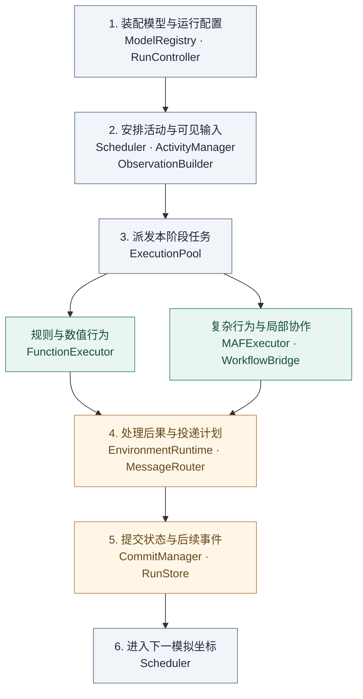
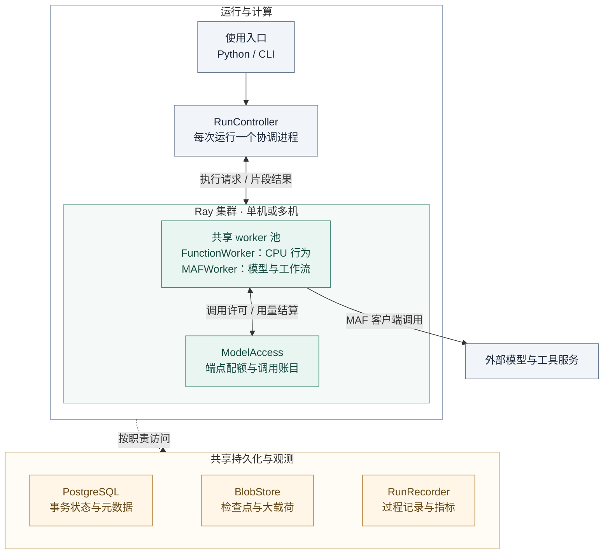

# MASim × MAF：面向规模化多智能体模拟的基础设施设计

**Muhan · 2026-09-08 · v0.2 工程架构审阅稿**

本方案建设一个可组合主体、行为、环境和交互机制的模拟运行系统。核心使用图景是：**大量主体持续存在，多种局部活动按需发生；活动可以跨模拟时刻持续，同一主体可以在同一时期参加不同活动。**

总体路线为：**MAF 承载行为与局部协作，MASim 的适用能力按需迁移，新系统统一组织模拟时间、活动、环境反馈和执行资源。** 工程参考实现采用 Python、MAF、Ray 与事务存储，主体状态独立于执行 worker。复杂活动复用 MAF 的工作流、请求与响应、会话和检查点机制。

本文集中给出一套可进入接口设计和原型建设的架构。主体、活动及系统目标来自前期共识；模块、接口与技术选型是本稿的工程设计。当前交付为设计文档，新系统尚未完成集成和性能验证。

| 阅读顺序                               | 内容                           | 解决的问题                       |
| -------------------------------------- | ------------------------------ | -------------------------------- |
| [1. 系统使用方式](#system-use)          | 输入、运行、输出和终态能力     | 使用者拿到系统后能够做什么？     |
| [2. 问题与设计原则](#design-principles) | 关键瓶颈及对应方法             | 为什么需要这样的架构？           |
| [3. 总体架构](#architecture)            | 架构图、模块与职责             | 哪些部分需要建设，怎样协作？     |
| [4. 核心对象与接口](#contracts)         | 主体、活动、执行请求和结果     | 模块怎样连接，开发者怎样扩展？   |
| [5. MAF 的接入](#maf-integration)       | 行为、工作流、工具、会话与接续 | MAF 具体承担哪些工作？           |
| [6. 模拟推进与通信](#simulation-flow)   | 时间、活动、消息及贯穿示例     | 一次持续模拟怎样实际运行？       |
| [7. 部署与规模](#deployment)            | worker、模型请求、存储与瓶颈   | 如何从单机扩大执行规模？         |
| [8. 提交、恢复与检查](#reliability)     | 状态生效、故障处置与过程记录   | 如何判断系统按声明的规则运行？   |
| [9. 迁移与工程结构](#engineering)       | MASim 资产、包目录和依赖       | 如何开始写代码并复用已有工作？   |
| [10. 实施与验收](#delivery-plan)        | 建设顺序、工程负载和交付条件   | 怎样分阶段到达终态？             |
| [11. 依据与待核验事项](#evidence)       | 来源、关键风险和设计状态       | 哪些已有依据，哪些需要原型验证？ |

<a id="system-use"></a>

## 1. 系统使用方式与最终能力

### 1.1 使用者提供什么，系统交付什么

研究者通过 Python 组件和配置装配一个模拟模型。例如，在虚构的资源共享社区中，主体拥有不同需求、资源与关系，可以独立行动，也可以临时协商或合作。

| 环节               | 使用者或系统需要完成的工作                                                               |
| ------------------ | ---------------------------------------------------------------------------------------- |
| **模型输入** | 定义主体及初始分布、行为实现、环境能力、关系与信息规则、活动模板，以及激活和时间规则     |
| **执行输入** | 指定 worker 资源、模型端点、并发与预算、持久化位置、运行时长及故障策略                   |
| **系统运行** | 初始化主体和环境，安排激活，构造可见输入，执行行为与活动，处理反馈，保存状态并继续推进   |
| **运行操作** | 启动、查询进度、查看指定主体或活动、请求暂停、恢复、停止和导出记录                       |
| **系统输出** | 运行配置与版本、主体和环境状态、活动与消息轨迹、模型调用及资源统计、可恢复位置和检查报告 |

模拟模型与执行配置分别保存。使用者增加 worker 时可以继续使用相同主体和环境定义；更换行为机制或信息规则时，则明确形成一个不同的模型配置。

### 1.2 终态必须具备的能力

| 能力             | 具体含义                                                       |
| ---------------- | -------------------------------------------------------------- |
| 持续主体         | 身份、属性、关系和记忆可长期保留，活动结束后主体继续存在       |
| 异质行为         | 规则、数值函数、LLM、多步工具行为和内部协作可以共存            |
| 可组合环境       | 环境通过模块定义可见信息、可用能力、资源约束与行动后果         |
| 按需活动         | 主体请求、消息或环境变化可触发活动，支持加入、退出、等待与结束 |
| 跨时刻与重叠参与 | 活动能够暂停并在后续模拟时刻继续；同一主体可参与多个未结束活动 |
| 可扩展执行       | 主体总量、活跃工作量、worker 数和模型并发分别管理              |
| 可恢复与可检查   | 状态、消息与活动进度能够关联恢复，并可检查运行是否符合声明规则 |

当前建设聚焦这些基础设施能力。领域模型的构造、历史拟合和经验有效性评价随后开展。这里的运行有效性首先指系统按照所声明的模型执行，具体模拟是否符合现实需要应用研究检验。

<a id="design-principles"></a>

## 2. 关键问题与设计原则

| 关键问题                                 | 采用的方法                                                  | 必须承担的代价或限制                           |
| ---------------------------------------- | ----------------------------------------------------------- | ---------------------------------------------- |
| 大量主体长期存在，但活跃工作不断变化     | 持久主体状态与共享 worker 分离，按就绪工作分配资源          | 增加状态装载、序列化和缓存管理                 |
| 行为与协作复杂度不同                     | 简单行为直接执行；复杂行为与局部活动交给 MAF                | 需要统一输入输出以及模拟边界适配               |
| 活动会跨时刻等待并相互影响               | 将活动登记为持续对象，以 MAF 待响应请求和检查点承载局部进度 | 需要把工作流请求对应到模拟消息、时间和环境操作 |
| 模型调用速度差异可能改变行为顺序         | 分开管理模拟推进与计算排队，同阶段结果按模型规则生效        | 保守推进可能受慢调用限制                       |
| 多个活动会操作同一主体或资源             | 明确状态归属，在统一提交边界处理冲突                        | 提交与共享环境可能形成热点                     |
| 长时间运行会遭遇失败、重复请求和预算不足 | 持久任务身份、结果记录、恢复位置与共享配额                  | 需要额外存储、错误分类和恢复检查               |

由这些问题形成五条贯穿设计的原则：

1. **模拟对象与运行对象分开。** 主体、活动、MAF 实例和 worker 分别拥有身份与生命周期。
2. **职责确定后复用能力。** MAF 负责局部行为运行；MASim 按模块、机制和有效测试迁移；新系统补充它们之间的模拟关系。
3. **计算完成与模拟生效分开。** 结果先形成候选，由环境规则和提交机制决定后果。
4. **运行优化与建模变化分开。** 调整 worker 和批量需要保持声明的模型含义；主体聚合、行为替代和记忆压缩作为显式建模选择记录。
5. **以完整运行链路检验设计。** 每一阶段都能追踪输入、执行、反馈和后续状态，再逐步扩大规模。

<a id="architecture"></a>

## 3. 总体架构：模块怎样组织

### 3.1 逻辑架构

运行先完成配置装配，随后反复执行图中的第 2–6 步。两类行为执行汇入同一条环境处理与提交主线。



规则与 MAF 执行都产出 `SegmentResult`。本阶段所需结果收齐后，EnvironmentRuntime 处理行动后果，MessageRouter 形成投递计划；CommitManager 将状态、消息和后续事件一并提交，Scheduler 据此继续推进。

RunStore 为活动计划与可见输入提供已提交版本，RunRecorder 贯穿执行与提交收集记录。图中省略这些公共读写与观测连线，具体状态归属见第 3.2 节；MASim 资产迁移见第 9 节。

### 3.2 模块职责与状态归属

| 模块                                         | 输入与输出                                           | 负责的状态或边界                                                 |
| -------------------------------------------- | ---------------------------------------------------- | ---------------------------------------------------------------- |
| **ModelRegistry / RunController**      | 组件和配置 → 已校验的运行定义；运行操作 → 状态反馈 | 组件版本、运行配置、启动与暂停请求                               |
| **Scheduler**                          | 已提交事件 → 下一模拟坐标及到期事件集合             | 事件队列、模拟时钟、激活顺序；持久记录由 RunStore 保存           |
| **ActivityManager**                    | 到期事件、活动记录 → 执行计划及等待关系             | 成员、活动生命周期、接续位置；一次活动至多有一个有效执行尝试     |
| **ObservationBuilder / MessageRouter** | 已提交状态、身份与关系 → 可见输入和待投递消息       | 信息范围与通信语义；缓存不改变信息归属                           |
| **EnvironmentRuntime**                 | 状态视图、行动集合 → 后果、处置结果及环境更新计划   | 每个环境字段和资源的权威归属、跨模块交互规则                     |
| **ExecutionPool / BehaviorExecutor**   | 就绪执行请求 → 片段结果                             | worker 配额、暂态执行；通过 FunctionExecutor 或 MAFExecutor 运行 |
| **CommitManager / RunStore**           | 候选结果、环境后果 → 原子提交及可恢复版本           | 主体、环境、活动、会话引用、在途消息和任务状态的一致关系         |
| **ModelAccess / RunRecorder**          | 模型调用与运行事件 → 配额许可、调用记录、指标与导出 | 端点总配额、预算账目、可追溯的过程关联                           |

模拟协调是由上述模块组成的运行进程。Scheduler 安排时间，ActivityManager 管理活动，EnvironmentRuntime 解释后果，CommitManager 组织生效；它们通过接口协作。行为计算、模型调用和工作流内部调度分别由执行层和 MAF 承担。

环境可由资源、关系、空间等多个模块构成。每个模块注册自己的状态范围和操作；跨模块行动由显式的组合处理器形成一份更新计划，最终一次提交。

<a id="contracts"></a>

## 4. 核心对象与扩展接口

### 4.1 主体、活动和运行请求

| 对象                                         | 核心内容                                                                             | 生命周期与身份                                        |
| -------------------------------------------- | ------------------------------------------------------------------------------------ | ----------------------------------------------------- |
| **ActorDefinition / ActorState**       | 身份、角色、行为配置、属性、记忆规则、关系及初始状态                                 | `actor_id` 跨活动稳定；共享资源通过引用访问         |
| **ActivityDefinition / ActivityState** | 参与规则、流程模板、成员、共享与私有状态、等待条件、结束规则                         | `activity_id` 跨模拟时刻稳定；定义与状态分别版本化  |
| **ExecutionRequest**                   | 运行、主体与任务身份、可选活动身份、模拟坐标、读取版本、可见输入、接续引用和计算限额 | `task_id` 对应一次逻辑激活；重试另记 `attempt_id` |
| **SegmentResult**                      | 行动、消息、主体更新请求、工作流待响应请求、活动进度、会话或检查点引用               | 属于一个任务及有效尝试；此时仍为候选结果              |
| **CommitBatch / CommitReceipt**        | 全阶段的状态更新、行动处置、消息、后续事件与提交版本                                 | 一个提交身份对应一次完整生效，恢复时可以查询          |

独立主体的周期行为或事件响应可以直接形成执行任务，无须先建立多方活动。只有需要保留成员关系、交互流程和等待进度时，才登记持续活动。

主体的内部辅助 Agent 由行为实现管理。例如一个主体可让内部分析、计划与检查角色协作。只有当某个角色代表模拟世界中独立存在的参与者时，才分配独立的主体身份与信息权限。

### 4.2 开发者怎样接入新能力

以下为拟实现的主要接口签名，用于约定职责；类型和方法尚未形成可调用 SDK。

```text
ModelRegistry.validate(spec) -> ValidatedSpec
ActivityManager.plan(events, snapshot) -> ExecutionPlan
ObservationBuilder.build(plan, snapshot) -> list[ExecutionRequest]

async BehaviorExecutor.run(request) -> SegmentResult
EnvironmentRuntime.resolve(snapshot, results) -> EffectPlan
MessageRouter.plan(snapshot, results, effects) -> DeliveryPlan

CommitManager.prepare(snapshot, results, effects, deliveries) -> CommitBatch
RunStore.commit(expected_version, batch) -> CommitReceipt
Scheduler.advance(receipt) -> ReadyEvents
```

其中 `EffectPlan` 包含环境后果及行动的接受、拒绝或无效果处置；`DeliveryPlan` 指定消息和反馈的接收者及生效坐标。CommitManager 再协调主体更新、活动与会话进度，形成完整的 CommitBatch。数据库写入集中在 RunStore，行为组件无须自行操作提交表。

`snapshot` 表示指定版本的只读视图，按需装载相关主体和资源。每次激活无须复制整个世界；执行请求及其读取依据在任务完成前保持可恢复。

扩展时遵循三条路径：

- **新增主体行为**：实现 BehaviorExecutor 合同或提供 MAF 行为工厂，声明使用的输入、工具和状态更新规则。
- **新增环境能力**：注册操作类型、参数、可见信息、资源约束和后果处理器，明确其状态范围。
- **新增活动类型**：提供参与规则、MAF 流程工厂和结束条件，使用 WorkflowBridge 与模拟交互。

ActivityManager 负责活动的登记、成员和等待关系。活动内部的分支、函数、Agent 调用及节点执行交给 MAF，避免再实现一套相同的流程调度器。

### 4.3 行为空间与环境反馈

系统不内置历史事件序列。模型作者定义环境可理解的能力，主体选择对象、参数、时机、沟通内容和活动组织方式。主体可以提出、拒绝、修改方案、等待或退出，环境可以产生多种结果。

自然语言提议可以在执行层通过声明的解释模块转成结构化操作，EnvironmentRuntime 再校验和处理后果；解释输入、结果和后果一同记录。需要额外模型调用的解释同样受 ModelAccess 管理。新增动作类型仍需相应环境能力，单纯增加文本输出尚不足以让环境处理任意行动。

<a id="maf-integration"></a>

## 5. MAF 怎样进入主体和活动运行

### 5.1 三种行为都接入同一运行合同

| 行为形态       | 运行方式                                                            | 示例                                             |
| -------------- | ------------------------------------------------------------------- | ------------------------------------------------ |
| 规则或数值行为 | FunctionExecutor 运行普通函数或显式状态机                           | 计算需求、按规则分配、周期更新                   |
| 单主体复杂行为 | MAF Agent 或 Workflow 组织模型、工具及内部角色                      | 读取可见信息 → 比较方案 → 检查约束 → 提出行动 |
| 多主体局部活动 | MAF Workflow 组织参与者执行与交互步骤，通过 WorkflowBridge 接入模拟 | 多方协商、共同计划、任务合作、反馈后继续         |

规则与模型混合行为通过函数、Agent 和 Workflow 节点的组合表达。是否先用规则约束、何时调用模型，由行为定义声明。

### 5.2 MAF 能力与我们的适配工作

| MAF 构件                   | 在系统中的用途                           | 我们需要补充的内容                                     |
| -------------------------- | ---------------------------------------- | ------------------------------------------------------ |
| Agent / 模型客户端         | 模型决策和工具循环                       | 主体身份、行为配置、输入输出合同及模型端点配置         |
| Session / Context Provider | 成员会话与上下文装配                     | 主体记忆、活动私有状态和信息可见性的对应关系           |
| 工具与结构化输出           | 查询可见信息、执行计算、表达行动请求     | 工具能力声明、输出校验、状态变化入口                   |
| Workflow / Executor        | 局部流程、分支、并发和内部协作           | 活动模板、参与者绑定、模拟交互节点                     |
| 请求与响应 / checkpoint    | 等待外部反馈、保存执行位置并接续         | 将请求映射到模拟事件，将检查点与提交版本关联           |
| Middleware / 观测          | 拦截模型及工具调用，记录错误、耗时和用量 | 统一配额、重试记账，以及运行—主体—活动—调用身份关联 |

MAF 的 Agent、Workflow 和运行支撑职责见[官方概览](https://learn.microsoft.com/en-us/agent-framework/overview/)。模型中间件会进入工具循环中的各次模型调用，因此可用于接入统一配额与记账；底层 SDK 的额外重试也需纳入同一策略。[MAF Middleware](https://learn.microsoft.com/en-us/agent-framework/concepts/agents/middleware/)

### 5.3 用 WorkflowBridge 连接局部流程与模拟世界

MAF 原生提供向工作流外部发送请求、等待响应和恢复执行的机制。本方案使用自定义 Executor 将这种请求表达为 **SimulationRequest**，内容可以是发送模拟消息、申请环境操作、等待投递或等待某个模拟时刻。返回的 **SimulationResponse** 包含已生效结果及新的可见输入。[MAF 请求与响应](https://learn.microsoft.com/en-us/agent-framework/workflows/human-in-the-loop)

完整过程为：

1. ActivityManager 选择活动模板与读取版本，MAFExecutor 构建或恢复 Workflow。
2. MAF 执行当前可完成的内部计算，到达模拟交互节点时，由 WorkflowBridge 发出请求。
3. 适配器收集请求，等待当前可运行路径排空，并保存对应检查点，形成 SegmentResult。
4. 协调模块在当前阶段处理请求并提交状态，安排反馈或未来激活事件。
5. 到达允许接续的模拟坐标后，加载已提交检查点，将 SimulationResponse 交回对应请求，继续执行。

**一个执行片段就是两次返回模拟边界之间的局部执行。** 同一个逻辑 Workflow 可以跨多次运行调用和多个模拟时刻。活动等待期间，其检查点与状态保存在存储中，worker 可以服务其他活动。

现有 MAF Python 参考源码支持 `request_info`、`response_handler`，以及恢复检查点后传入 `responses`。这些提供了可用的实现入口；SimulationRequest 的定义、请求去重和全局提交关联属于新增适配。MAF 文档也说明检查点包含待响应请求。[检查点与响应接续](https://learn.microsoft.com/en-us/agent-framework/workflows/human-in-the-loop#checkpoints-and-requests)

WorkflowBridge 是明确的流程节点，发出请求后依赖该反馈的路径停止继续向下执行。适配器不能把流式输出中的第一条请求立即当作全局已生效操作；需要等到本片段有完整、可恢复的结果。无界工具或计算循环通过步骤及调用上限诊断为执行失败。

行动获准、被拒绝或没有效果，都通过对应响应返回流程。仍有必需反馈待处理的活动保持等待状态，收到反馈并达到结束条件后才能完成；取消则通过显式的取消规则清理等待关系。

### 5.4 会话、成员与信息范围

主体长期记忆、活动共享记录和成员私有会话分别保存。MAF Agent 的可变会话按运行、活动和主体身份隔离；同一主体在不同活动中的私有历史，按主体记忆规则决定何时跨活动传播。客户端和流程模板可以缓存，可变状态始终从指定版本装载。[MAF 会话](https://learn.microsoft.com/en-us/agent-framework/concepts/agents/conversations/)

参考实现中，Workflow 内的成员会话随其检查点保存，RunStore 保存关联引用；独立 Agent 调用的会话单独序列化并随提交保存引用。同一份可变会话只有一个恢复来源，主体长期记忆的写入另按主体更新规则提交。

采用可在本地完整序列化的会话；服务端会话标识不足以充当完整恢复状态。恢复后需要校验成员、会话内容和待响应请求，校验失败即报告错误，避免以空白会话继续模拟。这项检查纳入首阶段跨实例接续探针。

活动中的模拟主体通信通过 WorkflowBridge 与 MessageRouter 生效，按第 6 节的可见时间接续。单主体内部辅助角色的讨论可在片段内完成。标准 Group Chat 默认共享对话历史，因此多主体活动需要适配路由及模拟交互边界，尤其不能将私有输入直接广播给所有成员。[MAF Group Chat](https://learn.microsoft.com/en-us/agent-framework/workflows/orchestrations/group-chat)

成员加入或退出在活动边界提交。流程模板采用稳定的参与者调度节点，成员列表保存在活动状态中；恢复已有检查点时保持流程结构及执行器身份，成员变化通过数据与绑定处理。复杂结构变更应建立新的流程版本和显式迁移位置。

<a id="simulation-flow"></a>

## 6. 模拟时间、活动与通信怎样推进

### 6.1 时间模型及选择理由

采用**离散事件队列 + 同一时刻内的有序阶段**。模拟坐标为 `(t, p)`：`t` 表示整数时间单位，`p` 表示同一时刻内的因果阶段。时间单位由模型声明，周期行为通过定时事件表达。

选择这一组织方式，是因为主体激活、消息到达、环境定时变化和活动继续都可以作为事件安排，适合按需发生与长时间等待。对于全部主体每轮都活跃的模型，事件队列未必降低开销，需要用密集负载测量。数据结构保留时间策略接口，当前参考实现围绕这一套时间合同建设。

同一阶段内，所有任务读取同一已提交版本。即时消息在后续阶段可见，带延迟消息在其到达时刻可见；环境定时变化也作为事件处理。调度的稳定排序键来自模拟坐标、事件来源和持久身份，不使用 worker 返回先后决定模拟顺序。

可控的随机行为按运行种子与逻辑任务身份派生独立随机流，同一任务的重试复用该流，避免并发调度改变取样顺序。真实模型输出仍作为外部计算结果保存。

### 6.2 一个阶段的运行顺序

```text
读取最早到期事件
  → ActivityManager 生成执行计划，ObservationBuilder 构造可见输入
  → ExecutionPool 分批派发，MAF / 函数执行至返回模拟边界
  → 收齐当前阶段要求的有效结果
  → EnvironmentRuntime 处理同阶段行动及资源冲突
  → MessageRouter 形成消息和反馈的投递计划
  → CommitManager 汇总状态、消息和后续事件，RunStore 一次提交
  → Scheduler 从已提交事件继续派发，推进下一模拟坐标
```

同一活动在一个阶段最多激活一次，多条到期消息先合并到该活动的输入。不同活动可以同时涉及同一主体，随后根据主体更新和环境规则协调效果。

当前采用保守推进：本阶段必需的结果到齐后再提交。该机制便于建立清晰的观察与生效关系，但慢模型调用会限制阶段吞吐。批处理和更多 worker 可以改善计算利用率，不能消除模型要求的等待关系。

### 6.3 等待、冲突与通信规则

| 情况                           | 系统处理                                                                     |
| ------------------------------ | ---------------------------------------------------------------------------- |
| 活动等待未来消息或模拟时刻     | 保存待响应请求与检查点，登记唤醒条件，释放 worker；模拟可处理其他到期工作    |
| 当前阶段的模型调用尚未完成     | 继续执行其他就绪任务；保留本阶段提交屏障                                     |
| 同一主体收到多项活动的状态更新 | 可合并的追加记录按稳定顺序保存；冲突字段按主体更新规则处置，并反馈给相关活动 |
| 多个行动争用相同资源           | 环境对同阶段行动集合执行声明的分配、排序或拒绝规则                           |
| 没有定义冲突处理规则           | 模型校验或运行检查报错，避免由返回速度决定胜负                               |
| 模拟中声明了响应期限           | 定时事件触发相应领域后果；与实际 API 超时分别记录                            |
| 即时事件持续触发且无法结束     | 达到阶段上限后报错并暂停，保留诊断记录                                       |

MessageRouter 负责接收者解析、成员或关系校验、投递时间与稳定消息身份。内部使用轻量信封，至少包含发送者、接收者、活动、发送与可见坐标、内容引用。物理传输可批量发送，逻辑投递仍逐项可识别。

外部模型、检索或工具通过 ModelAccess 和工具适配层接入，声明数据来源、超时与效果范围。将来增加远端 Agent 协议时，仍转换成相同的执行和响应合同；协议连接不授予直接写入模拟状态的能力。

### 6.4 贯穿示例：两项活动共享一个主体

A、B、C 从 t0 开始协商 X，A 又在 t1 与 D 开展协作 Y。两项活动分别维护流程和会话，A 的身份、长期记忆和资源保持共享关联。

| 时刻 | 活动 X：A、B、C                      | 活动 Y：A、D                        | 关键系统动作                             |
| ---- | ------------------------------------ | ----------------------------------- | ---------------------------------------- |
| t0   | 提出需求，发送消息并等待后续答复     | 尚未开始                            | MAF 返回请求；登记消息和 X 的接续位置    |
| t1   | 根据已到达答复继续协商               | A 接受邀请，开始协作                | 为两项活动构造各自可见输入，分别执行     |
| t2   | 根据反馈修改方案                     | Y 申请使用 A 的资源，收到处置后结束 | 环境处理申请并提交反馈；Y 在后续阶段完成 |
| t3   | 获取允许可见的新信息后达成协议或结束 | 已完成                              | X 依据当前信息继续；活动结束后主体仍存在 |

每个 t 内可以有多个 p 阶段，表格省略内部阶段。若 X、Y 在同一阶段争用 A 的资源，二者先读取相同状态，再按环境规则处理。示例的结果由行为决定，工程验证可使用受控响应构造成功、拒绝、取消和等待等分支。

<a id="deployment"></a>

## 7. 执行部署与规模方法

### 7.1 技术分工

参考实现采用 Python；MAF 处理复杂行为与活动工作流；Ray 提供 worker 和共享服务的进程承载；**PostgreSQL 保存事务状态与运行元数据**。检查点、模型原始响应等较大内容通过 BlobStore 保存，数据库记录其不可变引用。

选择事务数据库是为了将状态版本、活动进度和后续事件的更新放在一个明确的原子提交位置。数据库提供事务能力，模拟中的状态归属、版本检查及重试规则仍由应用实现。[PostgreSQL 事务](https://www.postgresql.org/docs/current/tutorial-transactions.html)

该选择增加数据库部署和维护成本，也让原型可以直接验证跨进程的一致提交。初始参考部署使用数据库中的事件表安排工作，暂不增加独立消息队列服务。

本地开发时各进程和数据库可在一台机器运行；扩展时将同一 worker 池部署到多台 Ray 节点，并使用所有节点可访问的 BlobStore。数据库及各组件的具体版本在依赖核验后锁定。

### 7.2 物理部署

按部署位置分为协调进程、Ray 执行集群和共享支撑设施。图中用分组连接概括执行请求与公共设施访问。



模型调用由 MAFWorker 在取得 ModelAccess 许可后，通过自身客户端发起；工具服务由配置的适配层访问。

虚线概括共享设施的访问：RunController 提交模拟状态，ModelAccess 保存调用账目，MAFWorker 保存检查点载荷，RunRecorder 汇集过程记录与指标。各对象的部署与生命周期如下。

| 对象                       | 放在哪里                                     | 常驻或按需                         |
| -------------------------- | -------------------------------------------- | ---------------------------------- |
| 主体状态                   | RunStore，按运行与主体索引，必要时缓存热数据 | 持久保存；不要求每主体一个进程     |
| 活动状态与待响应请求       | RunStore + 检查点引用                        | 等待期间持久存在                   |
| MAF 实例和会话副本         | MAFWorker 内，按活动版本构建或恢复           | 执行时装载；完成或等待后可释放     |
| FunctionWorker / MAFWorker | Ray 集群                                     | 有界共享池，数量按实际计算负载配置 |
| 模型客户端                 | MAFWorker 自己的事件循环内                   | 可复用连接；不同活动隔离可变上下文 |
| 协调进程、配额服务         | 每次运行的协调进程与共享端点服务             | 运行期间常驻，持久状态支持重建     |

MAFWorker 采用 Ray 异步 Actor，显式限制并发；CPU 密集工作进入 FunctionWorker，避免阻塞其事件循环。Ray 文档说明异步 Actor 在单一事件循环中复用任务，阻塞操作会影响并发，因此“异步接口”不能代替实际的非阻塞实现。[Ray 异步 Actor](https://docs.ray.io/en/latest/ray-core/actors/async_api.html)

### 7.3 扩展规模的具体方法

1. **按激活生成工作。** 用事件队列和活动等待索引定位就绪对象，不要求为每个未行动主体执行空调用。
2. **有界派发与批量装载。** 限制在途任务数；按不可变输入版本装载数据和分组派发简单函数，避免调度开销超过行为计算。
3. **复用客户端和模板。** MAFWorker 保留连接及流程工厂，主体与活动的可变状态按身份隔离。
4. **集中控制模型总负载。** 每次模型调用前取得端点许可及预算预留，结束后结算实际用量；各 worker 的局部并发受总配额约束。
5. **批写记录、共享载荷。** 相同的大内容保存一次不可变载荷，按模型定义的接收关系传递引用；实际投递事件继续独立记录。

ModelAccess 统一决定模型调用的重试次数与退避。SDK 的隐式重试需关闭或纳入同一记账策略；未知结果的调用保留待核对账目，不立即释放其全部费用预留。预算不足时暂停新调用，已派发工作继续收集；正常运行不自动切换主体的行为机制。

调用配额、费用和执行尝试属于运行账目，与模拟状态版本分开保存。ModelAccess 的记账不会推进模拟时间或改变主体读取的状态版本。

每次运行保持一个逻辑提交顺序。行为执行可以增加 worker，多个独立运行可以分别配置协调进程。**单次运行的提交吞吐、共享环境热点和模型服务仍是规模上限的候选瓶颈。** 原型必须分别测量排队、行为、环境处理、持久化和阶段等待时间，不能仅测模型调用吞吐。

### 7.4 哪些优化需要改变模型配置

增加 worker、调整批量、复用客户端与压缩传输，目标是保持同一模型的可见状态及事件关系。主体聚合、降低激活频率、规则替代 LLM、记忆压缩和相似决策复用，则可能改变信息或行为分布，应作为独立配置登记和比较。

模型可以主动选择混合行为及不同时间频率，规模方案据此估算负载；系统不会假定任意行为替换都保持结果含义。

<a id="reliability"></a>

## 8. 状态提交、恢复与过程检查

### 8.1 状态生效与并发边界

每类环境资源有唯一的权威归属，主体状态可以保存资源引用。活动私有状态、成员会话和主体长期记忆分别版本化。一个协调进程负责某次运行的全局提交；worker 只返回结果和不可变载荷引用。

一次阶段提交包括：

1. **准备。** 保存任务清单和读取版本后再派发。worker 将结果及检查点写入不可变载荷，完成持久化后返回引用；协调进程登记候选结果与尝试身份。
2. **校验与解释。** 排除已失效尝试；EnvironmentRuntime 统一处理同阶段行动。CommitManager 应用主体更新规则，形成活动、环境与通信的联合更新。
3. **原子提交。** 检查运行所有权代次和预期状态版本，将新状态或其引用、活动进度、请求处置、消息、后续事件与提交记录，在一个数据库事务内写入。
4. **继续派发。** 从已提交事件表安排下一项工作。消息和任务采用稳定身份去重，重复投递不再次改变状态。

大载荷先写入 BlobStore，再提交引用。提交前的孤立载荷不可见于模拟，后续可回收；已提交引用必须保持可读取。Ray 对象引用和 worker 本机临时文件不充当跨重启的持久化位置。

同一主体参与不同活动时，各自 Workflow 可并行计算；相同共享字段的更新由主体规则处理。活动内部只推进自己的有效尝试，工作流共享状态不能直接覆盖其他活动或全局环境。

### 8.2 故障和暂停怎样处理

| 故障位置                       | 恢复行为                                                           |
| ------------------------------ | ------------------------------------------------------------------ |
| worker 尚未形成完整结果        | 依据已登记任务和读取版本重试；旧尝试标记失效                       |
| 候选结果已保存、全局提交前中断 | 校验任务身份与候选完整性，复用或重新计算，随后提交                 |
| 提交后、后续工作派发前中断     | 从持久事件表重新派发，按稳定身份去重                               |
| 活动等待期间重启               | 加载活动对应的已提交检查点和请求，等待正确坐标后提供响应           |
| 协调进程重启或存在旧实例       | 取得新的运行所有权代次；数据库拒绝旧代次提交，避免两个实例同时写入 |
| 模型调用结果未知               | 查询可查询的结果或记录未知状态；重新调用可能产生不同输出或重复费用 |
| 工具外部副作用未知             | 按工具的幂等或查询协议处理；无法判定时暂停相关运行                 |

阶段 1 明确运行所有权、尝试与状态版本的关系。后续实现需要验证失效实例、重复响应和提交重放，而不能仅以进程重启成功作为恢复验收。

MAF checkpoint 保存的是局部流程状态，新系统恢复还要对齐主体、环境、消息和活动记录。恢复采用已提交的检查点引用，保持模板版本与执行器身份。[MAF 检查点](https://learn.microsoft.com/en-us/agent-framework/workflows/checkpoints)

正常暂停在安全提交边界停止继续推进。对于仍在执行的阶段，保留有效任务与候选结果；强制停止后按故障恢复路径处理。模型请求失败在有限重试后暂停或标记失败，模拟中的响应期限由模型时间规则另行处理。

### 8.3 记录与检查的对象

RunRecorder 将 `run_id、actor_id、activity_id、task_id、call_id` 与模拟坐标关联，连接配置、可见输入、行动、消息、环境处置及后续状态。实际执行时间、token 和错误作为运行观测保存。

恢复所需的任务、提交和投递记录完整保留。详细诊断可按运行策略采样，但需要可复核模型行为的运行应保留对应输入输出引用。检查重点包括信息范围、资源约束、重复效果、活动生命周期和事件顺序。

提交记录与相关状态在同一事务内保存，RunRecorder 可据此补做导出；指标管线暂时不可用时，已经生效的状态仍有可恢复依据。

在确定性行为或受控响应下，改变 worker、批量和返回顺序，应保持声明的状态与因果关系。真实模型重新调用的结果不承诺逐字相同，保存响应可用于检查执行与提交过程。

EPG 作为后续输出适配：**通用过程记录 → 独立 EPG 适配器 → 轨迹展示与分析**。当前先保存身份、时间、来源与关联，图转换及领域评价不占用首轮建设主线。

<a id="engineering"></a>

## 9. MASim 迁移与新项目工程结构

### 9.1 按新模块组织迁移

| MASim 资产及入口                                                                  | 进入新系统的位置                    | 处理方式                                                       |
| --------------------------------------------------------------------------------- | ----------------------------------- | -------------------------------------------------------------- |
| [Player](../masim/player/general.py)、[Persona](../masim/persona/general.py)        | model 与 BehaviorExecutor           | 抽取身份、生命周期和行为合同；解除主体状态与常驻执行对象的绑定 |
| [拓扑](../masim/utils/topology.py)、[代理与通信记录](../masim/proxy/general.py)     | MessageRouter、关系与可见性组件     | 保留适用图和路由能力，加入活动身份、可见时间与稳定投递记录     |
| [GeneralSimulator](../masim/simulator/general.py)                                  | Scheduler、ExecutionPool            | 复用执行收集和 Ray 经验，按事件及活动边界重组推进              |
| [配置](../masim/utils/config.py)、[配置校验](../masim/simulator/config_schema.py)   | ModelRegistry 与装配入口            | 抽取模板、引用及类型检查，按新组件重整配置                     |
| [历史](../masim/utils/history.py)、[进度扫描](../masim/simulator/resume_scanner.py) | RunStore 与 RunRecorder             | 复用缓存、批写和进度记录经验，补充联合提交和完整恢复           |
| [模型调用 helper](../masim/utils/llm_utils.py)                                     | ModelAccess 与 MAF 适配             | 保留错误分类经验，统一重试，检查同步调用及领域默认回退         |
| 通用测试与示例                                                                    | contracts、integration 与 workloads | 迁移仍适用的断言，新增持续活动、共享状态和恢复用例             |

MASim 通用启动路径当前为每个 Player 创建一个 Ray Persona；通用 `run()` 的轮次接续代码注明主体 `custom_state` 从初始配置重建。这些实现提供复用基础，也说明新系统的主体承载和一致恢复需要实质适配，不能只搬入口名称。[对应源码](../masim/simulator/general.py)

逐项迁移登记来源提交、保留行为、修改原因、依赖和验证结果。项目依赖从实际选用的代码与 MAF 包重新整理。

### 9.2 拟建仓库的代码组织

以下为新项目的建议包结构，尚未创建；`sim_runtime` 是暂定包名。各目录对应本文职责，不复制整套旧项目。

```text
src/sim_runtime/
  contracts.py               # 主体、活动、请求、结果与提交数据类型
  model/                     # 定义、注册、初始化与配置校验
  coordination/              # Scheduler、ActivityManager、MessageRouter
  environment/               # 可见输入、环境接口、组合后果处理
  runtime/
    function.py              # 普通函数与显式状态机适配
    maf/                     # MAFExecutor、WorkflowBridge、会话与工具适配
  execution/                 # 本地入口、Ray worker 池、ModelAccess
  storage/                   # RunStore、事务提交、BlobStore、恢复
  observability/             # RunRecorder、指标、检查与导出
  cli.py                     # 启动、状态、暂停、恢复和导出入口

examples/                    # 小型工程示例与组件扩展示例
tests/contracts/             # 接口及状态边界
tests/integration/           # 真实 MAF 与存储、执行层的集成
workloads/                   # 受控负载与测量配置
docs/                        # 架构、开发接入、运行与验收说明
```

通用合同与模型定义不依赖 MAF、Ray 的具体类型。适配层将框架对象转换成合同数据，禁止把连接池、协程和运行锁写入持久状态。环境插件通过自己的合同接入，不导入某个具体行为实现。

MAF core、编排与实际 provider 分别固定版本。PostgreSQL 为参考事务后端；BlobStore 本地实现用于单机开发，分布式实现要求所有节点访问同一持久内容。这些是同一架构的部署适配，接口验收保持一致。

<a id="delivery-plan"></a>

## 10. 实施计划、工程负载与验收

前文描述最终系统，本节规定到达终态的建设顺序。阶段简化保留相同的对象与合同；较早阶段只实现部分行为内容，随后补齐跨时刻、并发、持久恢复和规模能力。

### 10.1 五个建设阶段

| 阶段                            | 主要交付                                                                                      | 验收与进入下一阶段的条件                                                            |
| ------------------------------- | --------------------------------------------------------------------------------------------- | ----------------------------------------------------------------------------------- |
| **1. 接口与关键接续验证** | 新仓库骨架、合同、配置；固定 MAF 版本的外部请求—检查点—新实例响应接续探针；事务存储基本操作 | 受控输入下能跨实例继续正确流程并保留会话及待响应请求；明确 MAF 与系统各自保存的状态 |
| **2. 基本运行链路**       | 主体与环境初始化、事件推进、函数行为和真实 MAF 执行、单阶段提交与记录                         | 行动进入环境并获得反馈；新增行为或环境不需要改动通用调度；失败结果不产生部分效果    |
| **3. 持续与重叠活动**     | 成员状态、消息等待、模拟定时、WorkflowBridge、共享状态冲突与会话隔离                          | X、Y 示例可成功、拒绝、取消及等待；等待释放执行资源；两个活动不重复占用同一资源     |
| **4. 共享执行与恢复**     | Ray worker 池、模型总配额、状态加载、运行所有权和故障恢复                                     | worker 数和返回顺序变化后受控结果保持约定性质；各故障位置均能解释并恢复已生效结果   |
| **5. 工程交付与负载报告** | 安装与运行说明、组件接入示例、受控负载、指标及限制报告                                        | 新环境可复现工程示例，团队可独立添加组件；报告分开呈现容量、吞吐、成本和瓶颈        |

阶段 1 优先核验影响整个架构的 MAF 接续边界；阶段 2 开始真实事务提交；阶段 3 完成活动语义；阶段 4 再检验跨进程和故障。正式状态恢复始终以 RunStore 的已提交版本为准。

### 10.2 三类代表性负载

下表是建议的工程验证输入，用于确定测试范围，**不是已达到的性能或真实模型预算承诺**。先使用确定性函数和模拟响应，再按需要对有限调用做真实端点验证。

| 负载                         | 建议起始配置及扩展方向                                                     | 重点观察                                             |
| ---------------------------- | -------------------------------------------------------------------------- | ---------------------------------------------------- |
| **持续主体与稀疏激活** | 主体数从 100、1,000 到 10,000；固定 1% 与 10% 活跃率分别测量               | 每主体存储开销、热状态内存、激活定位、装载和派发成本 |
| **局部复杂协作**       | 100 个主体；10 到 100 项未结束活动；每项 2–5 名成员，部分主体参加两项活动 | 活动接续、私有会话、模型请求排队、等待活动的常驻成本 |
| **共享环境高争用**     | 100 到 1,000 个活跃主体竞争一组资源；混入延迟、重复响应和进程中断          | 环境处理、提交吞吐、尾延迟、冲突处置和恢复正确性     |

各次测量固定并报告硬件、worker 数、状态体积、消息密度、活动步骤和模型响应分布。主体容量指能够持续保存多少身份与状态；吞吐指单位时间完成多少工作，两者分别报告。

若活跃片段数为 A，每个片段平均调用 k 次模型，则该批基础调用量约为 A × k，另加重试和环境模型调用。主体总数无法单独决定成本；需要同时考虑活跃率、活动内部复杂度和上下文长度。

### 10.3 关键验收性质

| 性质       | 检查方式                                                           |
| ---------- | ------------------------------------------------------------------ |
| 信息范围   | 设置仅一个成员可见的内容，检查其他活动和主体的输入及会话           |
| 活动接续   | 在未来消息到达前后检查生命周期、MAF 待响应请求与 worker 占用       |
| 状态一致   | 构造共享主体字段和资源冲突，检查处置、版本及反馈                   |
| 重试与恢复 | 在派发后、结果保存后、提交前后分别中断；重放相同任务和消息         |
| 执行调整   | 固定输入和随机流，改变 worker、批量和完成顺序，比对状态及事件关系  |
| 可扩展开发 | 添加一种行为、一种环境操作和一种活动，检查通用协调代码是否需要修改 |
| 资源约束   | 注入模型限流和预算不足，检查总配额、在途调用、暂停及账目           |

已有 MAF 接口探针只支持其原先覆盖的局部机制，不能替代这里的集成与接续验收。当前尚未执行本节负载和测试。关键性质不成立时，先修正所属接口或机制，再扩大负载。

<a id="evidence"></a>

## 11. 依据、主要取舍与后续核验

### 11.1 设计依据

| 来源                                                                                   | 本稿采用的依据                                    | 适用边界                                   |
| -------------------------------------------------------------------------------------- | ------------------------------------------------- | ------------------------------------------ |
| MASim 通用源码                                                                         | 主体行为、拓扑、配置、Ray 与记录的迁移基础        | 定向阅读及关键路径复核；迁移行为需重新验收 |
| MAF 官方文档与参考源码                                                                 | Agent、Workflow、外部请求、会话和检查点的组合入口 | 支持接口可行性，尚未证明新系统整体可运行   |
| [AgentSociety 2 架构](https://agentsociety2.readthedocs.io/en/latest/architecture.html) | 独立主体状态与按批次执行的工程参考                | 未移植其完整系统或复现其性能               |
| [Li、Tao 社会模拟立场论文 v2](https://arxiv.org/abs/2603.00113v2)                       | 分别表达主体、环境、可见性、调度和转移机制        | 为模型职责提供概念依据，不证明本架构最优   |
| Ray 与 PostgreSQL 官方文档                                                             | 异步 worker 的运行限制、数据库原子提交能力        | 工具提供构件，应用仍需实现任务和状态合同   |

MASim 参考版本为 [main 的 cbe507e8](https://github.com/AgenticFinLab/multiagent-simulation/tree/cbe507e814bf8e4742fc6c527441a21ece10f269)。迁移表依据现有通用入口、主体初始化、通信、配置与轮次恢复路径整理；具体资产迁移时仍需逐项验收。

已有 MAF 本地参考快照的 core 元数据为 `1.17.0`、orchestrations 为 `1.1.1`。本稿的接续设计核对了 `_workflow_context.py` 的请求入口、`_workflow.py` 的等待与检查点响应路径，以及 `_agent_executor.py` 的会话保存和恢复逻辑。源码表明服务端会话可能无法在本地完整序列化，恢复异常也可能进入重建会话的路径，因此需要第 5.4 节的明确校验。当前没有完成新的集成验证；参考快照与滚动文档均不代替后续依赖锁定。

### 11.2 选择理由与需要优先验证的事项

| 设计选择                               | 当前理由                                          | 原型需要回答的问题                                 |
| -------------------------------------- | ------------------------------------------------- | -------------------------------------------------- |
| 活动作为持续对象，MAF 保存局部流程进度 | 对应跨时刻和重叠活动需求，并复用现成请求/响应机制 | 请求、检查点、成员会话能否在新 worker 上完整接续？ |
| 离散事件与有序阶段                     | 统一表示激活、投递、等待和定时变化                | 稀疏与密集负载下，队列和阶段管理的开销分别多大？   |
| 主体状态与共享 worker 分离             | 分别管理长期主体容量和实时计算量                  | 状态装载、序列化与缓存收益能否抵消重建成本？       |
| 保守推进与事务提交                     | 首先建立明确的观察和生效关系                      | 慢调用、环境争用及单次运行提交是否限制目标负载？   |
| 单机到 Ray 多机使用同一合同            | 缩小早期部署复杂度，便于受控比较                  | 执行布局变化后，任务、状态与信息边界是否保持？     |

本轮完成的是单一工程路线的设计收敛。接下来应先确认模块职责、MAF 接续边界和首阶段验收，再创建新仓库并实现关键探针。机器资源、模型端点与预算在实际验证前确定；领域模拟和研究评价在基础设施交付后另行规划。
