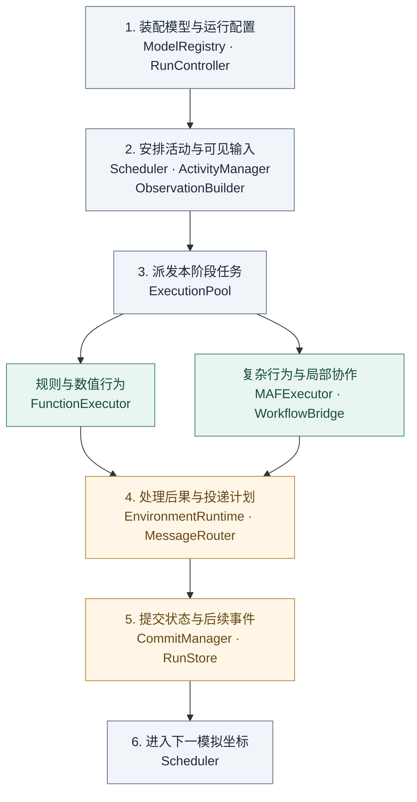

# 02 · 总体架构与职责

[返回总览](README.md) · 前一篇：[范围与需求](01-scope-and-requirements.md) · 下一篇：[模型与合同](03-model-and-contracts.md)

## 1. 架构选择

采用“模型组件—模拟协调—共享执行—持久支撑”的组织方式。模型组件表达主体和环境；模拟协调确定何时执行、看见什么及结果何时生效；共享执行运行函数和 MAF；持久支撑保存状态、恢复依据和调用账目。

MAF 的内部图调度留在行为与活动中。新系统围绕它组织跨活动的时间、资源和信息关系。MASim 中适用的配置、主体、拓扑、消息和 Ray 经验按职责迁入，迁移表见 [11](11-migration-and-engineering.md)。

## 2. 逻辑运行图

图中展示主要处理顺序。运行完成装配后，反复执行第 2–6 步；共享存储和观测连线省略，以保持图的可读性。

两类执行都返回 `SegmentResult`。同阶段结果收齐后，环境处理行动，消息模块生成投递计划，提交模块统一保存后果与后续事件。独立主体可以直接形成执行任务，只有持续交互才建立活动。

## 3. 模块职责

| 模块 | 主要输入 → 输出 | 负责的规则或状态 |
|---|---|---|
| ModelRegistry | 定义与配置 → ValidatedSpec | 组件注册、版本、类型和组合约束 |
| RunController | 运行定义与操作 → 运行状态 | 初始化、暂停、恢复、停止及协调进程生命周期 |
| Scheduler | 已提交事件 → 到期事件集合 | 模拟坐标、事件顺序和阶段推进 |
| ActivityManager | 事件、主体与活动视图 → ExecutionPlan | 激活、成员、生命周期、等待和接续位置 |
| ObservationBuilder | 指定版本与参与身份 → ActorView | 可见字段、已到达消息、允许使用的记忆和能力描述 |
| ExecutionPool | 执行请求 → 候选结果引用 | 派发、并发、尝试与 worker 资源 |
| FunctionExecutor / MAFExecutor | 可见输入与接续状态 → SegmentResult | 行为计算、MAF 局部执行与输出校验 |
| WorkflowBridge | MAF 外部请求 ↔ SimulationRequest / Response | 模拟交互节点、请求身份映射与返回边界 |
| EnvironmentRuntime | 状态视图、候选行动、定时事件 → EffectPlan | 能力检查、资源约束、冲突和后果 |
| MessageRouter | 消息、成员和关系视图 → DeliveryPlan | 接收者、信息范围、可见时间与投递身份 |
| CommitManager / RunStore | 结果与后果计划 → CommitReceipt | 联合更新、版本检查、事务写入与恢复依据 |
| ModelAccess / RunRecorder | 调用和过程记录 → 配额、账目与观测 | 端点总负载、费用、因果关联、指标及导出 |

模块是职责边界，无须全部部署成独立服务。参考实现中，Scheduler、ActivityManager、EnvironmentRuntime、MessageRouter 与 CommitManager 位于每次运行的协调进程；worker 和端点配额服务独立承载。

## 4. 状态归属

| 状态 | 规则归属 | 持久保存位置 | 谁可以提出修改 |
|---|---|---|---|
| 主体属性与长期记忆 | 主体更新规则 | RunStore + 内容引用 | 所属主体的有效行为、已声明的环境规则 |
| 环境资源、空间和关系 | 对应环境模块 | RunStore | 注册操作与环境定时事件 |
| 活动成员、状态与等待 | ActivityManager | RunStore | 有权限的参与者请求、模板生命周期规则 |
| 工作流位置与成员会话 | MAF 适配层 | BlobStore，RunStore 指向生效版本 | 该活动唯一有效的执行尝试 |
| 消息与可见时间 | MessageRouter | RunStore + 内容引用 | 有效发送请求及系统反馈 |
| 任务、尝试、预算和用量 | 执行层、ModelAccess | 运行账目表 | 相应运行组件 |

worker 可以保存候选载荷，不直接覆盖已生效主体或环境状态。主体拥有资源引用时，资源余额仍由环境模块管理，避免两处余额相互矛盾。所有共享字段须有唯一的权威更新位置。

## 5. 三条关键边界

**计算与生效。** 一次 MAF 调用完成，只表明产生了可校验结果。资源获得、消息发送和活动完成由提交确认；流式输出用于观测。

**局部流程与全局时间。** MAF 管理节点、分支和局部并发；Scheduler 管理模拟坐标。一次工作流可以跨多个模拟时刻，一个模拟阶段也可以执行多个工作流。

**持久状态与暂态对象。** 主体和活动长期存在；Python 对象、Ray 引用和客户端连接可以重建。恢复读取已提交引用，不能依赖某个 worker 的残留内存。

## 6. 完整运行链

1. 校验组件和配置，展开群体定义，持久化初始状态与初始事件。
2. 选取到期事件，固定阶段读取版本，生成主体任务和活动接续任务。
3. 为每名参与者构造独立视图，保存任务清单，再有界派发。
4. 函数或 MAF 执行一个片段，返回完整候选结果和接续引用。
5. 环境处理行动与定时后果；活动和消息规则形成相应更新。
6. 检查版本、运行所有权及有效尝试，一次提交状态和后续事件。
7. 将反馈安排到允许可见的坐标，继续运行或进入等待、暂停、完成状态。

时间细则见 [07](07-time-and-communication.md)，数据库提交细则见 [09](09-state-and-recovery.md)。终态行为不由这张处理链预先决定，具体结果取决于行为组件和环境规则。
