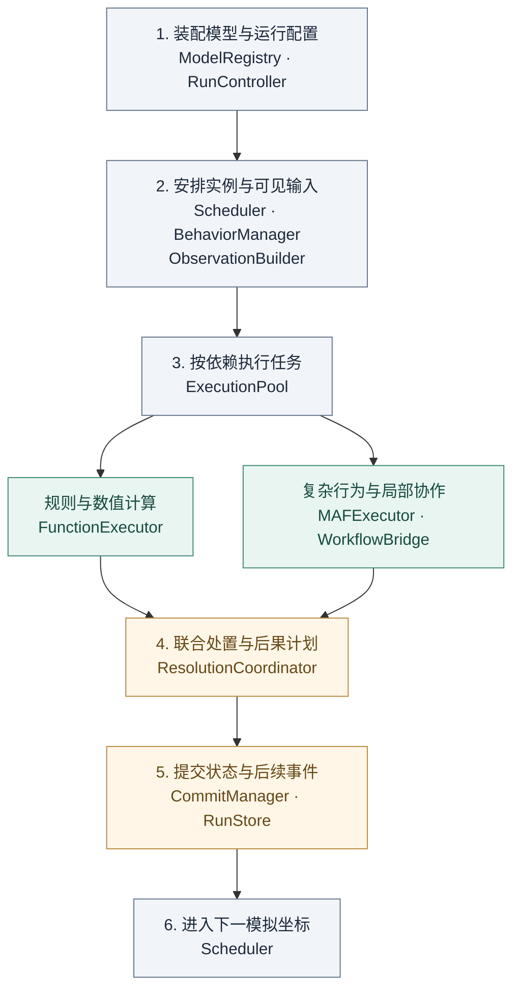

# 02 · 总体架构与职责

[返回总览](README.md) · 前一篇：[范围与需求](01-scope-and-requirements.md) · 下一篇：[模型与合同](03-model-and-contracts.md)

## 1. 架构选择

采用“模型组件—模拟协调—共享执行—持久支撑”的组织方式。模型组件表达主体、环境和机制；模拟协调确定时间、输入与后果；共享执行运行函数和 MAF；持久支撑保存状态、恢复依据和调用账目。

MAF 承载主体决策、内部协作和活动流程。模拟协调层管理长期存在的主体与活动，处理它们之间的资源、信息和时间关系。MASim 适用资产按职责迁入，见 [11](11-migration-and-engineering.md)。

## 2. 逻辑运行图

装配后反复执行第 2–6 步。共享存储和观测连线省略，以保持主要处理顺序清楚。

第 3 步按模型声明的依赖完成输入准备、行为计算和可选的环境辅助判断。结果齐备后，系统统一确定行动后果，生成状态更新与消息投递计划。各类任务的输入输出见 [03](03-model-and-contracts.md)。

## 3. 模块职责

| 模块 | 输入 → 输出 | 负责的规则或状态 |
|---|---|---|
| ModelRegistry | 模型与执行配置 → ValidatedSpec | 组件、模型绑定、版本和组合检查 |
| RunController | 定义与操作 → 运行状态 | 初始化、暂停、恢复、停止与协调进程 |
| Scheduler | 已提交事件 → 到期集合 | 模拟坐标、事件顺序和阶段推进 |
| ActivityManager | 活动请求与处置 → 活动计划 | 成员、参与条件和领域生命周期 |
| BehaviorManager | 事件与实例状态 → PhasePlan / 行为计划 | 独立及活动实例、触发合并、等待与接续位置 |
| ObservationBuilder | 版本与身份范围 → ActorView | 当前可见字段、消息、角色记忆与能力 |
| MechanismPlanner | 阶段规则与上游结果 → 机制任务 | prepare / adjudicate 依赖、输入范围及结果消费绑定 |
| ExecutionPool | 执行请求 → 完整候选引用 | 统一派发、并发、任务尝试与资源 |
| FunctionExecutor / MAFExecutor | 授权输入 → SegmentResult 或 MechanismResult | 行为和机制计算、局部流程、输出校验 |
| WorkflowBridge | MAF 请求 ↔ 模拟反馈 | 请求身份、当前视图注入、去重与接续 |
| ResolutionCoordinator | 请求、更新、规则、机制结果 → DispositionPlan | 跨模块约束、组合成败和资源分配 |
| EnvironmentRuntime / ActorStatePolicy | 固定处置 → 环境 / 主体计划 | 领域规则、状态归属及更新计划 |
| MessageRouter | 固定处置与成员规则 → DeliveryPlan | 接收者、信息范围、可见时间和投递身份 |
| CommitManager / RunStore | 完整计划 → CommitReceipt | 所有权、版本、联合事务与恢复依据 |
| ModelAccess / RunRecorder | 调用和过程记录 → 配额、账目与观测 | 模型身份核对、总负载、费用与来源关联 |

这些是逻辑职责，无须分别部署服务。参考实现将调度、实例管理、领域验证与处置、消息和提交组织在每 run 的协调进程中；行为及机制模型计算进入共享 worker，端点配额由共享 ModelAccess 管理。

## 4. 状态归属

| 状态 | 规则归属 | 唯一生效位置 |
|---|---|---|
| 主体属性、长期记忆与内部角色状态 | 所属主体的更新和记忆规则 | ActorState 及其 SubAgentState 引用 |
| 环境资源、空间和关系 | 所属环境模块 | 相应环境状态 |
| 活动成员、共享记录和领域状态 | ActivityManager | ActivityState |
| 流程位置、局部角色会话与待请求 | BehaviorManager + MAF 适配 | BehaviorInstanceState 指向的 checkpoint 根 |
| 消息、反馈和可见时间 | MessageRouter | 消息、响应与投递记录 |
| 任务、选中候选、预算和用量 | 执行层与 ModelAccess | 运行账目，不推进模拟状态版本 |

状态元数据保存在 RunStore，大载荷通过不可变引用进入 BlobStore。ActorState 和 ActivityState 通过行为实例关联各自的流程进度。

worker 产生候选结果，由状态所属模块决定如何更新。主体规则管理长期属性与记忆，行为实例保存局部会话与执行位置；资源余额由环境管理，主体和活动持有资源引用。

## 5. 关键边界

**持久状态与执行对象。** 主体、内部角色和活动按各自生命周期保留状态，worker 按任务分配与释放。状态容量和同时运行的计算量因此可以分别扩展。

**计算与生效。** 一次 MAF 调用完成只产生候选。联合处置确定请求和更新的结果，各模块据此生成更新计划，再由数据库统一提交。

**局部流程与全局时间。** MAF 管理节点、分支和内部并发；Scheduler 管理模拟坐标。机制任务的依赖顺序也不自动增加模拟时长。

**模型与部署。** 行为、模型身份、解码、信息和时间规则属于模型定义；worker、连接、凭据和配额属于执行配置。恢复核对二者的绑定关系。

## 6. 完整运行链

1. 校验模型，展开群体与环境，保存初始状态和事件。
2. 固定本阶段读版本，安排独立或活动行为实例及机制依赖。
3. 构造授权输入，封存各工作阶段任务，再经共享执行池计算。
4. 保存完整候选与接续状态，固定供下游使用的上游结果。
5. 统一确定请求结果，各模块生成相应状态更新与后续事件。
6. 检查版本、有效尝试与运行所有权，一次提交状态和后续事件。
7. 到允许坐标后，携带当前视图与反馈继续实例，或进入等待、暂停、结束状态。

数据合同见 [03](03-model-and-contracts.md)，时间见 [07](07-time-and-communication.md)，提交与恢复见 [09](09-state-and-recovery.md)。行为路径由组件与环境规则共同决定。
