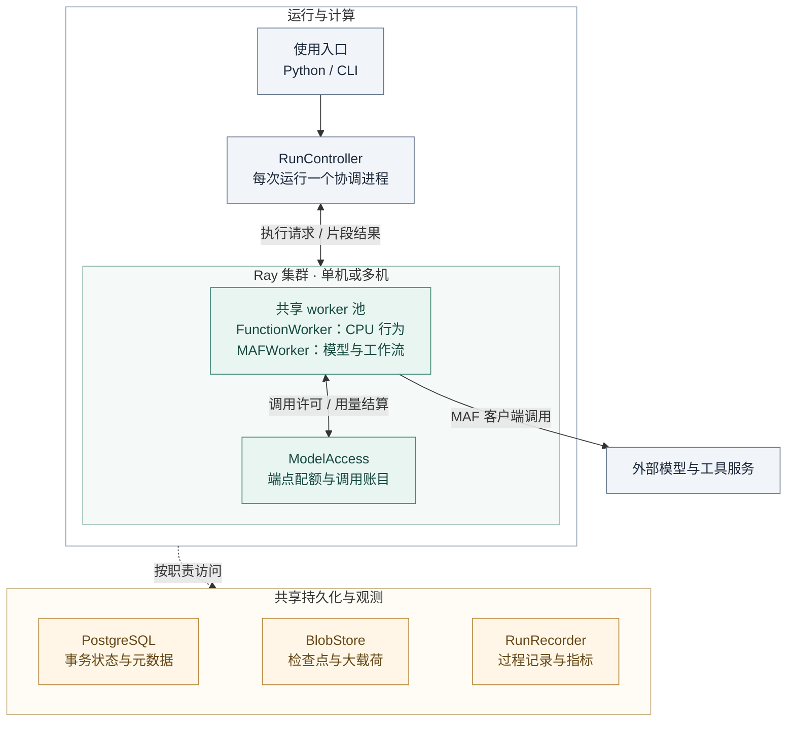

# 08 · 分布式执行、规模与成本

[返回总览](README.md) · 前一篇：[时间与通信](07-time-and-communication.md) · 下一篇：[状态与恢复](09-state-and-recovery.md)

## 1. 执行路线与理由

参考实现采用 Python、MAF、Ray、PostgreSQL 和 BlobStore。一个 run 保持一个逻辑协调与提交顺序，行为任务分配给有界共享 worker。多个独立 run 可以分别配置协调进程并共享模型端点配额。

这一路线复用 MASim 的 Ray 经验，同时使主体总数和实际计算资源分别扩展。代价是增加状态装载、接续重建与事务存储；单个 run 的共享环境和提交顺序仍可能限制扩展。

MAF 负责客户端、工具循环和局部工作流，Ray 负责执行进程及资源调度。模型推理服务作为端点接入，本系统管理它的使用方式，不承担训练或另建推理引擎。

## 2. 物理部署



虚线概括按职责访问：协调进程提交模拟状态，ModelAccess 写调用账目，worker 写候选载荷，RunRecorder 读取过程记录。数据库保存哪些对象见 [09](09-state-and-recovery.md)。

单机开发部署本地 Ray、PostgreSQL 与本地持久 BlobStore；多机部署沿用相同合同，BlobStore 必须能由所有执行节点读取。worker 本机临时目录和 Ray 对象存储都不作为恢复的唯一依据。

## 3. 资源对象与粒度

| 对象 | 承载位置 | 扩展单位 |
|---|---|---|
| 主体状态 | RunStore，按需缓存 | 持久主体数量及热状态体积 |
| 活动与等待 | RunStore + checkpoint 引用 | 未结束活动数量、成员数与待响应请求 |
| FunctionWorker | Ray 计算进程 | CPU 任务及简单行为批次 |
| MAFWorker | 有界异步 Ray Actor | 活动片段和模型 I/O |
| 模型客户端 | worker 自己的事件循环 | 可复用连接，不共享可变会话 |
| ModelAccess | 端点级共享配额服务 | endpoint / quota group |
| 协调与后果处理 | 每 run 一个逻辑协调进程 | 独立运行，或未来有证据支持的内部优化 |

MAFWorker 使用显式并发上限；阻塞函数和 CPU 密集处理进入 FunctionWorker。Ray 异步 Actor 复用单个事件循环，阻塞操作会影响其他任务，因此需要测量实际的非阻塞路径。[Ray 异步 Actor](https://docs.ray.io/en/latest/ray-core/actors/async_api.html)

worker 按请求装载活动实例，完成或进入持久等待后释放。缓存流程工厂、客户端与不可变定义；可变会话始终按身份和版本重建。

## 4. 六项规模方法

| 方法 | 要降低的开销 | 保持的条件 |
|---|---|---|
| 事件定位与等待索引 | 大量未激活主体的空检查 | 激活集合和时间规则相同 |
| 有界派发与背压 | 无界任务、模型队列及结果堆积 | 当前阶段任务清单保持完整 |
| 简单行为批处理 | 细粒度 Ray 调度与 I/O | 每项任务身份、随机流和处置可单独恢复 |
| 版本化装载与热缓存 | 重复读库和构造成本 | 缓存键包含版本，不能读到未来状态 |
| 连接与模板复用 | 客户端握手、工厂初始化 | 活动和会话状态隔离 |
| 共享内容与批写记录 | 重复载荷、投递及写入成本 | 逻辑接收者和恢复记录仍完整 |

稀疏激活通过减少实际工作取得收益；密集交互与高争用负载仍可能受屏障或环境限制。目标是测清每种负载的主导成本，再调整对应层。

AgentSociety 2 的当前架构提供了状态重建、批次执行与共享服务的参考；它的 LLM 并发控制以进程为单位，本方案还需端点级总配额，不能直接把局部并发上限相加作为全局治理。[AgentSociety 2 架构](https://agentsociety2.readthedocs.io/en/latest/architecture.html)

## 5. ModelAccess 如何管理模型调用

```text
MAF 即将调用模型
  → 检查 run / task / attempt 是否仍有效
  → 申请端点并发许可和用量预留
  → worker 通过 MAF client 发出实际请求
  → 保存响应或错误
  → 结算用量并释放可确认的许可
```

配额包含端点总并发、请求速率、token 速率及 run 预算。每个调用归因到 run、actor、activity、task、attempt 和 call。费用上限依据已知价格、输入估计和最大输出预留；未知价格或供应商未报告用量时标注估计，不能宣称精确费用保证。

MAF chat middleware 可覆盖工具循环中的各次模型调用，适合作为入口；SDK 内部重试应关闭或显式纳入统一策略。仅包围最外层 Agent 调用无法完整统计多步调用。[MAF Middleware](https://learn.microsoft.com/en-us/agent-framework/concepts/agents/middleware/)

采用一次逻辑配额所有者管理一个端点配额组，持久账目支持服务重建。失效 worker 和旧协调实例不能取得新调用许可。运行层重试有明确次数和退避，工具及业务层不能再叠加未登记的重试。

调用中断且结果未知时保留 unknown 账目，通过查询或明确的核对策略处置；外部请求可能仍在运行，租约到期不证明调用已经结束。恢复无法确认时暂停相应调度，避免无依据地释放全部预算再重复调用。

预算不足停止派发新调用，收集已在执行的结果。若本阶段不能完成，则保存部分阶段进度并暂停；恢复仍使用原任务清单与输入版本，详见 [09](09-state-and-recovery.md#pause)。

## 6. 执行优化与模型变化

| 调整 | 分类 | 检查方式 |
|---|---|---|
| worker 数、传输压缩、批写 | 执行优化 | 固定响应下状态与因果关系一致 |
| 确定性纯函数缓存 | 执行优化，前提是完整输入和版本相同 | 缓存与重算结果相同 |
| 固定运行响应回放 | 回放模式 | 严格匹配请求与保存响应 |
| 复用一次 LLM 输出给多个主体 | 模型变化 | 可能改变随机性与主体间相关性 |
| 语义缓存、摘要、反思频率 | 模型变化 | 记录信息变换并比较行为影响 |
| 主体聚合、代表者、活跃抽样 | 模型变化 | 保存成员映射与策略，对照未聚合模型 |
| 低频 LLM 计划 + 高频规则执行 | 显式混合行为 | 计划有效期、更新触发和执行边界可查看 |
| 超时改用其他行为 | 显式故障模型 | 标记触发条件及对模拟的影响 |

这些模型化方法可以充分利用 MAF 的组合能力，但需要由模型作者选择。默认运行不会因机器负载而自动改变主体行为机制。

## 7. 怎样报告规模

至少同时报告 N（持续主体）、A（活跃任务）、K（未结束活动）、活动成员数、消息密度、状态体积、模拟时长及端点吞吐。主体容量与单位墙钟时间完成的有效工作分别计量。

阶段基础模型调用量约为 `活跃片段数 × 每片段平均调用数`，再加解释、检索辅助和重试调用。实际成本还取决于上下文长度、输出长度和价格。总主体数不能单独决定预算。

单 run 的关键风险是慢任务屏障、共享环境热点、串行提交与数据装载。未来若要在一个 run 内分区推进，需证明跨区因果和冲突规则，不能仅以更换队列替代这项设计工作。
