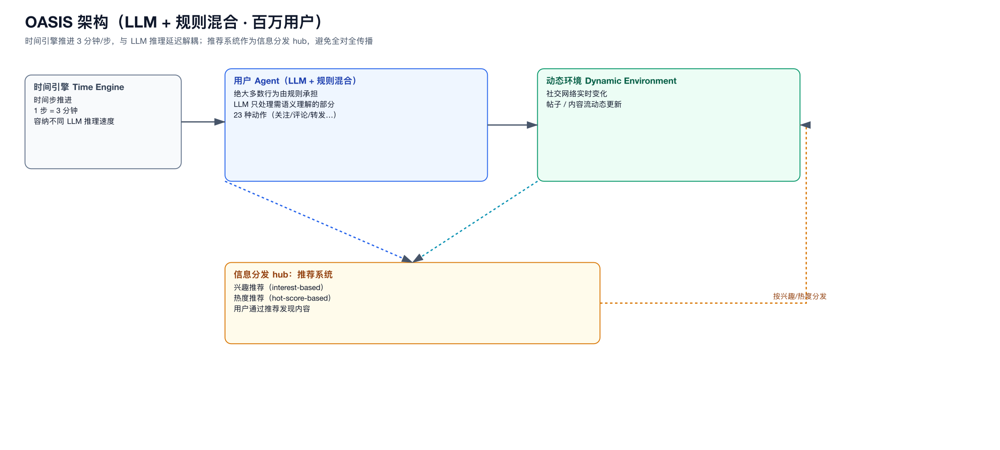
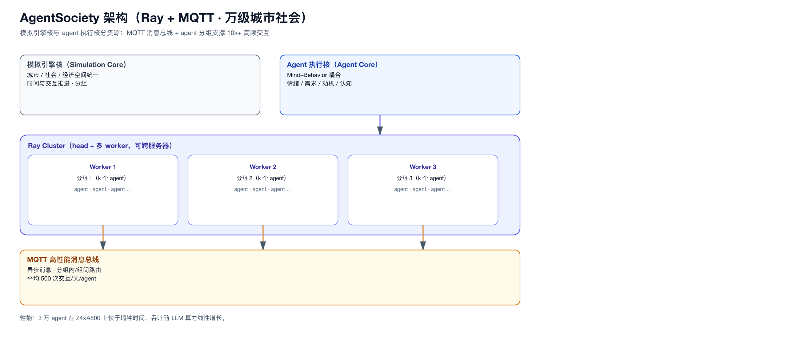

# 01 · 大规模社会模拟器（10⁴~10⁶）

> 这一类是所有「已有工作」里最接近“几十万 agent”目标的，也是规模经验的直接来源。

## 1. OASIS（百万级社交媒体模拟）

- 出处：NeurIPS 2024 / arXiv 2411.11581；开源 camel-ai/oasis。
- 定位：LLM + 规则混合，模拟 Twitter/Reddit 上**多达 100 万用户**。

### 核心架构
- **混合引擎**：LLM agent 与 rule-based agent 共存；绝大多数行为由规则承担，LLM 只处理需要语义理解的部分。
- **时间引擎（Time Engine）**：时间步推进，1 步 = 3 分钟，显式“容纳不同 LLM 推理速度”——即时间推进与 LLM 延迟解耦。
- **动态环境**：社交网络与帖子内容随时间更新。
- **信息 hub = 推荐系统**：兴趣推荐 + 热度推荐，用户通过推荐发现内容，避免全对全传播。
- **23 种动作**：关注、评论、转发等，动作空间显式化。

### 关键事实
- 规模：10⁶ 用户。
- 研究目标：信息传播、群体极化、羊群效应。

### 对我们的启示
- “LLM+规则混合 + 时间步 + 信息 hub”是百万级的三板斧。
- **时间推进必须与 LLM 延迟解耦**，否则一轮 = 最慢的 LLM。

### 图

---

## 2. AgentSociety（万级城市社会模拟）

- 出处：ACL 2025 Industry / arXiv 2502.08691；清华。

### 核心架构
- **Ray 分布式 + MQTT 高性能消息系统**。
- **异步模拟架构 + agent 分组机制**。
- **Mind–Behavior 耦合**：agent 有心智层（情绪、需求、动机、认知）与行为层，按社会理论耦合。
- **环境**：城市/社会/经济三类空间统一。
- 明确把**模拟引擎核**与**agent 执行核**分资源（64 核：32 引擎 + 32 agent）。

### 关键事实
- 规模：10k+ agent，平均 500 次交互/天，共 500 万次交互。
- 吞吐：3 万 agent 在 24×A800 上“快于墙钟时间”，性能随 LLM 算力**线性增长**。
- 研究手段：survey / interview / intervention（问卷、访谈、干预）。

### 对我们的启示
- **Ray + 消息总线 + 分组 + 异步**是万级社会模拟的成熟工程组合。
- “引擎核 / 执行核分资源”直接对应我们“世界引擎 / 决策引擎分离”。

### 图

---

## 3. Project Sid（多智能体文明模拟）

- 出处：arXiv 2411.00114；Altera。

### 核心架构
- **PIANO**：Parallel Input Aggregation via Neural Orchestration（并行输入聚合 + 神经编排）。
  - 核心思想：**并发** + **信息瓶颈**（信息通过聚合瓶颈进入 agent，避免每个输入流都打断）。
- 10~1000+ agent 在 Minecraft 中长期共存，实时与人类/其他 agent 交互，保持多输出流一致。

### 关键事实
- 规模：10~1000+ agent。
- 涌现：职业分化、集体文明进步（复杂度非线性增长）。

### 对我们的启示
- **“信息瓶颈 + 并行聚合”** 是处理多子流/多输入的有效结构，可用于复合 agent 的子 agent 汇总。
- 验证了“数千 agent 长期共存 + 实时交互”的可行性边界。

---

## 4. 本类共性小结

| 系统 | 规模 | 混合 | 时间 | 信息分发 | 分布式 |
|------|------|------|------|----------|--------|
| OASIS | 10⁶ | LLM+rule | 时间步(3min) | 推荐 hub | 未强调（平台内） |
| AgentSociety | 10⁴ | LLM 为主 | 异步 | MQTT + 分组 | Ray |
| Project Sid | 10³ | LLM | 实时 | PIANO 瓶颈 | 未强调 |

**三条经验定律**：
1. 规模越大，rule 占比越高（OASIS 最极端）。
2. 时间推进必须与 LLM 延迟解耦。
3. 信息分发必须有 hub/瓶颈，不能全对全。
