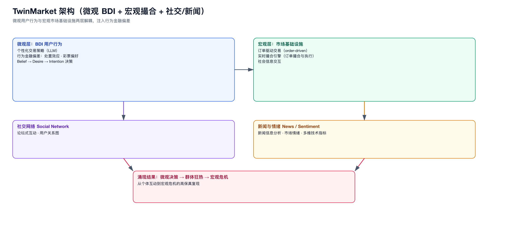
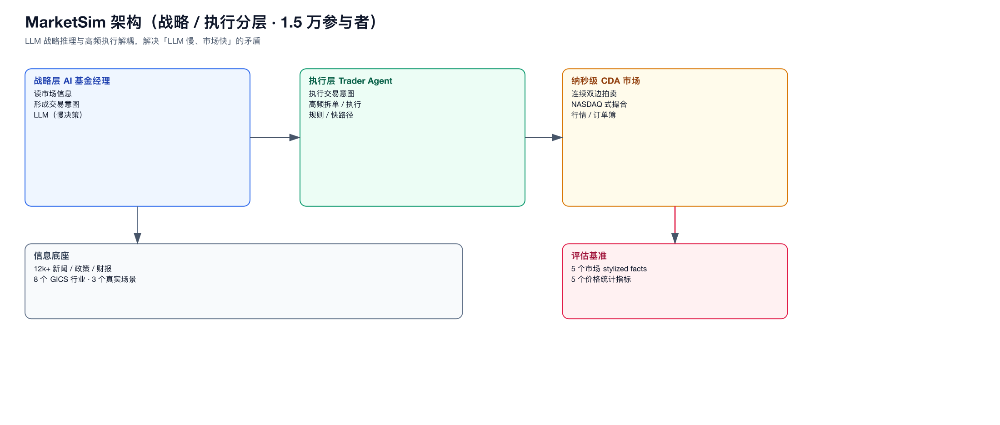

# 02 · 金融 / 经济模拟器

> 这是与 MASim 同域的直接邻居，重点关注“微观决策 + 宏观市场基础设施”如何组合、如何规模化。

## 1. TwinMarket（可扩展行为与社会金融市场模拟）

- 出处：NeurIPS 2025 / arXiv 2502.01506；ICLR 2025 Financial AI Workshop 最佳论文。

### 核心架构（两层）
- **微观层**：BDI（Belief–Desire–Intention）驱动的用户行为——个性化交易策略、行为金融偏差（处置效应、彩票偏好等）。
- **宏观层**：订单驱动交易 + 社会信息交互；**实时撮合引擎**（订单撮合与执行）。
- **社交网络**：论坛式互动 + 用户关系图；**新闻/情绪分析**；多维技术指标。

### 关键事实
- 千人级 LLM 投资者，复现市场涌现现象（狂热、危机）。
- “个体互动 → 群体狂热 → 宏观危机”的涌现链路。

### 对我们的启示
- **BDI 微观 + 订单驱动宏观 + 社交信息 + 实时撮合**，几乎就是 MASim 的“同构加强版”。
- 行为金融偏差（disposition effect、lottery）是让 LLM agent “像人”的关键注入点。

### 图

---

## 2. MarketSim（大规模股票市场生成式模拟）

- 出处：ICML 2026（poster 65297）。

### 核心架构（分层解耦）
- **战略层**：AI 基金经理读市场信息、形成交易意图（LLM 慢决策）。
- **执行层**：交易员 agent 在**纳秒级 NASDAQ 式连续双边拍卖**市场执行意图（高频快执行）。
- 接入 12k+ 新闻/政策/财报，8 个 GICS 行业、3 个真实场景。

### 关键事实
- 规模：15,000+ 异质参与者。
- 复现 5 个市场 stylized facts；高频价格动态平均 MAPE 3.48%。

### 对我们的启示
- **战略/执行分层**是金融场景“LLM 慢、市场快”矛盾的标准答案。
- stylized facts + 价格统计指标是**可复现、可校准**的评估基准。

### 图

---

## 3. TradingAgents（LangGraph 交易公司模拟）

- 出处：开源 TradingAgents（UCLA Tauric Research）。

### 核心架构
- **12 个 LLM agent + 3 个支撑组件**，经 LangGraph `StateGraph` 编排。
- 5 层结构：分析师团队（市场/技术/社交媒体情绪等）→ 研究员 → 交易员 → 风控 → …
- 4 个顺序阶段，由 Situation Summariser 串联；`Pydantic AgentState` 共享状态。

### 关键事实
- 规模：~12 agent（一个“公司”级协作）。
- 结构化输出（confidence、horizon 等）。

### 对我们的启示
- “基金公司 = 一组专家 sub-agent + 共享状态”是**复合 agent** 的直接范本。
- LangGraph 的 checkpoint 与共享 State 是 sub-agent 协作的现成机制。

---

## 4. EconAgent（宏观经济模拟）

- 出处：ACL 2024。
- 核心：**感知模块**造出异质 agent（劳动/消费决策），**记忆模块**让 agent 反思过去个体经历与宏观趋势。
- 规模：~100 agent。
- 启示：异质性来自“不同感知机制”，记忆用于“对宏观趋势的反思”。

---

## 5. CompeteAI（竞争行为）

- 出处：arXiv 2310.17512。
- 核心：LLM agent 竞争（两个餐馆），验证市场博弈行为。
- 规模：极小（几个 agent）。
- 启示：竞争/博弈类交互是微观机制的有效起点。

---

## 6. 本类共性小结

| 系统 | 规模 | 分层 | 市场模型 | 记忆/行为 |
|------|------|------|----------|-----------|
| TwinMarket | 10³ | 微观 BDI + 宏观撮合 | 订单驱动实时撮合 | 行为偏差注入 |
| MarketSim | 1.5×10⁴ | 战略/执行 | CDA（纳秒） | 新闻/政策 |
| TradingAgents | ~12 | 5 层团队 | 无（策略输出） | 共享 State |
| EconAgent | 10² | 感知+记忆 | 宏观劳动/消费 | 记忆反思 |
| CompeteAI | <10 | 无 | 博弈 | 无 |

**对金融域的结论**：
1. 金融模拟的“市场基础设施”（订单簿、撮合、行情）是**独立的、可复用的世界内核**，与“谁在决策”无关。
2. 规模化金融模拟必须**战略/执行分层**，否则 LLM 延迟无法匹配市场节奏。
3. 行为真实性靠**行为金融偏差 + 记忆/反思**注入，而非仅靠 prompt。
