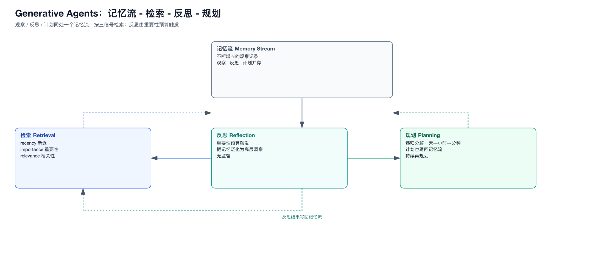

# 03 · 生成式智能体的行为学基础

> 这两篇是“让 LLM agent 像人”的方法论根基，决定了 agent 的**记忆、反思、规划、校准**怎么做。

## 1. Generative Agents（Park et al., UIST 2023）

### 核心：记忆-反思-规划三件套
- **记忆流（Memory Stream）**：一条不断增长的观察记录列表。
- **检索（Retrieval）**：按三个信号加权打分取回——**recency（新近）、importance（重要性）、relevance（相关性）**。
- **反思（Reflection）**：当“足够多的重要事情发生”时，把记忆泛化为高层洞察（重要性预算触发，非人工判分）。
- **规划（Planning）**：递归任务分解（天 → 小时 → 分钟），每层计划也存入记忆流；持续再规划。

### 关键点
- 观察、反思、计划**同处一个记忆流**，检索时相互竞争。
- 反思是**无监督、按重要性预算触发**的。

### 图

---

## 2. Generative Agent Simulations of 1,000 People（Park et al., 2024）

### 核心：访谈校准 + 专家反思
- **AI 访谈者**：半结构化访谈 + 动态追问。
- **专家反思模块**：从 4 个领域专家视角合成访谈（不是简单摘要）。
- **全文注入**：整段访谈原文（非摘要）用于生成响应。
- **思维链提示**。
- **测量框架**：与真实人的态度/行为 ground truth 对齐校准。

### 关键事实
- 规模：1,000 个真实个体（2 小时定性访谈）。
- 用“访谈 → 个体级数据 → 校准”提升行为对齐。

---

## 3. 对我们的启示

| 机制 | 来源 | 规模化后的取舍 |
|------|------|----------------|
| 记忆流 + 三信号检索 | Park 2023 | 保留，但记忆要**压缩 + 冷存储**，不能无限增长 |
| 重要性触发的反思 | Park 2023 | 保留，但反思触发要**节流**（否则又变成每轮 LLM 调用） |
| 递归规划（天/时/分） | Park 2023 | 对应“低频战略 + 高频执行”分层 |
| 访谈校准 | Park 2024 | **10⁵ 不可行**，退化为“统计校准”（分布对齐） |
| 专家反思 | Park 2024 | 用于少量关键/代表性 agent，不普及 |

**结论**：行为学范式在“保真”端（几十~几千）完全适用；在“规模”端必须把“逐人校准”替换为“统计校准 + 模板 + 分布”。
