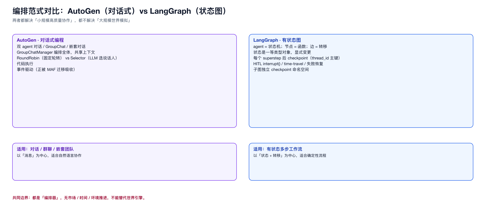

# 04 · 通用多智能体框架与编排

> 这一类解决“小规模、高质量协作”，是 MAF 的同类/前身，也是复合 agent 内部编排的候选机制。

## 1. AutoGen（Microsoft Research）

- 核心：**对话式编程**——把 agent 组合建模为“多轮对话”。
- 模式：双 agent 对话、**GroupChat**（一个 `GroupChatManager` 编排全体，共享上下文）、**嵌套对话**、代码执行。
- 说话人选择：`RoundRobinGroupChat`（固定轮转）vs `SelectorGroupChat`（LLM 选下一个说话人）。
- 现状：事件驱动架构，正被 **MAF 迁移吸收**（官方提供 AutoGen → MAF 迁移指南，强调从“事件驱动”转向“数据流/图”）。

## 2. LangGraph（LangChain）

- 核心：**有状态图**——agent = 状态机；节点 = 函数；边 = 转移；状态是一等类型对象，显式变更。
- **Checkpoint**：每个 superstep 后落盘；`thread_id` 主键；支持**失败恢复、time-travel、HITL `interrupt()`**。
- 子图有独立 checkpoint 命名空间。
- 借鉴点：checkpoint-per-superstep + thread 隔离，是我们“幂等/快照/断点续跑”的现成范式。

## 3. CrewAI

- 核心：**角色制 crew + 流程**；`Process.sequential` 或 `Process.hierarchical`（一个 manager agent 动态分派/验证）。
- 借鉴点：**hierarchical = 内部节点规划/分派/合成，只有叶子干活**，是 supervisor-worker 的教科书实现。

## 4. AgentScope（Java 2.0）

- 核心：JVM 生产级 agent 框架。
- **无状态水平扩展**；**多租户隔离**（session / user / agent / org 四级）；**双层层 agent 架构 + 事件流**；权限系统、中间件、工作区沙箱；**MCP/A2A 支持**。
- 借鉴点：**无状态 + 多租户隔离 + 事件流 + MCP/A2A** 是“生产级”与“标准互操作”的成熟样板。

## 5. CAMEL

- 核心：**角色扮演（role-playing）**——两个 agent（如用户/助手）经 inception prompting 自动生成协作。
- 借鉴点：角色化 + 自动任务生成，用于 persona 与多角色对话的自动化。

## 6. 编排框架的能力边界（重要）

| 框架 | 强项 | 弱项 |
|------|------|------|
| AutoGen | 对话/群聊/嵌套 | 无世界推进、无大规模 |
| LangGraph | 状态图/checkpoint/HITL | 单应用内，无市场/时间 |
| CrewAI | 角色 + 层级流程 | 无持久化规模 |
| AgentScope | 无状态扩展/隔离/MCP/A2A | 无领域世界 |
| CAMEL | 角色扮演/自动任务 | 协作规模小 |

**关键判断**：这些框架都**不管“世界如何运转、市场如何撮合、时间如何推进”**。它们是“编排器”，不是“世界引擎”。与 MAF 一样，它们是能力层候选，不能替代 MASim 的内核。

### 图

