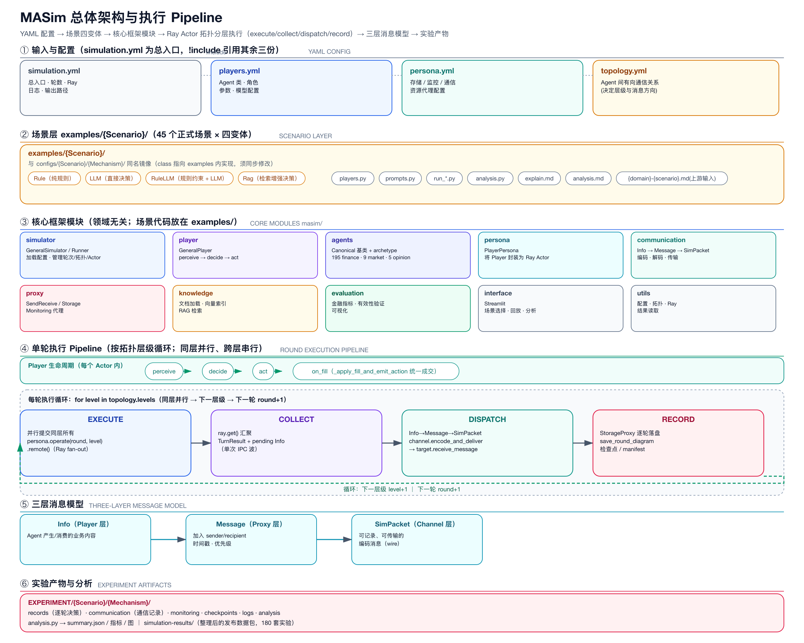
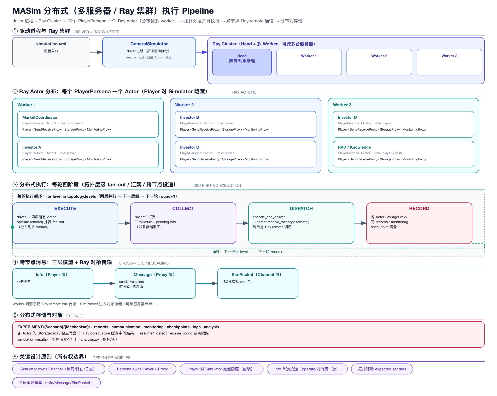

# 06 · 底座 A：MASim（我们的框架）

> 定位：**金融市场的“世界内核”**。这是混合架构要保留、不重写的部分。

## 1. 核心执行链

```
YAML 配置 → GeneralSimulator 创建 Ray Actor
→ PlayerPersona 托管 Player 与基础设施代理
→ Player perceive → decide → act (→ on_fill)
→ Communication/Proxy 路由消息 → Storage 逐轮落盘
→ analysis.py 指标与产物
```

## 2. 单轮四阶段（拓扑层级循环）

1. `execute`：同层 agent 并行 `operate()`；
2. `collect`：`ray.get()` 汇聚结果与待发消息；
3. `dispatch`：`Info→Message→SimPacket`，投递给目标；
4. `record`：落盘 + 拓扑图 + checkpoint。

## 3. 关键设计资产（要保留的）

- **三层消息模型**：`Info`（Player）→ `Message`（Proxy）→ `SimPacket`（Channel）。
- **四机制**：Rule / LLM / RuleLLM / Rag。
- **契约**：`_apply_fill_and_emit_action` 统一成交；archetype 只覆盖 `on_fill`，禁止 override `act/decide`。
- **所有权边界**：Simulator owns Channel；Persona owns Player + Proxy；Player 对 Simulator 隐藏。
- **断点续跑**：`detect_resume_round` + `write_resume_checkpoint`。
- **实验产物**：`EXPERIMENT/` + `simulation-results/` + `analysis.py`。

## 4. 规模现状与边界

- 已具备：Ray 分布式、拓扑层级、有状态 actor、消息与状态。
- 尚缺：统一异构引擎、分层聚合（group/hub）、协议桥（A2A/MCP/AG-UI）、成本/降级控制。

## 5. 在混合架构中的角色

- **世界引擎**：时间推进、市场撮合、拓扑、消息、状态、产物。
- **不负责**：agent 的“高质量协作编排”（交给 MAF）、外部协议互操作（交给 MAF）。

### 图


