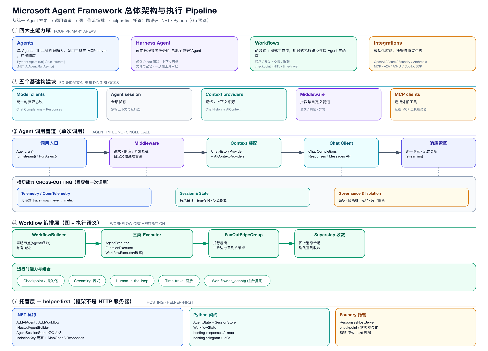
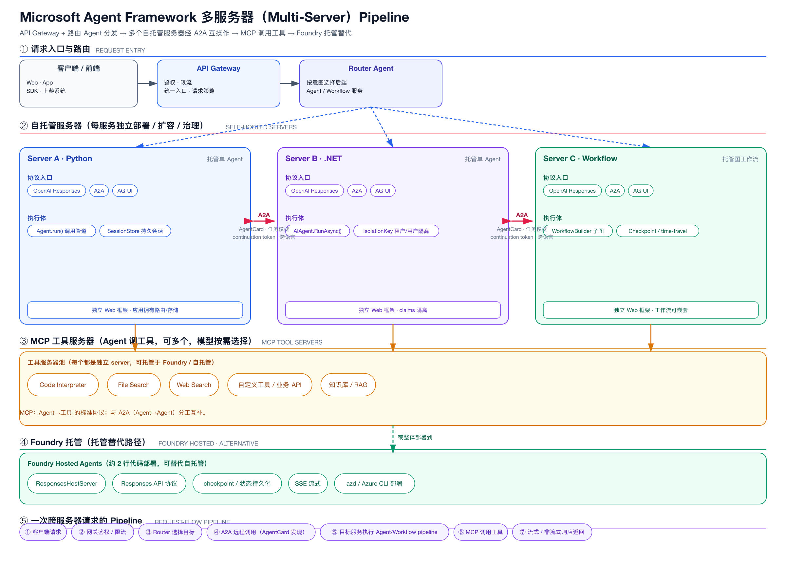

# 07 · 底座 B：Microsoft Agent Framework（MAF）

> 定位：**生产级 agent 的“决策/编排/协议/治理能力层”**。这是混合架构要借用的部分。

## 1. 四大主能力域 + 五基础块

- **Agents**：单 agent，调工具/MCP，统一 `run/run_stream`。
- **Harness Agent**：长任务“电池全带好”（规划/todo、上下文压缩、文件/记忆、一次性工具审批）。
- **Workflows**：图式（顺序/并发/交接/群聊）+ checkpoint + HITL + time-travel + `as_agent()`。
- **Integrations**：多供应商、托管、协议、生态。
- 五基础块：model clients、session、context providers、middleware、MCP clients。

## 2. 对混合架构最有价值的四项

1. **Workflow.as_agent()**：把图工作流当 agent 用 → 直接对应“复合 agent”。
2. **Harness / supervisor**：长任务与子任务分派 → 对应“复合 agent 的经理”。
3. **A2A / MCP / AG-UI**：标准协议互操作 → 对应“外部/远端子 agent 与工具接入”。
4. **SessionStore + isolation key**：会话持久化 + 多租户隔离 → 对应“状态与多租户”。

## 3. 托管哲学（重要）

- **helper-first**：MAF **不是** HTTP 服务器，应用拥有路由/鉴权/存储/扩容，框架只做协议翻译 + 可选执行状态。
- 意味着：MAF 可被“塞进”我们的 Ray 世界，作为 agent 决策的实现，而不是取代我们的运行时。

## 4. 能力边界

- 强：单个/少量 agent 的高质量定义、编排、协议、可观测、治理。
- 弱：**没有世界推进、市场撮合、大规模扇入扇出、10⁵ 级 actor 编排**。

## 5. 在混合架构中的角色

- **能力层**：复合 agent 内部编排、统一模型客户端、协议桥、会话/隔离、可观测。
- **不负责**：世界怎么运转（交给 MASim）。

### 图

