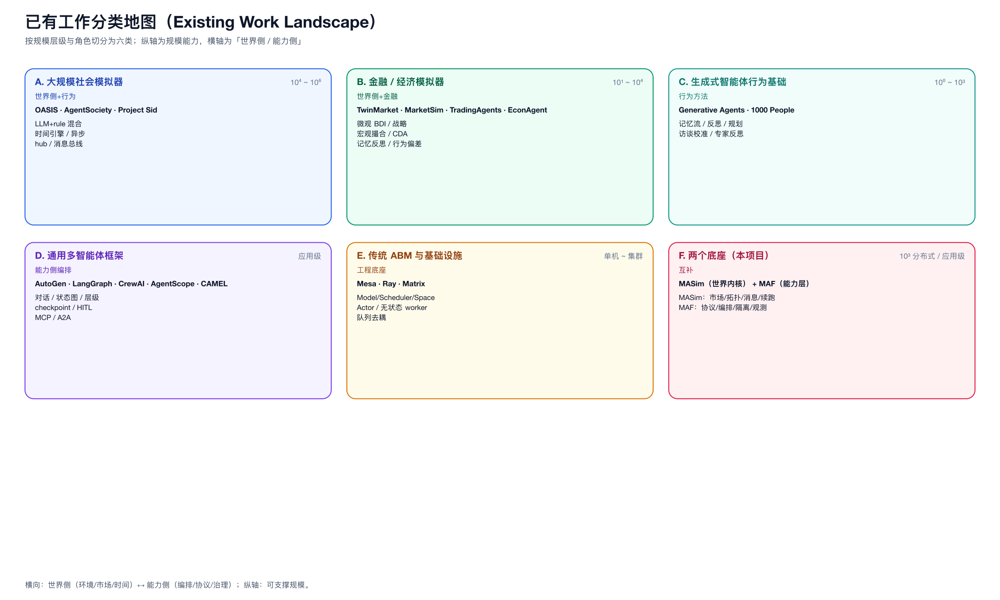

# 08 · 横向对比总表

> 用 8 个维度把已有工作放到同一把尺子上量。评分是**相对能力定位**（● 强 / ◐ 中 / ○ 弱 / — 不涉及），用于讨论，不是论文式打分。

## 1. 维度定义

| 维度 | 含义 |
|------|------|
| D1 规模上限 | 能支撑的 agent 数量级 |
| D2 异构引擎 | 代码/规则与 LLM 是否可混合 |
| D3 世界推进 | 时间/市场/环境是否自持 |
| D4 通信机制 | 消息/信息分发的组织方式 |
| D5 状态/持久化 | 快照、断点、幂等 |
| D6 协议互操作 | A2A/MCP/AG-UI 等标准协议 |
| D7 复合/sub-agent | 是否原生支持嵌套/子 agent |
| D8 成本/降级 | 预算、缓存、降级控制 |

## 2. 对比表

| 系统 | D1 规模 | D2 异构 | D3 世界 | D4 通信 | D5 状态 | D6 协议 | D7 复合 | D8 成本 |
|------|---------|---------|---------|---------|---------|---------|---------|---------|
| OASIS | ● 10⁶ | ● 混合 | ● 时间引擎 | ● 推荐hub | ◐ | ○ | ○ | ○ |
| AgentSociety | ● 10⁴ | ◐ | ● 城市 | ● MQTT+分组 | ◐ | ○ | ○ | ◐ |
| Project Sid | ◐ 10³ | ◐ | ● Minecraft | ● PIANO瓶颈 | ○ | ○ | ● 多流 | ○ |
| TwinMarket | ◐ 10³ | ● BDI+规则 | ● 撮合 | ● 社交+新闻 | ○ | ○ | ○ | ○ |
| MarketSim | ● 1.5×10⁴ | ● 战略/执行 | ● CDA | ◐ 新闻 | ○ | ○ | ● 分层 | ○ |
| TradingAgents | ○ ~12 | ○ 全LLM | ○ 无 | ○ | ◐ LangGraph | ○ | ● 12专家 | ○ |
| EconAgent | ○ 10² | ◐ | ● 宏观 | ○ | ◐ 记忆 | ○ | ○ | ○ |
| Generative Agents | ○ 25 | ○ 全LLM | ◐ 小镇 | ○ | ◐ 记忆流 | ○ | ○ | ○ |
| 1000 People | ◐ 10³ | ○ 全LLM | ○ | ○ | ○ | ○ | ○ | ○ |
| AutoGen | ○ 应用 | ○ | ○ | ● 群聊 | ◐ | ◐ | ● 嵌套 | ○ |
| LangGraph | ○ 应用 | ◐ | ○ | ○ | ● checkpoint | ◐ | ● 子图 | ○ |
| CrewAI | ○ 应用 | ○ | ○ | ○ | ○ | ○ | ● 层级 | ○ |
| AgentScope | ◐ 应用 | ◐ | ○ | ● 事件流 | ● 隔离 | ● MCP/A2A | ● 双层 | ◐ |
| Mesa | ◐ 单机 | ● 规则 | ● 时间步 | ○ | ○ | ○ | ○ | ○ |
| Ray | ● 集群 | — | — | ◐ 对象 | ● 对象 | ○ | ○ | ○ |
| Matrix | ● 集群 | ◐ | ○ | ● 队列 | ○ | ○ | ○ | ◐ 吞吐 |
| **MASim（我们）** | ● 10³ 分布式 | ● 四机制 | ● 市场/拓扑 | ● 三层消息 | ● 续跑 | ○ | ○ | ○ |
| **MAF** | ○ 应用 | ◐ | ○ 无 | ◐ | ● session | ● A2A/MCP | ● workflow | ◐ 中间件 |

## 3. 从对比表读出的关键事实

1. **没有任何一个系统同时拿到全部 8 项**。最强的是 OASIS（D1/D2/D3/D4）和 AgentSociety（D1/D3/D4），但它们都缺 D6/D7/D8。
2. **D6 协议互操作只有 MAF 和 AgentScope 较强**，而这二者都缺 D3 世界推进。
3. **D7 复合/sub-agent 强的是“应用级编排”（TradingAgents、CrewAI、MAF）**，但它们不解决大规模。
4. **MASim 已拿到 D1/D2/D3/D4/D5 的“世界侧”五项**，缺 D6/D7/D8 的“能力侧”三项。
5. **MAF 恰好补 D6/D7/D8（及 D5 的会话/隔离）**，缺 D1/D3/D4 的“世界侧”。

## 4. 结论：互补缺口完全对齐

```text
MASim 强：D1 规模 · D2 异构(四机制) · D3 世界 · D4 消息 · D5 续跑
MAF  强：D6 协议 · D7 复合/编排 · D8 治理/中间件 · D5 会话隔离
                         ↓
     两者缺口互补，且不重叠冲突 —— 这是混合架构成立的最强证据
```

### 图

