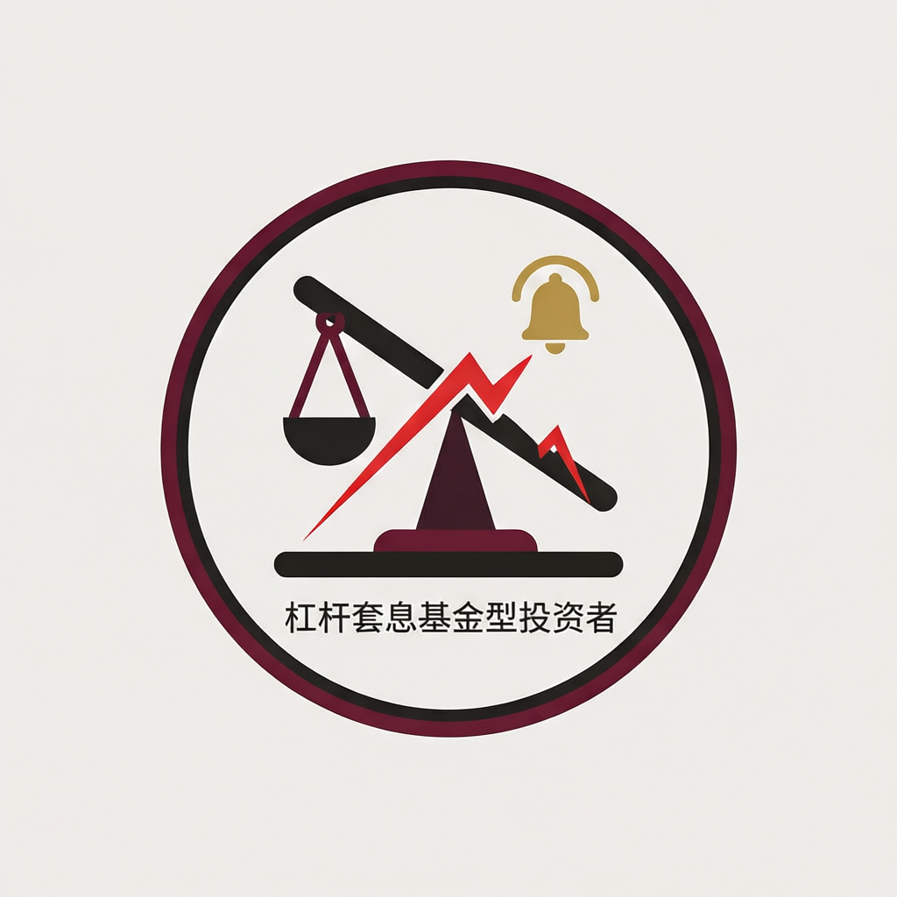

# Leveraged carry fund

## Summary

| Field                 | Content |
|-----------------------|---------|
| Archetype             | Stop-loss constrained leveraged carry fund |
| Theory Family         | Liquidity / Funding |
| Behavioral Tendency   | **Diverging** - forced liquidation amplifies funding-currency appreciation |
| Time Horizon          | short |
| Risk Tolerance        | high until constraint breach |
| Information Asymmetry | partial |
| Determinism           | deterministic |

## Definition and Goals

This agent models a leveraged macro fund whose carry position is governed by margin, stop-loss, or VaR discipline. The real-world counterpart is a leveraged FX fund or prime-broker-financed macro book. It emits sell orders when the funding-currency appreciation breaches the stop-loss threshold.

The decision goal is balance-sheet survival: liquidate quickly once losses breach the fund's risk rule. Non-goals: it must not provide stabilizing liquidity during its own constraint breach, and it must not override the stop-loss with discretionary optimism.

## Theoretical Foundation

**Funding-liquidity spiral**:
- Theory / Study: Market liquidity and funding liquidity.
- Citation: Brunnermeier, M. K., & Pedersen, L. H. (2009). Market liquidity and funding liquidity. *Review of Financial Studies*, 22(6), 2201-2238. https://doi.org/10.1093/rfs/hhn098
- Core Insight: Losses reduce funding capacity, forcing sales that depress prices further and tighten constraints.
- Mathematical Formulation: `forced_sell = min(position, leverage * base_size)` when `deviation > stop_loss`.
- Empirical Evidence: The paper formalizes margin spirals and documents funding-liquidity amplification.
- Relevance to This Agent: Stop-loss selling operationalises forced deleveraging.
- Calibration Source: `stop_loss` 0.02-0.06, `base_size` 400-1200, leverage 3-8.
- Falsification Conditions: If stop-loss breach does not produce a sell order, the agent is invalid.
- Alternative Theories: Patient value liquidation; discretionary macro stop-out.

## Design Purpose and Activation Triggers

Purpose: Convert funding shock losses into large forced sell orders.

Call Frequency: every-tick.

Prerequisite Signals:
- `price` available
- `deviation` available
- own `position` available

Missing-Signal Policy: hold when required inputs are missing.

Activation Triggers:
- `deviation > stop_loss`: sell `min(position, leverage * base_size)`.
- `<Default>`: hold or maintain prior exposure.

Deactivation Conditions:
- position exhausted.
- deviation returns below stop-loss threshold after liquidation.

Behavioral Adaptation by Condition:
| Condition | Behavioral change | Mechanism |
|-----------|-------------------|-----------|
| mild stress | hold | risk rule not yet breached |
| stop-loss breach | forced sell | margin discipline |

Environmental Dependencies: none beyond declared market broadcast and own state.

## Behavioral Framework

#### I/O Contract

##### Inputs (per decision call)

| Input | Source | Type / Shape | Required? | Notes |
|-------|--------|--------------|-----------|-------|
| `deviation` | environment | float | yes | stop-loss trigger |
| `position` | own state | float | yes | sell capacity |
| `price` | environment | float | yes | execution reference |

##### Outputs (per decision call)

| Field | Type | Valid Range / Enum | Unit | Required? | Meaning |
|-------|------|--------------------|------|-----------|---------|
| `action` | enum | `{"sell", "hold"}` | none | yes | forced liquidation action |
| `quantity` | float | `>= 0` | units | yes | sell size |
| `reasoning` | string | 1-3 sentences | none | yes | audit trail |

##### Content Constraints

Quantity cannot exceed current position.

##### Serialization Format

`<analysis>...</analysis><decision>{"action":"sell|hold","quantity":0.0,"reasoning":"..."}</decision>`

##### Implementer Contract Reminder

Every implementation variant must use the stop-loss branch exactly.

#### Decision Information Set

| Signal | Type | Memory Window | Rationale |
|--------|------|---------------|-----------|
| `deviation` | Continuous | 1 tick | stop-loss state |
| `position` | State | persistent | liquidation cap |
| `price` | Continuous | 1 tick | execution reference |

Does NOT use: long-run valuation, media narrative, private broker messages.

#### Core Behavioral Mechanism

1. Read `deviation`, `position`, and `price`.
2. If `deviation > stop_loss`, compute sell quantity.
3. Cap sell quantity at current position.
4. If threshold is not breached, hold.
5. Emit decision and update state after execution.

#### Action Space

| Aspect | Specification |
|--------|---------------|
| Action types allowed | sell, hold |
| Action parameter rule | market order at current price |
| Sizing rule | `min(position, leverage * base_size)` |
| Action lifetime | one decision call |
| Revision policy | repeated forced liquidation until inventory is exhausted |
| State constraint | position cannot become negative |
| Resource cap | sell quantity capped by position |
| Exit rule | stop selling when position is zero |

#### Mathematical Model

`q_sell = min(position, leverage * base_size)` if `deviation > stop_loss`; otherwise `q_sell = 0`.

| Symbol | Meaning | Default Value | Source |
|--------|---------|---------------|--------|
| `stop_loss` | forced-exit threshold | 0.03 | Brunnermeier & Pedersen (2009) |
| `leverage` | leverage multiplier | 5.0 | Brunnermeier & Pedersen (2009) |
| `base_size` | base liquidation size | 800.0 | Brunnermeier & Pedersen (2009), scenario normalization |

#### Behavioral Properties

- Time horizon: short, because stop-loss response is immediate.
- Risk tolerance: high before breach, low after breach.
- Information asymmetry: partial.
- Psychological profile: rule-bound risk control.

## Parameters

| Parameter | Type | Default | Valid Range | Sensitivity | Description | Impact | Source |
|-----------|------|---------|-------------|-------------|-------------|--------|--------|
| `stop_loss` | float | 0.03 | [0.02, 0.06] | high | forced-exit threshold | Higher -> later cascade | Brunnermeier & Pedersen (2009) |
| `leverage` | float | 5.0 | [3.0, 8.0] | high | liquidation multiplier | Higher -> larger forced sell | Brunnermeier & Pedersen (2009) |
| `base_size` | float | 800.0 | [400, 1200] | medium | base liquidation units | Higher -> larger order imbalance | Brunnermeier & Pedersen (2009), scenario normalization |

## Worked Numerical Examples

### Case 1 - Breach
System state: deviation 0.04, position 800.
Calculation: `q = min(800, 5 * 800) = 800`.
Decision: sell 800.
State update: position declines after execution.

### Case 2 - No Breach
System state: deviation 0.02.
Calculation: threshold not crossed.
Decision: hold.
State update: unchanged.

### Case 3 - Inventory Cap
System state: deviation 0.04, position 100.
Calculation: `q = min(100, 400) = 100`.
Decision: sell 100.
State update: position goes to zero after execution.

### Edge Case - Missing Signal
System state: deviation unavailable.
Calculation: missing-signal policy.
Decision: hold.
State update: unchanged.

## Behavioral Verification and Calibration

- Given `deviation > stop_loss`, agent must sell positive inventory.
- Given `position = 0`, agent must not sell.
- Given `deviation <= stop_loss`, agent must hold.

#### Ablation Hooks

| Ablation name | Setting | Hypothesis tested | Expected direction | Metric |
|---------------|---------|-------------------|--------------------|--------|
| no-forced-fund | `base_size = 0` | forced deleveraging drives cascade velocity | decrease | unwind velocity |

## Academic References

| # | Citation | Notes |
|---|----------|-------|
| 1 | Brunnermeier, M. K., & Pedersen, L. H. (2009). Market liquidity and funding liquidity. https://doi.org/10.1093/rfs/hhn098 | Funding-liquidity spiral |

## Design Provenance and Versioning

| Field | Content |
|-------|---------|
| Author | Codex |
| Created | 2026-07-08 |
| Version | 1.0.1 |
| Icon |  |
| Change log | Initial CarryTradeUnwind fork from leverage/funding-stress family; 1.0.1 — Added Icon row via polish-simulation-pipeline Step 2 icon-repair |
| Status | draft |
