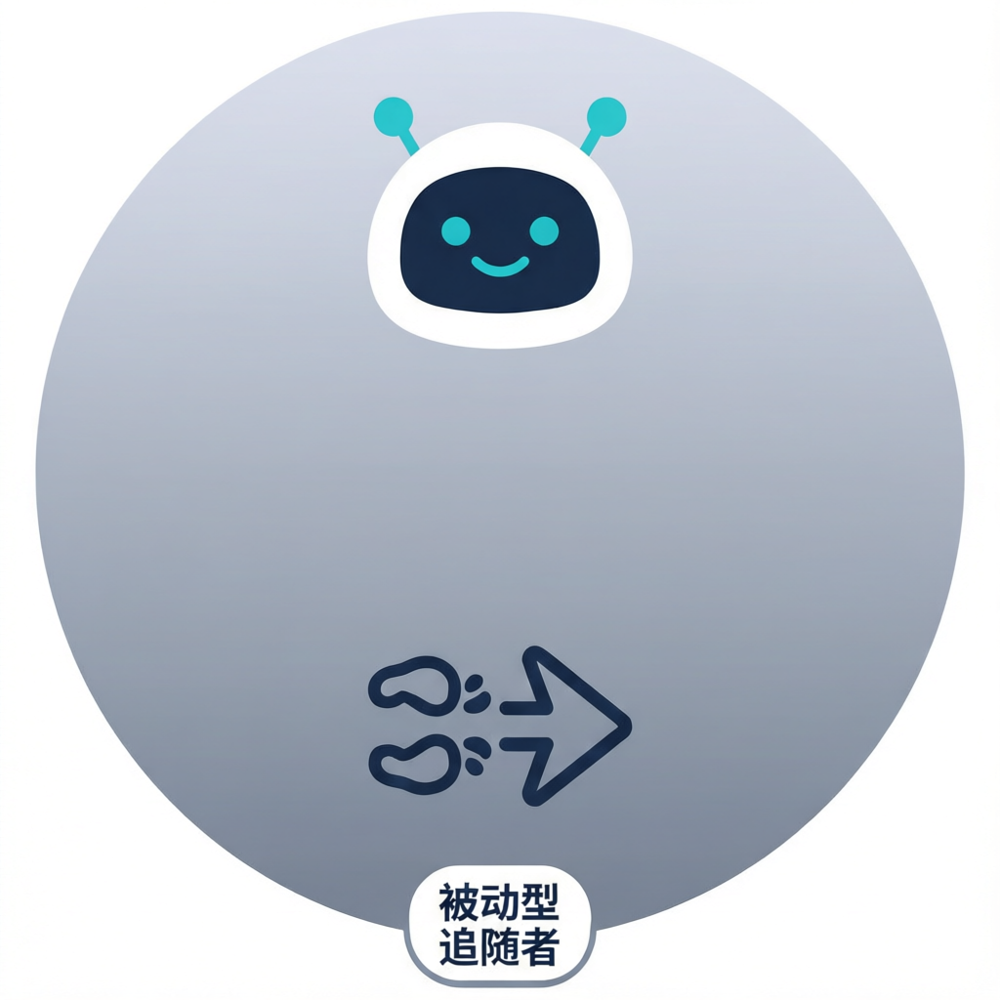

# Passive Follower

## Summary

| Field                 | Content |
|-----------------------|---------|
| Archetype             | Herding agent who mirrors the majority's recent action |
| Theory Family         | Herding / Social Learning |
| Behavioral Tendency   | **Amplifying** - copies the majority direction, reinforcing existing trends |
| Time Horizon          | short |
| Risk Tolerance        | medium |
| Information Asymmetry | high (uninformed, relies on social signal) |
| Determinism           | stochastic |

## Definition and Goals

This agent models an investor who lacks private information and instead infers the correct action by observing the majority's recent behavior. The real-world counterpart is the herding participant documented by Banerjee (1992) and Bikhchandani, Hirshleifer, and Welch (1992). The agent mirrors whichever action (buy or sell) was most prevalent among peers in the recent lookback window.

The decision goal is to follow the crowd signal, buying when the majority recently bought and selling when the majority recently sold. It is not an independent analyst and it does not use fundamental information. Non-goals: it must not act contrarian to the observed majority, and it must not trade when no clear majority exists.

## Theoretical Foundation

**Herding and social learning**:
- Theory / Study: A simple model of herd behavior; A theory of fads, fashion, custom, and cultural change.
- Citation: Banerjee, A. V. (1992). A simple model of herd behavior. *Quarterly Journal of Economics*, 107(3), 797-817. https://doi.org/10.2307/2118364
- Citation: Bikhchandani, S., Hirshleifer, D., & Welch, I. (1992). A theory of fads, fashion, custom, and cultural change as informational cascades. *Journal of Political Economy*, 100(5), 992-1026. https://doi.org/10.1086/261849
- Core Insight: When private signals are weak, rational agents discard their own information and copy predecessors, creating informational cascades. Once a cascade forms, even many agents acting identically convey no additional information.
- Mathematical Formulation: `action = majority_action` when `abs(majority_fraction - 0.5) > consensus_threshold`.
- Empirical Evidence: Banerjee shows cascades form even with rational agents; Cipriani & Guarino (2005) document herding in financial markets.
- Relevance to This Agent: The agent operationalizes cascade-following by copying the majority with probability proportional to consensus strength.
- Calibration Source: `consensus_threshold` 0.05-0.20, `follow_fraction` 0.10-0.30, `lookback` 5-20.
- Falsification Conditions: If the agent acts against the observed majority or trades without majority information, the design is falsified.
- Alternative Theories: Momentum trading (Jegadeesh & Titman 1993); rational expectations equilibrium without cascades.

## Design Purpose and Activation Triggers

Purpose: Amplify existing market trends by adding order flow in the majority's direction, modeling the destabilizing effect of herding behavior.

Call Frequency: every-tick.

Prerequisite Signals:
- `majority_action` available (most common action in lookback: "buy" or "sell")
- `majority_fraction` available (fraction of peers taking majority action, 0.5-1.0)
- `price` available
- own `cash` and `position` available

Missing-Signal Policy: hold when any required signal is unavailable.

Activation Triggers:
- `majority_fraction > 0.5 + consensus_threshold` AND `majority_action == "buy"` AND `cash > 0`: buy.
- `majority_fraction > 0.5 + consensus_threshold` AND `majority_action == "sell"` AND `position > 0`: sell.
- `<Default>`: hold.

Deactivation Conditions:
- no clear majority (fraction within threshold of 0.5).
- resources exhausted.

Behavioral Adaptation by Condition:
| Condition | Behavioral change | Mechanism |
|-----------|-------------------|-----------|
| strong buy consensus | buys aggressively | herd following |
| strong sell consensus | sells aggressively | panic herding |
| no consensus | holds | no informational cascade |

Environmental Dependencies: requires peer action aggregation (majority signal).

## Behavioral Framework

#### I/O Contract

##### Inputs (per decision call)

| Input | Source | Type / Shape | Required? | Notes |
|-------|--------|--------------|-----------|-------|
| `price` | environment | float | yes | execution reference |
| `majority_action` | environment | enum {"buy","sell"} | yes | most common peer action |
| `majority_fraction` | environment | float [0.5, 1.0] | yes | strength of consensus |
| `cash` | own state | float | yes | buy capacity |
| `position` | own state | float | yes | sell capacity |

##### Outputs (per decision call)

| Field | Type | Valid Range / Enum | Unit | Required? | Meaning |
|-------|------|--------------------|------|-----------|---------|
| `action` | enum | `{"buy", "sell", "hold"}` | none | yes | order direction |
| `quantity` | float | `>= 0` | units | yes | order size |
| `reasoning` | string | 1-3 sentences | none | yes | audit trail |

##### Content Constraints

Required fields are `action`, `quantity`, and `reasoning`. Quantity is clamped to available resources.

##### Serialization Format

`<analysis>...</analysis><decision>{"action":"buy|sell|hold","quantity":0.0,"reasoning":"..."}</decision>`

##### Implementer Contract Reminder

Every implementation variant must consume the same inputs and emit the same decision fields.

#### Decision Information Set

| Signal | Type | Memory Window | Rationale |
|--------|------|---------------|-----------|
| `price` | Continuous | 1 tick | execution reference |
| `majority_action` | Discrete | lookback window | cascade direction |
| `majority_fraction` | Continuous | lookback window | cascade strength |
| `cash` | State | persistent | buy constraint |
| `position` | State | persistent | sell constraint |

Does NOT use: fundamental value, private signals, technical indicators, leverage.

#### Core Behavioral Mechanism

1. Read `price`, `majority_action`, `majority_fraction`, `cash`, and `position`.
2. If `majority_fraction <= 0.5 + consensus_threshold`, hold (no cascade).
3. Compute intensity: `intensity = (majority_fraction - 0.5) / 0.5` (normalized 0-1).
4. Compute quantity: `q = follow_fraction * intensity * cash / price` (buy) or `q = follow_fraction * intensity * position` (sell).
5. Apply noise: `q = q * (1 + N(0, noise_sigma))`, floor to 0.
6. Emit decision matching `majority_action`.

#### Action Space

| Aspect | Specification |
|--------|---------------|
| Action types allowed | buy, sell, hold |
| Action parameter rule | market order at current price |
| Sizing rule | `follow_fraction * intensity * resource` |
| Action lifetime | one decision call |
| Revision policy | replace previous intent each tick |
| State constraint | position cannot go negative |
| Resource cap | buy capped by cash / price; sell capped by position |
| Exit rule | follows majority; no independent exit logic |

#### Mathematical Model

`q = follow_fraction * ((majority_fraction - 0.5) / 0.5) * resource * (1 + epsilon)` where `resource = cash / price` for buys or `position` for sells; `epsilon ~ N(0, noise_sigma)`. Action matches `majority_action` if `majority_fraction > 0.5 + consensus_threshold`.

| Symbol | Meaning | Default Value | Source |
|--------|---------|---------------|--------|
| `consensus_threshold` | minimum excess above 0.5 to trigger | 0.10 | Banerjee (1992) |
| `follow_fraction` | fraction of resource to deploy | 0.15 | calibration |
| `noise_sigma` | stochastic noise | 0.05 | calibration |
| `lookback` | peer action observation window (ticks) | 10 | calibration |

#### Behavioral Properties

- Time horizon: short, because the agent reacts to recent peer actions.
- Risk tolerance: medium, because it follows others rather than making independent risk assessments.
- Information asymmetry: high (uninformed), relying entirely on social signal.
- Psychological profile: conformist, uncertainty-averse, information-free rider.

## Parameters

| Parameter | Type | Default | Valid Range | Sensitivity | Description | Impact | Source |
|-----------|------|---------|-------------|-------------|-------------|--------|--------|
| `consensus_threshold` | float | 0.10 | [0.05, 0.20] | high | excess fraction above 0.5 needed to follow | Higher -> less frequent herding | Banerjee (1992) |
| `follow_fraction` | float | 0.15 | [0.10, 0.30] | high | fraction of resources deployed per herd action | Higher -> larger herd orders | calibration |
| `noise_sigma` | float | 0.05 | [0.0, 0.15] | low | stochastic sizing noise | Higher -> more heterogeneity | calibration |
| `lookback` | int | 10 | [5, 20] | medium | ticks for peer action aggregation | Longer -> smoother majority signal | calibration |

## Worked Numerical Examples

### Case 1 - Strong Buy Consensus

System state: price 100.0, majority_action "buy", majority_fraction 0.75, cash 20000, position 50.
Calculation: `intensity = (0.75 - 0.5)/0.5 = 0.50`. `q = 0.15 * 0.50 * 20000/100 = 15 units`.
Decision: buy 15.
State update: cash decreases by 1500, position increases by 15.

### Case 2 - Strong Sell Consensus

System state: price 100.0, majority_action "sell", majority_fraction 0.80, cash 5000, position 200.
Calculation: `intensity = (0.80 - 0.5)/0.5 = 0.60`. `q = 0.15 * 0.60 * 200 = 18 units`.
Decision: sell 18.
State update: position decreases by 18, cash increases by 1800.

### Case 3 - No Consensus

System state: price 100.0, majority_action "buy", majority_fraction 0.55, cash 20000, position 100.
Calculation: `0.55 - 0.50 = 0.05 < consensus_threshold 0.10`.
Decision: hold.
State update: unchanged.

### Edge Case - Consensus but No Resources

System state: price 100.0, majority_action "buy", majority_fraction 0.80, cash 0, position 50.
Calculation: consensus reached but cash is 0; cannot buy.
Decision: hold.
State update: unchanged.

## Behavioral Verification and Calibration

- Given `majority_fraction > 0.5 + consensus_threshold` and resources available, agent must follow majority.
- Given `majority_fraction <= 0.5 + consensus_threshold`, agent must hold.
- Agent must never act against the observed majority direction.
- Given missing majority signal, agent must hold.

#### Ablation Hooks

| Ablation name | Setting | Hypothesis tested | Expected direction | Metric |
|---------------|---------|-------------------|--------------------|--------|
| no-threshold | `consensus_threshold = 0` | any majority suffices -> stronger herding | increase | trend amplification |
| high-follow | `follow_fraction = 0.30` | larger herd orders amplify bubbles | increase | price autocorrelation |
| no-noise | `noise_sigma = 0` | coordination without heterogeneity | increase | order clustering |

## Academic References

| # | Citation | Notes |
|---|----------|-------|
| 1 | Banerjee, A. V. (1992). A simple model of herd behavior. https://doi.org/10.2307/2118364 | Sequential herd model |
| 2 | Bikhchandani, S., Hirshleifer, D., & Welch, I. (1992). A theory of fads, fashion, custom, and cultural change. https://doi.org/10.1086/261849 | Informational cascades |
| 3 | Cipriani, M., & Guarino, A. (2005). Herd behavior in a laboratory financial market. https://doi.org/10.1257/aer.95.5.1427 | Experimental evidence |

## Design Provenance and Versioning

| Field | Content |
|-------|---------|
| Author | Codex |
| Created | 2026-07-16 |
| Version | 1.0.0 |
| Icon |  |
| Status | draft |
