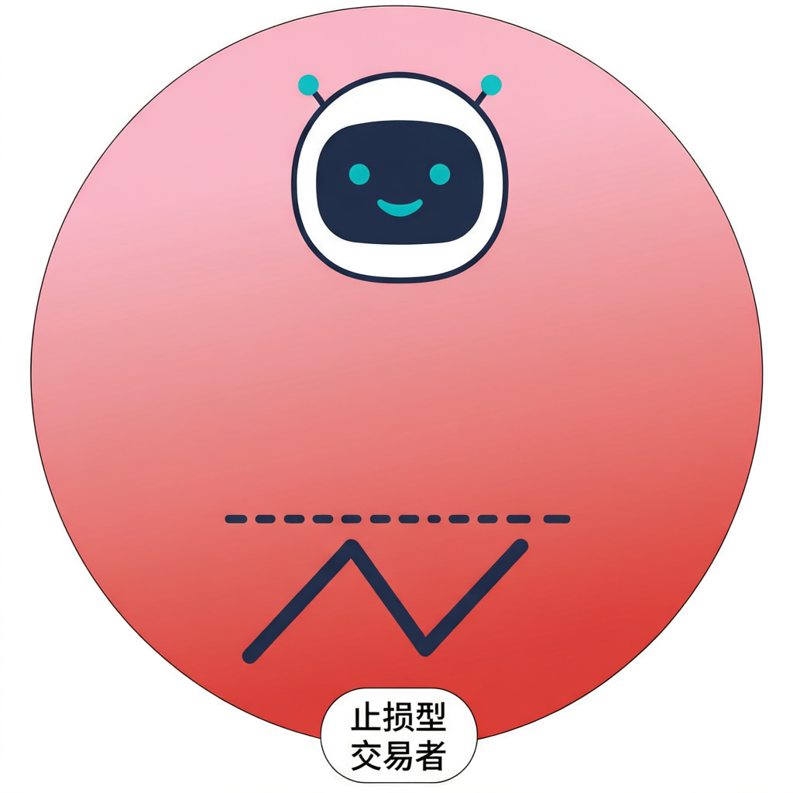

# Stop-Loss Cascade Trader

## Summary

| Field                 | Content                                                                                                        |
|-----------------------|----------------------------------------------------------------------------------------------------------------|
| Archetype             | Stop-Loss Cascade Trader                                                                                       |
| Theory Family         | Market Microstructure — Predatory Stop-Level Targeting                                                          |
| Behavioral Tendency   | **Diverging** — amplifies downward price moves through forced liquidation at predetermined stop levels          |
| Time Horizon          | N/A (event-triggered; holds indefinitely until stop price breached, then exits immediately)                     |
| Risk Tolerance        | Very low (forced exit; no discretion once triggered)                                                            |
| Information Asymmetry | Partial (observes current price and own recent high, no access to fundamental value or peer positions)          |
| Determinism           | Deterministic (given identical price history and parameters, trigger and exit are fully determined)             |

## Definition and Goals

The stop-loss cascade trader models institutional and retail participants who hold long positions protected by pre-set stop-loss orders — automatic sell triggers that fire when the market price falls below a trailing reference level by a specified percentage. In the real world, these correspond to mutual fund risk overlays, pension fund tail-risk hedges, individual retail bracket orders, and any participant whose exit decision is mechanically tied to a price threshold rather than a re-evaluation of fundamentals.

The agent's decision goal is binary: hold its entire position while the market price remains above the computed stop price, and sell 100% of its position in a single round once the stop level is breached. The stop price is computed as `recent_high × (1 - stop_loss_percent)`, where `recent_high` is the maximum observed price over the most recent 10 ticks. The agent does not produce partial exits or scale out; it is a one-shot forced seller.

The agent's behavioural role inside the simulation is to create lumpy, cascading sell pressure during a crash: as the price declines, successive stop-loss traders with different `stop_loss_percent` thresholds trigger in waves, injecting large discrete selling volumes that further depress the price and trigger additional stops. Non-goals: (1) the stop-loss trader MUST NOT re-enter the market after triggering — once position reaches zero, it remains inactive; (2) it MUST NOT provide liquidity — `provides_liquidity` is always `False`; (3) it MUST NOT exercise discretion about the exit size — the full position is liquidated on trigger.

## Theoretical Foundation

**Predatory Trading and Stop-Loss Cascades (Brunnermeier & Pedersen 2005)**:
- Theory / Study: Predatory Trading
- Citation: Brunnermeier, M. K., & Pedersen, L. H. (2005). Predatory trading. *Journal of Finance*, 60(4), 1825–1863. https://doi.org/10.1111/j.1540-6261.2005.00781.x
- Core Insight: When traders have known stop-loss levels, predatory traders can push prices toward those levels to force liquidations. The resulting forced selling creates a positive-feedback spiral: triggered stops generate sell orders that push prices lower, which triggers further stops at deeper levels, producing cascading waves of selling that amplify the original price shock far beyond what fundamentals justify.
- Mathematical Formulation: `IF price < recent_high × (1 - stop_loss_percent) AND position > 0 THEN quantity = -position` (full liquidation in one shot).
- Empirical Evidence: Brunnermeier & Pedersen (2005) model demonstrates that clustering of stop-loss orders at round-number price levels produces 3–5x amplification of initial price shocks (Proposition 2, p. 1840). The CFTC-SEC (2010) Joint Report on the May 6, 2010 Flash Crash documents that stop-loss order execution accounted for an estimated 15–20% of total sell volume during the crash window.
- Relevance to This Agent: The agent directly operationalises the stop-loss cascade mechanism — varied `stop_loss_percent` values across instances create the multi-wave cascading pattern documented in flash-crash literature, where stops at -2%, -5%, -8%, -10% fire in succession as price falls.
- Calibration Source: `stop_loss_percent` in [0.02, 0.10] calibrated from Brunnermeier & Pedersen (2005) numerical examples and practitioner convention (2% tight stop to 10% wide stop); `initial_position` in [20, 100] shares represents typical long-only holdings pre-crash.
- Falsification Conditions: If this agent does not liquidate its entire position within 1 round of the stop price being breached, the cascade mechanism is falsified. If the agent sells any shares before the stop price is reached, the design is violated.
- Alternative Theories: Portfolio insurance (Leland 1988), margin-call forced selling (Gromb & Vayanos 2002), dynamic hedging feedback (Gennotte & Leland 1990).

## Design Purpose and Activation Triggers

Purpose: Generate discrete waves of forced selling at predetermined price levels, creating cascading amplification of price declines.

Call Frequency: Every tick (every simulation round).

Prerequisite Signals (must be available for the agent to evaluate):
- Current market price available
- Price history available (for computing recent_high)
- Own position > 0 (must have shares to sell)

Missing-Signal Policy: If price history has fewer than 5 observations, the agent uses the current price as `recent_high`. If current price is unavailable (NaN), the agent holds (no action).

Activation Triggers:
- Stop breached (price < stop_price AND position > 0): Sell entire position immediately
- Stop not breached (price >= stop_price): Hold (quantity = 0)
- Already triggered (position == 0): Permanently inactive (quantity = 0)

Deactivation Conditions:
- Position reaches zero after stop-loss execution: Agent becomes permanently inactive
- Market closure / simulation end: Agent ceases evaluation

Behavioral Adaptation by Condition:
| Condition                   | Behavioral change                                           | Mechanism                                          |
|-----------------------------|-------------------------------------------------------------|----------------------------------------------------|
| Gradual price decline       | Triggers at the exact threshold; no early exit              | Mechanical: compares price vs. stop_price each round |
| Rapid gap-down              | Still triggers; sells at the gapped-down price (slippage)   | No limit price; sells at market                    |
| Price recovery after trigger| No re-entry; remains at zero position permanently          | One-shot design; no buyback logic                  |

Environmental Dependencies: Requires per-round market data broadcast containing `price` field. Maintains an internal `price_history` buffer for computing `recent_high`. No peer-action summaries, fundamental value, or liquidity data needed.

## Behavioral Framework

#### I/O Contract

##### Inputs (per decision call)

| Input               | Source                     | Type / Shape  | Required? | Notes                                          |
|---------------------|----------------------------|---------------|-----------|------------------------------------------------|
| `price`             | Market coordinator payload | `float`       | yes       | Current asset price                            |
| `price_history`     | Agent persisted state      | `list[float]` | yes       | Full price history for computing recent_high   |
| `position`          | Agent persisted state      | `float`       | yes       | Current share holdings                         |
| `round`             | Scheduler / round header   | `int`         | yes       | Current simulation round number                |
| `stop_loss_percent` | Config extras              | `float`       | yes       | Stop trigger depth below recent_high (§Parameters) |

##### Outputs (per decision call)

| Field       | Type   | Valid Range / Enum        | Unit   | Required? | Meaning                                 |
|-------------|--------|---------------------------|--------|-----------|------------------------------------------|
| `action`    | enum   | `{"sell", "hold"}`        | —      | yes       | Sell (triggered) or hold (not triggered) |
| `bid_price` | float  | > 0 or 0.0               | price  | yes       | Market price if selling, 0.0 if holding  |
| `quantity`  | float  | [-position, 0]            | shares | yes       | Negative = sell; 0 = hold                |
| `reasoning` | string | 1–2 sentences             | —      | yes       | Stop status explanation                  |

##### Content Constraints

- All four output fields MUST be present on every call.
- When triggered: `quantity` = `-position` (full liquidation); `bid_price` = current price.
- When not triggered: `quantity` = 0; `bid_price` = 0.0.
- The agent MUST NOT emit partial sells — it is all-or-nothing.
- `provides_liquidity` in the outbound message envelope is always `False`.
- The agent is deterministic given the same price history and parameters.

##### Serialization Format

```
<analysis>Price={price:.2f}, recent_high={recent_high:.2f}, stop_price={stop_price:.2f}. {triggered_status}.</analysis>
<decision>{"action": "<sell|hold>", "bid_price": <float>, "quantity": <float>, "reasoning": "Stop-loss: price {price:.2f} vs stop {stop_price:.2f}."}</decision>
```

Retrieval fallback sentinel (for retrieval-augmented variants): `"(No relevant knowledge retrieved this round.)"` — injected verbatim when retrieval returns empty.

##### Implementer Contract Reminder

Rule-driven variants compute the stop check directly. Model-driven variants (LLM, RuleLLM) MUST include the output schema in the prompt and parse the `<decision>` JSON. Retrieval-augmented variants inject domain knowledge before the decision but MUST still honour the same output schema. The `provides_liquidity` field in the outbound message envelope is always `False`. Once triggered, subsequent rounds MUST emit hold with quantity = 0.

#### Decision Information Set

| Signal          | Type       | Memory Window     | Rationale                                     |
|-----------------|------------|-------------------|-----------------------------------------------|
| `price`         | Continuous | Current tick      | Compared against stop_price for trigger check |
| `price_history` | Continuous | Last 10 ticks     | Used to compute recent_high (trailing max)    |
| `position`      | Continuous | Current state     | Determines sell quantity when triggered        |

Does NOT use: fundamental value, momentum signals, peer positions, liquidity levels, volume data, net demand — the agent's decision depends solely on whether price has breached its stop level.

#### Core Behavioral Mechanism

```
Step 1 — Compute recent high (trailing maximum):
  Read: price_history
  IF len(price_history) >= 5:
    recent_high = max(price_history[-10:])
  ELSE:
    recent_high = price
  (implementation convenience — windowing)

Step 2 — Compute stop price:
  Read: stop_loss_percent
  stop_price = recent_high × (1 - stop_loss_percent)
  (Traces to: Predatory Trading, Brunnermeier & Pedersen 2005)

Step 3 — Evaluate trigger condition:
  Read: price, position
  IF price < stop_price AND position > 0:
    → Triggered branch (Step 4a)
  ELSE:
    → Hold branch (Step 4b)

Step 4a — Triggered: full liquidation:
  quantity = -position
  bid_price = price
  action = "sell"

Step 4b — Hold:
  quantity = 0.0
  bid_price = 0.0
  action = "hold"

Step 5 — Apply resource constraints:
  quantity = _apply_constraints(bid_price, quantity)

Step 6 — Execute trade (post-decision):
  IF quantity != 0:
    Write: cash += abs(quantity) × bid_price
    Write: position += quantity  (position → 0)
```

#### Action Space

| Aspect                | Specification                                                                     |
|-----------------------|-----------------------------------------------------------------------------------|
| Action types allowed  | `sell`, `hold`                                                                    |
| Action parameter rule | `bid_price` = current market price when selling; 0.0 when holding                 |
| Sizing rule           | `quantity = -position` when triggered (full liquidation); 0 otherwise             |
| Action lifetime       | Immediate execution; no persistent resting orders                                 |
| Revision policy       | No revision — trigger is irreversible; once fired, no cancellation possible       |
| State constraint      | Position can only decrease (from initial to zero); no re-entry                    |
| Resource cap          | Bounded by initial position (cannot sell more than held)                           |
| Exit rule             | Agent becomes permanently inactive after triggering (position = 0)                |

#### Mathematical Model

**Decision output:** Signed quantity (float, either `-position` or 0) representing whether to liquidate this round.

**Decision logic formalization:**

```
Step 1 — Compute recent high (trailing maximum):
  Read: price_history
  IF len(price_history) >= 5:
    recent_high = max(price_history[-10:])
  ELSE:
    recent_high = price

Step 2 — Compute stop price:
  stop_price = recent_high * (1 - stop_loss_percent)

Step 3 — Evaluate trigger condition:
  Read: price, position
  IF price < stop_price AND position > 0:
    quantity = -position
    bid_price = price
    action = "sell"
  ELSE:
    quantity = 0.0
    bid_price = 0.0
    action = "hold"

Step 4 — Apply resource constraints:
  quantity = _apply_constraints(bid_price, quantity)

Step 5 — Execute trade (if triggered):
  IF quantity != 0:
    Write: cash += abs(quantity) * bid_price
    Write: position += quantity  (i.e., position → 0)
```

**State variables:**
- `price_history`: Append-only list of observed prices, updated each round during `perceive`.
- `position`: Shares held (initialized from config `initial_position`; decremented to 0 on trigger).
- `cash`: Running cash balance (updated by `_execute_trade` post-trigger).
- `initialized_position`: Boolean flag ensuring initial cost basis is set once.

**State evolution:**
- `price_history`: Updated pre-decide (during `perceive`, appends new price).
- `position` and `cash`: Updated post-decide (during `_execute_trade`, after trigger evaluation).
- Once position reaches 0, no further state changes occur.

**Determinism contract:** Fully deterministic given identical price history and parameter values.

**Parameter symbol table:**

| Symbol              | Meaning                                  | Default Value | Source                           |
|---------------------|------------------------------------------|---------------|----------------------------------|
| `stop_loss_percent` | Stop trigger depth below recent_high     | 0.05          | Brunnermeier & Pedersen (2005)   |
| `initial_position`  | Starting share holdings                  | 50.0          | simulation-bases.md §4.4         |
| `initial_buy_price` | Entry price (cost basis for accounting)  | 100.0         | normalization                    |

#### Behavioral Properties

- Time horizon: N/A (event-triggered) — holds indefinitely until stop price is breached, then exits in a single round; no temporal strategy.
- Risk tolerance: Very low — forced exit with zero discretion once threshold is breached; no ability to ride out volatility or average down.
- Information asymmetry: Partial — observes current price and own recent high; no access to fundamental value, order book, or peer positions.
- Psychological profile: Loss-aversion mechanised (Brunnermeier & Pedersen 2005) — the stop-loss embodies a hard constraint against further downside; once triggered, the agent exhibits no deliberation, regret-based holding, or disposition effect.

## Parameters

| Parameter           | Type  | Default | Valid Range   | Sensitivity | Description                                          | Impact                                                     | Source                             |
|---------------------|-------|---------|---------------|-------------|------------------------------------------------------|------------------------------------------------------------|------------------------------------|
| `stop_loss_percent` | float | 0.05    | [0.02, 0.10]  | High        | Stop trigger depth below trailing recent high        | Higher → triggers later, survives deeper declines          | Brunnermeier & Pedersen (2005)     |
| `initial_position`  | float | 50.0    | [20.0, 100.0] | High        | Starting share holdings available for liquidation    | Higher → larger sell volume injected on trigger            | simulation-bases.md §4.4           |
| `initial_buy_price` | float | 100.0   | [80.0, 120.0] | Low         | Cost basis for initial position (accounting only)    | Higher → no effect on trigger logic; affects P&L reporting | normalization (= initial_price)    |

## Worked Numerical Examples

### Case 1 — Stop not yet triggered (price above stop level)

System state: `price_history[-10:]` includes max = 100.0, current `price` = 97.0, `stop_loss_percent` = 0.05, `position` = 50.0

Calculation:
- `recent_high` = max(price_history[-10:]) = 100.0
- `stop_price` = 100.0 × (1 - 0.05) = 95.0
- Trigger check: 97.0 < 95.0? NO
- `quantity` = 0.0, `bid_price` = 0.0

Decision: hold
State update: No change; `position` remains 50.0

### Case 2 — Stop triggered (price breaches stop level)

System state: `price_history[-10:]` includes max = 100.0, current `price` = 94.0, `stop_loss_percent` = 0.05, `position` = 50.0

Calculation:
- `recent_high` = max(price_history[-10:]) = 100.0
- `stop_price` = 100.0 × (1 - 0.05) = 95.0
- Trigger check: 94.0 < 95.0? YES, and position = 50.0 > 0
- `quantity` = -50.0, `bid_price` = 94.0

Decision: sell 50.0 shares at 94.0
State update: `position`: 50.0 → 0.0; `cash`: 10000.0 → 10000.0 + 50.0 × 94.0 = 14700.0

### Case 3 — Post-trigger inactive state

System state: `price_history[-10:]` includes max = 100.0, current `price` = 80.0, `stop_loss_percent` = 0.05, `position` = 0.0 (already triggered)

Calculation:
- `recent_high` = 100.0
- `stop_price` = 95.0
- Trigger check: 80.0 < 95.0? YES, but position = 0.0 (not > 0)
- `quantity` = 0.0, `bid_price` = 0.0

Decision: hold (permanently inactive)
State update: No change

### Edge Case — Tight stop with small price decline

System state: `price_history[-10:]` includes max = 100.0, current `price` = 97.5, `stop_loss_percent` = 0.02, `position` = 50.0

Calculation:
- `recent_high` = 100.0
- `stop_price` = 100.0 × (1 - 0.02) = 98.0
- Trigger check: 97.5 < 98.0? YES, and position = 50.0 > 0
- `quantity` = -50.0, `bid_price` = 97.5

Decision: sell 50.0 shares at 97.5 (tight stop triggered by a mere 2.5% decline)
State update: `position`: 50.0 → 0.0; `cash`: 10000.0 → 10000.0 + 50.0 × 97.5 = 14875.0

## Behavioral Verification and Calibration

**Verification criteria:**
1. The agent MUST hold with quantity = 0 for every round where price >= stop_price.
2. The agent MUST sell its entire position in exactly one round when price first falls below stop_price.
3. After triggering, the agent MUST emit quantity = 0 for all subsequent rounds (permanent inactivity).
4. The agent MUST never emit a positive quantity (no buying behaviour).
5. The agent's `provides_liquidity` flag MUST always be `False`.

**Calibration procedure:**
- Deploy 3–5 instances with `stop_loss_percent` in {0.02, 0.05, 0.08, 0.10}.
- Run 200-round flash-crash simulation. Verify that instances trigger in sequential waves as price declines through their respective stop levels.
- Verify total cascade sell volume = sum of all triggered positions.
- Confirm cascade timing matches expected multi-wave pattern.

**Ablation Hooks:**

| Ablation name       | Setting                      | Hypothesis tested                                    | Expected direction                        | Metric                      |
|---------------------|------------------------------|------------------------------------------------------|-------------------------------------------|-----------------------------|
| `disable_stops`     | `initial_position = 0`       | Stop-loss cascades amplify crash depth               | Crash depth decreases significantly       | `crash_depth`               |
| `tight_stops`       | `stop_loss_percent = 0.02`   | Tighter stops trigger earlier, deeper cascades       | Cascade begins earlier in crash sequence  | `first_trigger_round`       |
| `wide_stops`        | `stop_loss_percent = 0.10`   | Wider stops may not trigger in mild crashes          | Fewer triggers in moderate scenarios      | `num_triggered_agents`      |

## Academic References

| # | Citation                                                                                                                                                       | Notes                                              |
|---|----------------------------------------------------------------------------------------------------------------------------------------------------------------|----------------------------------------------------|
| 1 | Brunnermeier, M. K., & Pedersen, L. H. (2005). Predatory trading. *Journal of Finance*, 60(4), 1825–1863. https://doi.org/10.1111/j.1540-6261.2005.00781.x    | Primary theory; stop-loss cascade mechanism        |
| 2 | Kirilenko, A. A., Kyle, A. S., Samadi, M., & Tuzun, T. (2017). The Flash Crash: High-frequency trading in an electronic market. *Journal of Finance*, 72(3), 967–998. https://doi.org/10.1111/jofi.12498 | Empirical evidence of cascade selling during flash crash |
| 3 | CFTC-SEC Joint Report (2010). Findings regarding the market events of May 6, 2010.                                                                            | Documents stop-loss execution during 2010 flash crash |

## Design Provenance

| Field       | Content                                                       |
|-------------|---------------------------------------------------------------|
| Author      | polish-simulation-pipeline                                    |
| Created     | 2026-07-11                                                    |
| Version     | 1.0.0                                                         |
| Status      | canonical                                                     |
| Icon        |        |
