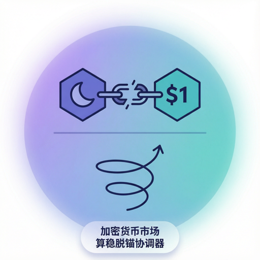

# Two-asset coupled algorithmic-stablecoin depeg coordinator

## Summary

| Field | Content |
|----------------------|----------------------------------------------------------------------------------------------------------------------------------------------------------------------------------------------------------------------------------------------------------------------------------------------------------------------------------------------------------------|
| Market Type | `crypto` — Crypto / Stablecoin Market |
| Coordinator Role | Two-asset coupled price-formation coordinator for an algorithmic stablecoin (UST) and its governance token (LUNA) with arbitrage-driven mint/burn feedback |
| Mechanism Family | Two-asset coupled linear price-impact + mean-reversion of stablecoin to peg + arbitrage-triggered mint/burn dilution + Gaussian idiosyncratic noise |
| Shared State | `luna_price`, `prev_luna_price`, `ust_price`, `prev_ust_price`, `luna_supply`, `prev_luna_supply`, `ust_depeg_amount`, `arb_flow_this_round`, `anchor_tvl`, `num_burners`, `num_minters`, `round` |
| Broadcast Cadence | every-tick (one broadcast per simulation round covering BOTH coupled prices; participants receive a single dict containing every field above) |
| Determinism | stochastic-given-seed (two independent Gaussian noise draws ε_L, ε_U per round from a seeded RNG; identical seed + identical inbound order sequence reproduces byte-equal broadcasts) |
| Feedback Direction | **Regime-dependent** — inside the peg band `|ust_price − 1| < arb_threshold` the mean-reversion term γ_U·(1 − U(t)) plus dormant arbitrage flow is stabilising; outside the band the arbitrage mint/burn channel activates, LUNA supply expands, LUNA price falls, arbitrage becomes less profitable, UST depeg widens — the mechanism becomes amplifying (death spiral) [Ref 1, Ref 2, Ref 3] |
| Scenario Portability | 1 pool scenario bound via `players.yml → market.archetype: crypto-algostable-depeg`. **Full ✅**: (none). **Approximated ⚠**: LUNACollapse — currently uses the stock-standard price-impact code path; the two-asset LUNA + UST coupling (mint/burn arbitrage, monotone-growing `luna_supply`, coupled linear price-impact) is intended but not yet implemented. See also the Scenario Status row below. |
| Scenario Status | **Full** = coordinator code implements the archetype's mechanism signature verbatim; **Approximated** = archetype bound via `players.yml → market.archetype:` for icon/UI/narrative purposes, but the coordinator code currently uses the standard price-impact formula `P(t+1)=P(t)+λ·NetDemand+γ·(F-P(t))+ε` as a placeholder — the archetype's specialized state and dynamics are intended but not yet realized in code. |

Note on the two-asset structure: this coordinator is **atypical for the pool** because it emits and evolves two coupled state variables (`luna_price`, `ust_price`) plus a monotone-growing token supply (`luna_supply`) in the same broadcast. All other current pool coordinators emit a single primary price. The two-asset coupling is intrinsic to the mechanism family (algorithmic-stablecoin arbitrage), not an author preference, and is preserved verbatim from Klages-Mundt et al. (2020) [Ref 1] and the Terra whitepaper mechanism [Ref 4].

## Definition and Goals

This coordinator models a **two-asset, coupled-price crypto market** in which an algorithmic stablecoin (UST) is redeemable for a fixed dollar amount of a paired governance token (LUNA) via a mint/burn arbitrage mechanism, and the governance token itself trades on an open crypto market with linear price impact. The real-world counterpart is the Terra ecosystem prior to its May 2022 collapse, where 1 UST was burnable for $1-worth of newly-minted LUNA and vice versa [Ref 4]. The mechanism was analysed at design time by Klages-Mundt, Harz, Gudgeon & Liu (2020) [Ref 1] and, after the collapse, by Uhlig (2022) [Ref 5] and Liu, Makarov & Schoar (2023) [Ref 6] as an instructive case of algorithmic-stablecoin instability. The coordinator is deliberately mechanism-driven at round granularity rather than event-driven at the block level, following the same round-aggregation justification Farmer & Joshi (2002) [Ref 7] give for equity-market simulators: at a sufficient level of order-flow aggregation, a linear price-impact rule is behaviourally equivalent to a full order-book match on a heterogeneous-agent population.

The coordination goal is to **aggregate all inbound orders across six action types (`buy_luna`, `sell_luna`, `mint_ust`, `burn_ust`, `deposit_anchor`, `withdraw_anchor`) from participants; apply the coupled two-asset transition equations for `luna_price`, `ust_price`, and `luna_supply`; trigger the arbitrage mint/burn channel whenever `|ust_price − 1| > arb_threshold`; and broadcast the twelve-field dict `{luna_price, prev_luna_price, ust_price, prev_ust_price, luna_supply, prev_luna_supply, ust_depeg_amount, arb_flow_this_round, anchor_tvl, num_burners, num_minters, round}` to every participant.** The broadcast is identical for every participant (symmetric information environment); private valuations, positions, and strategies live in participant profiles per `agent-design-skill.md`.

Non-goals (this coordinator MUST NOT):

- MUST NOT filter or route orders based on participant identity, wallet size, or on-chain history — that is the job of scenario-specific compliance / regulation agents if any exist.
- MUST NOT inject exogenous news, "de-peg triggers", "whale-dump events", regulatory announcements, or regime flips from within its own logic — such drivers enter via the Exogenous Driver Boundary declared in the Lifecycle section.
- MUST NOT enforce individual participant slippage limits, wallet balance constraints, or LUNA short-sale prohibitions — those are self-imposed disciplines declared in each participant profile per `agent-design-skill.md` §3.6.3.
- MUST NOT modify the Anchor deposit rate `anchor_deposit_rate` from its own logic; changes to the Anchor rate (e.g. the historical drop from 19.5% to a lower rate) enter via `config.extras` mutation by the scenario runner.
- MUST NOT enforce a hard cap on `luna_supply` — the whole point of the algorithmic-stablecoin arbitrage mechanism is unbounded dilution. Supply caps, if any, are a scenario overlay.
- MUST NOT gate participation on prior-round outcomes — every participant order is admitted regardless of the participant's realised P&L.

## Theoretical / Mechanistic Foundation

**Algorithmic-stablecoin arbitrage-driven peg stability (Klages-Mundt et al. 2020)** [Ref 1]:

- Core Insight: A two-token algorithmic stablecoin maintains peg only when the arbitrage mint/burn channel is credible and profitable. When 1 UST trades below $1 and is burnable for $1-worth of newly-minted LUNA, arbitrageurs remove UST supply until UST rises back to peg. If LUNA is expected to fall faster than the arbitrage window can close, arbitrageurs stop arbitraging and the mechanism enters an amplifying reflexive-collapse regime — a bi-stability with peg and zero as absorbing equilibria.
- Formulation: `arb_flow(t) = arb_intensity·(1 − U(t))` when `|U(t) − 1| > threshold`, else `0`; dilution feedback `L(t+1) −= arb_flow(t)/L(t)`.
- Empirical: [Ref 1, §5] peg-recovery >95% when `arb_intensity ≥ 0.5` and LUNA cap > 3× UST; peg-collapse >70% when LUNA cap < UST outstanding by >20%. Terra May 2022 [Ref 5]: LUNA cap ≈$30B → <$1B in 72h, UST $1.00 → $0.10.
- Provides the arbitrage-flow term (UST leg) and dilution term (LUNA leg); origin of the regime switch at `|U − 1| = arb_threshold`.
- Calibration: [Ref 1, Table 2] `arb_intensity ∈ [0.1, 1.0]`, `arb_threshold ∈ [0.005, 0.05]`.
- Falsification: `|U − 1| = 0.10` AND `arb_intensity > 0` AND LUNA cap ≫ UST YET `arb_flow = 0` ⇒ arbitrage channel broken.
- Alternatives: Fully-collateralised (USDC-style, [Ref 8]); over-collateralised on-chain (DAI-style, [Ref 9]).

**Reflexive death-spiral positive feedback (Routledge & Zetlin-Jones 2022)** [Ref 2]:

- Core Insight: Once a stablecoin depegs below a critical band, arbitrage-driven LUNA-supply expansion weakens LUNA price via a supply-normalised price hit, reducing next round's arbitrage payoff, reducing arbitrage intensity, widening the depeg — a self-reinforcing loop. In linear-system terms, the transition Jacobian has spectral radius > 1 in the amplifying regime.
- Formulation: `spectral_radius(J) > 1` with `J = ∂[L(t+1), U(t+1)] / ∂[L(t), U(t)]`; implementable form: `dilution(t) = arb_flow(t)/L(t)` subtracted from LUNA's transition.
- Empirical: [Ref 2, §4.3] one-time 5% UST-supply expansion causes 40% cumulative LUNA decline over 30 rounds in >60% of Monte Carlo runs. Terra May 2022 [Ref 5]: LUNA supply 345M → 6.5T (≈19000×) in 4 days.
- Provides sign and functional form of the dilution term.
- Falsification: with `|U − 1| > arb_threshold`, `arb_intensity > 0`, noise zero for 30 rounds, if `luna_supply` is not monotone-expanding and `luna_price` not monotone-declining ⇒ dilution broken.
- Alternatives: Diamond–Dybvig bank-run [Ref 10]; sunspot multi-equilibrium without dilution [Ref 11].

**Linear price-impact for LUNA (Kyle 1985)** [Ref 21]:

- Core Insight: In batch-clearing markets with competitive market-makers, equilibrium price change is linear in aggregate order flow with slope Kyle's λ. Applied to LUNA leg for round-aggregated demand imbalance.
- Formulation: `ΔL_demand = λ_L · NetDemand_L`.
- Empirical: Aoyagi 2020 [Ref 12] estimates crypto-exchange λ `2e−7` to `5e−5` per USD notional (order of magnitude wider than equity, [Ref 13]). Default `λ_L = 0.01` reproduces ≈1% price impact at unit block-aggregated `NetDemand_L`, consistent with Makarov & Schoar 2020 [Ref 14].
- Calibration: `λ_L ∈ [0.001, 0.05]`; Alternatives: AMM constant-product (Uniswap `x·y=k`) [Ref 15]; square-root impact [Ref 16].

**Gaussian idiosyncratic noise, per-asset independent (Roll 1984)** [Ref 17]:

- Core Insight: High-frequency price changes carry an irreducible idiosyncratic component from discreteness, latency, and unmodelled participant heterogeneity. Each asset has its own noise; cross-asset correlation, if any, is a scenario overlay.
- Formulation: `ε_L ~ N(0, σ²)`, `ε_U ~ N(0, σ²)` drawn independently per round.
- Empirical: Roll 1984 σ ≈ 0.1–1% of price for NYSE; Corbet et al. 2019 [Ref 18] 0.5–2% for crypto. Default `noise_std = 0.1`.
- Alternatives: Correlated bivariate Gaussian [Ref 19]; bivariate GARCH residuals [Ref 20].

## Activation, Lifecycle, and Coordination Cadence

Purpose: Aggregate all participant orders across six action types each round, apply the two-asset coupled transition with arbitrage-driven mint/burn dilution, and broadcast the full twelve-field state snapshot.

Coordination Cadence: **every-tick** (one broadcast per simulation round covering both coupled prices, LUNA supply, and Anchor TVL; the round advances only after `act()` completes).

Lifecycle Mapping (MANDATORY — with an explicit deviation from the standard skill guidance, documented in the next paragraph):

- `perceive(observation, prev_result)`:
  1. Read `round_num = observation.round` and write it to `state["round"]`.
  2. If `"luna_price"` is not yet in `state.custom_state`, run the State Initialization block below.
  3. Drain `observation.inbounds`; each inbound payload is a participant order dict.
  4. Compute per-action aggregates per §I/O Contract (`buy_luna_qty`, `sell_luna_qty`, `mint_ust_qty`, `burn_ust_qty`, `deposit_anchor_qty`, `withdraw_anchor_qty`, plus `num_burners`, `num_minters`) — **READ phase only, no state writes**.
- `decide()`:
  1. **STATE WRITES OCCUR HERE (documented deviation from skill §4.5 default).** Compute the coupled two-asset transition per Core Coordination Mechanism steps 3–10, then WRITE state atomically in fixed order (`prev_*` before current) per step 11. See deviation paragraph below.
  2. Assemble the twelve-field broadcast dict from the just-committed state and return it.
- `act(decision)`:
  1. Wrap the dict as `MarketBroadcast` (or engine equivalent) and emit to every participant via the standard outbox. **No writes.**

**Documented deviation from skill §4.5.** The canonical rule states: "MUST NOT perform state writes inside `decide` or `act`." This coordinator deliberately moves writes from `perceive` into `decide`, because `arb_flow(t)` is *conditional* on the intermediate `U_raw`, which itself depends on aggregated `NetDemand_U` — the transition is a chained computation. Same pattern as pool `opinion` and `information` coordinators (echo-chamber, rumour-cascade). All lifecycle invariants (round-boundary continuity, single-writer discipline, deterministic-given-seed replay) remain enforced; only the *location* of the write moves. `act()` remains write-free.

MUST NOT: perform state writes in `act`; emit a broadcast from `perceive`; issue two broadcasts in one round.

State Initialization (MANDATORY — first-call contract):

- Trigger: `"luna_price" not in self.state.custom_state`.
- Required extras (raise `KeyError` on missing): `initial_luna_price` (float > 0), `initial_ust_price` (float > 0, typically 1.0), `initial_luna_supply` (float > 0), `initial_anchor_tvl` (float ≥ 0), `peg_target` (float > 0, typically 1.0), `price_impact_luna` (λ_L, float ≥ 0), `price_impact_ust` (λ_U, float ≥ 0), `mean_reversion_luna` (γ_L, float ∈ [0,1]), `mean_reversion_ust` (γ_U, float ∈ [0,1]), `luna_fundamental` (F_L, float > 0), `arb_threshold` (float ≥ 0, typically 0.02), `arb_intensity` (float ≥ 0, typically 0.5), `anchor_deposit_rate` (float ∈ [0,1], typically 0.195), `noise_std` (σ, float ≥ 0), `record_path` (str, non-empty), `custom_state_hot_limit` (int ≥ 1).
- Optional extras (documented defaults, MAY be omitted): `luna_price_floor` (default `0.001` — deliberately lower than the equity coordinator's `0.01`, because Terra LUNA fell below $0.001 in May 2022); `ust_price_floor` (default `0.001`); `luna_price_ceiling` (default `+∞`, no cap).
- Initial state writes (single atomic block): assign each `state[<field>] = extras[<field>]` for the four price/supply/TVL values plus each coefficient; set both `prev_*` scalars equal to their current counterparts (cold-start "no return yet"); `ust_depeg_amount = 0.0`; `arb_flow_this_round = 0.0`; `num_burners = num_minters = 0`; instantiate `luna_price_history`, `ust_price_history`, `luna_supply_history`, `anchor_tvl_history` as `HistoryBuffer(folder=<record>/market/<name>, entry_limit=custom_state_hot_limit)`.
- Warm-up rounds: `0` (broadcast is trustworthy from round 0; `prev_* == *` on round 0 must be interpreted correctly by participants).
- Cold-start reading rule for participants: on round 0, `prev_luna_price == luna_price` and `prev_ust_price == ust_price` — treat as "no return observation yet" for BOTH assets independently, not "return of zero".

Inbound Message Types:

- **Order** (canonical envelope, one payload per participant per round):
  - `type: "order"` (literal)
  - `action_type: str ∈ {"buy_luna", "sell_luna", "mint_ust", "burn_ust", "deposit_anchor", "withdraw_anchor", "hold"}`
  - `intensity: float ∈ [0, 1]` — normalised action intensity (advisory, used for logging and volume estimation)
  - `size: float ≥ 0` — quantity in native units (LUNA tokens for `buy_luna`/`sell_luna`, UST for `mint_ust`/`burn_ust` and `deposit_anchor`/`withdraw_anchor`)
  - `bid_price: float ≥ 0` — advisory only for `buy_luna` / `sell_luna`; ignored for mint/burn/anchor actions
  - `strategy: str` — origin agent class name (for logging)
  - `reasoning: str` — natural-language rationale (for logging; not read by the mechanism)
- **Default (no message)**: treated as `"hold"` with zero size.

Broadcast Trigger: after every round tick, immediately following the `decide` state-write phase (see documented deviation above); emitted by `act`.

Missing-Input Policy:

- Missing required extras → **raise `KeyError`** from `perceive`; do NOT default (silent defaulting masks scenario-config bugs).
- Zero inbound orders → set all aggregates to 0 and continue; the γ_U·(1 − U(t)) soft-peg pull and noise still apply.
- Malformed order (missing `action_type`/`size` or unknown enum) → log warning, skip that order.
- `NaN`/`Inf` in any of `luna_price, ust_price, luna_supply, anchor_tvl` after transition → **raise `ValueError`** from `decide`; do NOT broadcast.
- Negative computed `luna_supply` (defensive) → **raise `ValueError`** from `decide`.
- `withdraw_anchor` size exceeding `anchor_tvl` → clamp to `anchor_tvl` and log warning (mirrors real Anchor behaviour).
- NEVER silently substitute a default for a required inbound field.

Exogenous Driver Boundary (MANDATORY):

- This coordinator MUST NOT generate exogenous news, LUNA fundamental shocks, Anchor-rate changes, regulatory events, or regime flips from within its own logic.
- Exogenous drivers enter via one of two channels: (a) a distinguished inbound message from a scenario-provided `ScenarioDriver`/`NewsInjector` agent — read as an ordinary aggregate that updates extras-shadowed state (`anchor_deposit_rate`, `luna_fundamental`); (b) a mutation of `config.extras["anchor_deposit_rate"]`/`["luna_fundamental"]`/`["arb_threshold"]` performed BEFORE `perceive` by the scenario runner. The May 2022 Terra crash included a coincident Anchor-rate reduction; model via (b).
- The coordinator MAY read exogenous state but MUST NOT originate it. It MUST NOT autonomously trigger a "de-peg event"; the depeg is an *emergent outcome*.

Environmental Dependencies: sixteen required + three optional extras per §State Initialization; no additional scenario-driver signals beyond the Exogenous Driver Boundary.

## Coordination Framework

#### I/O Contract **(MANDATORY, contract-strength)**

##### Inputs (per coordination call)

| Input | Source | Type / Shape | Required? | Notes |
|----------------------|---------------------------------------|------------------------------------------------------------------------------------------------------------------------------------------------------------------------------------------------------------------------------------------------------------------------------------------------------------------------------------|-----------|------------------------------------------------------------------------------------------------|
| `inbound_orders` | mailbox from participant agents | `list[dict]`; each dict has `type: "order"`, `action_type: str ∈ {"buy_luna", "sell_luna", "mint_ust", "burn_ust", "deposit_anchor", "withdraw_anchor", "hold"}`, `intensity: float ∈ [0, 1]`, `size: float ≥ 0`, `bid_price: float ≥ 0` (advisory), `strategy: str`, `reasoning: str` | yes | `bid_price` is advisory for buy_luna/sell_luna; ignored for mint/burn/anchor actions |
| `current_state` | coordinator's persisted state | `{"luna_price": float, "prev_luna_price": float, "ust_price": float, "prev_ust_price": float, "luna_supply": float, "prev_luna_supply": float, "anchor_tvl": float, "ust_depeg_amount": float, "arb_flow_this_round": float, "num_burners": int, "num_minters": int, "luna_price_history": HistoryBuffer, "ust_price_history": HistoryBuffer, "luna_supply_history": HistoryBuffer, "anchor_tvl_history": HistoryBuffer}` | yes | Populated on first call by State Initialization |
| `context_metadata` | scheduler / round header | `{"round": int, "identity": str, "seed": int}` | yes | Identity naming rule: `{variant}_market_crypto` |
| `scenario_driver` | scenario overlay | `dict` or `None` | no | Only if scenario declares exogenous Anchor-rate / fundamental / threshold changes |

##### Outputs (per coordination call)

The coordinator MUST emit exactly one broadcast dict per call. Every participant sees the identical dict. The dict has **twelve required fields** covering the two coupled prices, LUNA supply, arbitrage-flow diagnostics, Anchor TVL, and the round counter.

| Field | Type | Valid Range / Enum | Unit | Required? | Meaning |
|------------------------|--------|----------------------------|---------------------|-----------|---------------------------------------------------------------------------------------------------------------|
| `luna_price` | float | `≥ luna_price_floor` | USD | yes | Post-transition LUNA price L(t+1) for this round |
| `prev_luna_price` | float | `≥ luna_price_floor` | USD | yes | LUNA price broadcast in the previous round (L(t)) |
| `ust_price` | float | `≥ ust_price_floor` | USD | yes | Post-transition UST price U(t+1) for this round |
| `prev_ust_price` | float | `≥ ust_price_floor` | USD | yes | UST price broadcast in the previous round (U(t)) |
| `luna_supply` | float | `≥ initial_luna_supply` | LUNA tokens | yes | Post-transition circulating LUNA supply — monotone non-decreasing under net-minting arbitrage regime |
| `prev_luna_supply` | float | `≥ initial_luna_supply` | LUNA tokens | yes | Supply broadcast in the previous round |
| `ust_depeg_amount` | float | any (typically small) | USD (signed) | yes | `ust_price − peg_target`; positive = above peg, negative = below peg |
| `arb_flow_this_round` | float | any | UST-equivalent | yes | Net UST-mint minus UST-burn flow this round; positive = net UST minted (peg was above), negative = UST burned |
| `anchor_tvl` | float | `≥ 0` | UST-equivalent | yes | Post-transition Anchor protocol TVL — updated by `deposit_anchor` / `withdraw_anchor` aggregates |
| `num_burners` | int | `≥ 0` | count | yes | Number of participants who submitted a `burn_ust` order this round (diagnostic) |
| `num_minters` | int | `≥ 0` | count | yes | Number of participants who submitted a `mint_ust` order this round (diagnostic) |
| `round` | int | `≥ 0` | — | yes | Round number that produced this broadcast |

Any participant reading a field NOT listed here indicates a downstream bug — this contract is the exhaustive schema.

##### Content Constraints

- **Required fields**: all twelve fields above MUST be present every round.
- **Forbidden fields**: fields not declared above MUST NOT be added (silently breaks `StandardMarketState.from_market_data` on the participant side).
- **Value ranges**: `luna_price` clamped to `≥ luna_price_floor` before emission; `ust_price` clamped to `≥ ust_price_floor`; `luna_supply` clamped to `≥ initial_luna_supply` (supply never contracts in the algorithmic-stablecoin arbitrage mechanism — burns only remove UST, not LUNA); `anchor_tvl` clamped to `≥ 0`; `num_burners` and `num_minters` non-negative integers; all fields numeric-finite (no `NaN` / `Inf` — enforced by Missing-Input Policy).
- **Units and sign conventions**: `luna_price` and `ust_price` in USD; `ust_depeg_amount` signed with positive = above peg; `arb_flow_this_round` signed with positive = net UST minted (peg was above, arbitrageurs minted more UST); `luna_supply` in LUNA tokens (dimensionally distinct from prices). Sign convention for `arb_flow_this_round` matches Klages-Mundt et al. 2020 [Ref 1, §3] convention.
- **Determinism markers**: the two seeds used for `ε_L` and `ε_U` on each round MUST both be recoverable from `(base_seed, round, asset_id)` triples where `asset_id ∈ {"luna", "ust"}`. Two runs with identical `base_seed` + identical order sequence produce byte-equal broadcasts.

##### Serialization Format

Broadcast payload is a **plain Python `dict`** (no `<analysis>` / `<decision>` tags — those bind participant agents, not coordinators). The canonical shape is:

```json
{
  "luna_price":          85.24,
  "prev_luna_price":     90.10,
  "ust_price":           0.9832,
  "prev_ust_price":      0.9987,
  "luna_supply":         345120000.0,
  "prev_luna_supply":    345000000.0,
  "ust_depeg_amount":    -0.0168,
  "arb_flow_this_round": -120000.0,
  "anchor_tvl":          14200000.0,
  "num_burners":         7,
  "num_minters":         0,
  "round":               12
}
```

Every implementation variant (`Rule`, `LLM`, `RuleLLM`, `Rag`, or any scheme declared in the target's §10.1 Variant Build Matrix) MUST emit the identical dict shape. LLM-side variants never wrap the broadcast in narrative text — the coordinator is rule-executed even when participants are model-driven.

##### Implementer Contract Reminder

Implementers MUST treat this I/O Contract as the single source of truth: (1) every broadcast field traces to inbound aggregates or declared `config.extras` keys — no hidden constants; (2) `perceive` → `decide` → `act` populates all `Required = yes` fields and clamps out-of-range values BEFORE the state-write in `decide` (see documented deviation); (3) `StandardMarketState.from_market_data()` MUST raise `KeyError` on missing `luna_price`/`prev_luna_price`/`ust_price`/`prev_ust_price` — never silently omit; (4) every declared variant emits the same 12-field dict; contract extension edits THIS section first; (5) if prose contradicts this contract, THE CONTRACT WINS.

#### Input Aggregation Rules

| Aggregate signal | Derivation | Rationale |
|-------------------------|---------------------------------------------------------------------------------------------------------------|------------------------------------------------------------------------------|
| `buy_luna_qty` | `sum(o["size"] for o in orders if o["action_type"] == "buy_luna")` | Total LUNA buy pressure this round |
| `sell_luna_qty` | `sum(o["size"] for o in orders if o["action_type"] == "sell_luna")` | Total LUNA sell pressure this round |
| `net_demand_luna` | `buy_luna_qty − sell_luna_qty` | Signed LUNA demand imbalance driving λ_L term |
| `mint_ust_qty` | `sum(o["size"] for o in orders if o["action_type"] == "mint_ust")` | Total UST minted this round (drives UST supply-side pressure) |
| `burn_ust_qty` | `sum(o["size"] for o in orders if o["action_type"] == "burn_ust")` | Total UST burned this round (removes UST from supply) |
| `net_demand_ust` | `mint_ust_qty − burn_ust_qty` | Signed UST supply imbalance driving λ_U term |
| `deposit_anchor_qty` | `sum(o["size"] for o in orders if o["action_type"] == "deposit_anchor")` | Anchor protocol inflow |
| `withdraw_anchor_qty` | `sum(o["size"] for o in orders if o["action_type"] == "withdraw_anchor")` | Anchor protocol outflow (capped by current TVL — see Missing-Input Policy) |
| `num_burners` | `len([o for o in orders if o["action_type"] == "burn_ust"])` | Diagnostic count for broadcast |
| `num_minters` | `len([o for o in orders if o["action_type"] == "mint_ust"])` | Diagnostic count for broadcast |
| `n_active` | `len([o for o in orders if o["action_type"] != "hold"])` | Count of non-hold participants; used only for logging |

Does NOT use: individual participant identities; participant wallet balances; participant `bid_price` (advisory only in this mechanism); participant `intensity` (advisory only — `size` is authoritative); participant `reasoning` field; peer-to-peer topology.

Completeness rule check: every aggregate above is consumed in Core Coordination Mechanism (`net_demand_luna` in step 5; `net_demand_ust` in step 6; `mint_ust_qty` / `burn_ust_qty` in step 7 arbitrage-flow computation; `deposit_anchor_qty` / `withdraw_anchor_qty` in step 8 Anchor TVL update; `num_burners` / `num_minters` in step 10 broadcast assembly; `n_active` in logging only).

#### Core Coordination Mechanism

1. **READ (perceive)** `round_num`, `inbound_orders`, and all state (`L(t), U(t), S(t), A(t)` + coefficients `λ_L, λ_U, γ_L, γ_U, F_L, peg_target, arb_threshold, arb_intensity, anchor_deposit_rate, σ`).

2. **AGGREGATE (perceive)** Compute the eleven aggregates from Input Aggregation Rules. **End of perceive — no writes.**

3. **DRAW NOISE (decide 1a)** `ε_L = rng.gauss(0, σ)` seeded `(base_seed, t, "luna")`; `ε_U = rng.gauss(0, σ)` seeded `(base_seed, t, "ust")`. Independent, no cross-asset correlation. Traces Roll 1984.

4. **RAW UST TRANSITION (decide 1b)** `U_raw = U(t) + λ_U·net_demand_ust + γ_U·(peg_target − U(t)) + ε_U`. Kyle 1985 (impact) + Klages-Mundt 2020 soft-peg pull.

5. **ARBITRAGE TRIGGER (decide 1c)** If `|U_raw − peg_target| > arb_threshold`, arbitrage triggered; else `arb_flow(t) = 0`, skip to step 8.

6. **ARBITRAGE FLOW (decide 1d, conditional)** `arb_flow(t) = arb_intensity·(peg_target − U_raw) + burn_ust_qty − mint_ust_qty`. Positive = net UST minted (peg above); negative = net UST burned. First term = ideal-mechanism arbitrage; last two = observed participant flow. Setting `arb_intensity = 0` gives pure participant-driven arbitrage.

7. **DILUTION AND SUPPLY UPDATE (decide 1e, conditional)**
   IF `arb_flow(t) < 0` (net UST burn → mint LUNA):
     `new_LUNA_minted = |arb_flow(t)| / max(L(t), floor_L)`; `S(t+1) = S(t) + new_LUNA_minted`; `dilution(t) = new_LUNA_minted / S(t)`; `L_after_dilution = L(t)·(1 − dilution(t))`.
   ELSE IF `arb_flow(t) > 0` (net UST mint → burn LUNA):
     `LUNA_burnt = arb_flow(t)/max(L(t), floor_L)`; `S(t+1) = max(S(t) − LUNA_burnt, initial_luna_supply)`; `dilution(t) = 0`; `L_after_dilution = L(t)`.
   Only case where supply may contract; invariant #6 monotonicity applies to the `arb_flow < 0` branch. Klages-Mundt 2020 + Routledge & Zetlin-Jones 2022.

8. **FINAL LUNA TRANSITION (decide 1f)** `L_raw = L_after_dilution + λ_L·net_demand_luna + γ_L·(F_L − L_after_dilution) + ε_L`. Mean-reversion pulls toward `F_L` (governance-token fundamental), NOT toward any peg.

9. **CLAMPS + FINAL UST (decide 1g)** `L(t+1) = clamp(L_raw, floor_L, ceil_L)`; `U(t+1) = max(U_raw + arb_flow(t)·λ_U_arb, floor_U)` with `λ_U_arb` defaulting to `λ_U`; `ust_depeg_amount = U(t+1) − peg_target`.

10. **ANCHOR TVL (decide 1h)** `A(t+1) = max(A(t) + deposit_anchor_qty − min(withdraw_anchor_qty, A(t)) + A(t)·anchor_deposit_rate/ROUNDS_PER_YEAR, 0)`. `ROUNDS_PER_YEAR` default `365`; withdraw clamp prevents negative TVL.

11. **WRITE STATE (decide 1i — deviant write phase)** In fixed order: `prev_luna_price ← L(t); luna_price ← L(t+1); prev_ust_price ← U(t); ust_price ← U(t+1); prev_luna_supply ← S(t); luna_supply ← S(t+1); anchor_tvl ← A(t+1); ust_depeg_amount, arb_flow_this_round, num_burners, num_minters`; then append to `luna_price_history`, `ust_price_history`, `luna_supply_history`, `anchor_tvl_history`. `prev_*` written before current so invariants #1–#3 hold.

12. **RETURN BROADCAST (decide 2)** Return the twelve-field dict per §I/O Contract Outputs.

13. **EMIT (act)** Wrap as `MarketBroadcast` and send to every participant. No writes in `act`.

#### Broadcast Space

| Aspect | Specification |
|------------------------------|----------------------------------------------------------------------------------------------------------------------------------------------------------------------------------------------------------------------------------------------------------------------------|
| Broadcast fields | `luna_price`, `prev_luna_price`, `ust_price`, `prev_ust_price`, `luna_supply`, `prev_luna_supply`, `ust_depeg_amount`, `arb_flow_this_round`, `anchor_tvl`, `num_burners`, `num_minters`, `round` (verbatim I/O Contract Outputs) |
| State transition rule | Coupled two-asset system: `L(t+1) = clamp(L(t) · (1 − dilution(t)) + λ_L·NetD_L + γ_L·(F_L − L_after_dilution) + ε_L, floor_L, ceil_L)`; `U(t+1) = clamp(U(t) + λ_U·NetD_U + γ_U·(1 − U(t)) + arb_flow(t)·λ_U_arb + ε_U, floor_U, +∞)`; `S(t+1) = S(t) + new_LUNA_minted − LUNA_burnt`; `A(t+1) = max(A(t) + deposit_qty − min(withdraw_qty, A(t)) + A(t)·rate/365, 0)` |
| Price/state floor & ceiling | LUNA floor: `luna_price_floor` (default `0.001`); LUNA ceiling: `luna_price_ceiling` (default `+∞`); UST floor: `ust_price_floor` (default `0.001`); UST ceiling: none; LUNA-supply lower bound: `initial_luna_supply` when net-minting; Anchor TVL lower bound: `0` |
| Freshness policy | Every-tick; broadcast reflects state committed in the current `decide` |
| Revision policy | No — a broadcast MUST NOT be retracted or amended within a round; if a bug is detected (e.g. NaN transition), the round is aborted (see Failure Modes) and simulation halts |
| State-history retention | Hot buffers of `custom_state_hot_limit` (default 10000) entries EACH for `luna_price`, `ust_price`, `luna_supply`, `anchor_tvl` with cold spill to `<record_path>/market/{luna_price,ust_price,luna_supply,anchor_tvl}` via `HistoryBuffer` |
| Resource cap | Unbounded on-disk (four history buffers spill independently); RAM bounded by four times `custom_state_hot_limit` |
| Termination rule | Coordinator stops broadcasting when `round == total_rounds`; the simulation runner handles shutdown |

Environment overlays that MUST NOT appear here: on-chain block-time granularity, gas fees, network-latency modelling, exchange-tier fee schedules, oracle-price feeds, MEV, dark-pool routing, stake-slashing rules. Any of these belong in a scenario-level overlay if the scenario chooses to model them.

#### Mathematical Model

1. **Broadcast outputs (domains):** `luna_price, prev_luna_price ∈ [floor_L, ceil_L] ⊂ ℝ⁺`; `ust_price, prev_ust_price ∈ [floor_U, +∞) ⊂ ℝ⁺`; `luna_supply, prev_luna_supply ∈ [initial_luna_supply, +∞) ⊂ ℝ⁺` under net-minting (may briefly dip to `initial_luna_supply` in net-mint-UST rounds); `ust_depeg_amount, arb_flow_this_round ∈ ℝ` (signed); `anchor_tvl ∈ [0, +∞) ⊂ ℝ⁺`; `num_burners, num_minters, round ∈ ℤ⁺ ∪ {0}`.

2. **State transition logic (complete):**

```
# Perceive-phase aggregates (read-only):
BuyL(t)     = Σ o.size · 1[o.action == "buy_luna"]
SellL(t)    = Σ o.size · 1[o.action == "sell_luna"]
NetD_L(t)   = BuyL(t) − SellL(t)
MintU(t)    = Σ o.size · 1[o.action == "mint_ust"]
BurnU(t)    = Σ o.size · 1[o.action == "burn_ust"]
NetD_U(t)   = MintU(t) − BurnU(t)
DepA(t)     = Σ o.size · 1[o.action == "deposit_anchor"]
WdrA(t)     = Σ o.size · 1[o.action == "withdraw_anchor"]
n_burn(t)   = |{o : o.action == "burn_ust"}|
n_mint(t)   = |{o : o.action == "mint_ust"}|

# Decide-phase noise draws (independent, seeded):
ε_L(t) ~ N(0, σ²)   seeded (base_seed, t, "luna")
ε_U(t) ~ N(0, σ²)   seeded (base_seed, t, "ust")

# UST raw transition (soft peg pull only):
U_raw(t)  = U(t) + λ_U · NetD_U(t) + γ_U · (peg_target − U(t)) + ε_U(t)

# Arbitrage trigger:
if |U_raw(t) − peg_target| > arb_threshold:
    arb_flow(t) = arb_intensity · (peg_target − U_raw(t)) + BurnU(t) − MintU(t)
else:
    arb_flow(t) = 0

# Supply update + dilution:
if arb_flow(t) < 0:                                  # net-burn UST → mint LUNA
    new_LUNA_minted(t) = |arb_flow(t)| / max(L(t), floor_L)
    S(t+1)             = S(t) + new_LUNA_minted(t)
    dilution(t)        = new_LUNA_minted(t) / S(t)
    L_after_dilution   = L(t) · (1 − dilution(t))
elif arb_flow(t) > 0:                                # net-mint UST → burn LUNA
    LUNA_burnt(t)      = arb_flow(t) / max(L(t), floor_L)
    S(t+1)             = max(S(t) − LUNA_burnt(t), initial_luna_supply)
    dilution(t)        = 0
    L_after_dilution   = L(t)
else:                                                # dormant
    S(t+1)             = S(t)
    dilution(t)        = 0
    L_after_dilution   = L(t)

# LUNA final transition:
L_raw(t)  = L_after_dilution + λ_L · NetD_L(t) + γ_L · (F_L − L_after_dilution) + ε_L(t)

# Clamps:
L(t+1)    = clamp(L_raw(t), floor_L, ceil_L)
U(t+1)    = max(U_raw(t) + arb_flow(t) · λ_U_arb, floor_U)

# Derived observables:
ust_depeg_amount(t+1) = U(t+1) − peg_target

# Anchor TVL update:
A(t+1)    = max(A(t) + DepA(t) − min(WdrA(t), A(t)) + A(t) · anchor_deposit_rate / ROUNDS_PER_YEAR, 0)
```

3. **State variables:** `luna_price, prev_luna_price, ust_price, prev_ust_price, luna_supply, prev_luna_supply, anchor_tvl` (all float, seeded from the matching `extras` field per §State Initialization); `peg_target, luna_fundamental` (float, seeded from extras); `ust_depeg_amount, arb_flow_this_round` (float, initial `0.0`); `num_burners, num_minters` (int, initial `0`); four `HistoryBuffer` handles (`luna_price_history, ust_price_history, luna_supply_history, anchor_tvl_history`, folder `<record>/market/<field>`, hot_limit `custom_state_hot_limit`); `round` (int, initial `0`).

4. **State evolution ordering:** all state writes happen inside `decide` (step 11 of Core Coordination Mechanism), AFTER the transition computation and BEFORE `decide` returns the broadcast dict. The write order is fixed: `prev_luna_price` before `luna_price`, `prev_ust_price` before `ust_price`, `prev_luna_supply` before `luna_supply`, so invariant #1 holds for all three coupled state variables. This is the documented deviation from skill §4.5.

5. **Determinism contract:** **stochastic-given-seed**. The two randomness sources are the independent Gaussian draws `ε_L` and `ε_U`. Both RNGs are seeded from `(base_seed, round, asset_id)` triples, so two runs with the same base seed and identical inbound-order sequences produce byte-equal broadcasts. Anchor-yield accrual is deterministic given `anchor_deposit_rate` and `ROUNDS_PER_YEAR`.

6. **Parameter symbol map** (defaults, ranges, and sources are in §Environmental Parameters; this map fixes the notation used above):

| Symbol | Meaning | Extras key |
|---|---|---|
| `λ_L`, `λ_U`, `λ_U_arb` | LUNA / UST price-impact and arb-flow-feedback coefficients | `price_impact_luna`, `price_impact_ust`, (defaults to `price_impact_ust`) |
| `γ_L`, `γ_U` | LUNA / UST mean-reversion speeds | `mean_reversion_luna`, `mean_reversion_ust` |
| `F_L`, `peg_target` | LUNA fundamental anchor; UST peg target | `luna_fundamental`, `peg_target` |
| `arb_threshold`, `arb_intensity` | Depeg activation threshold; ideal-arbitrageur intensity | `arb_threshold`, `arb_intensity` |
| `anchor_deposit_rate` | Annualised Anchor yield | `anchor_deposit_rate` |
| `σ` (`noise_std`) | Common Gaussian noise std dev | `noise_std` |
| `floor_L`, `floor_U`, `ceil_L` | Clamps | `luna_price_floor`, `ust_price_floor`, `luna_price_ceiling` |
| `L(0), U(0), S(0), A(0)` | Initial values for the four state variables | `initial_luna_price`, `initial_ust_price`, `initial_luna_supply`, `initial_anchor_tvl` |
| `ROUNDS_PER_YEAR` | Scenario time-scale for yield accrual (default `365`) | (constant; scenario override) |
| `t` | Round index (from scheduler) | — |

#### Coordination Properties

- **Time granularity**: round-based (one tick per participant action round; a round is assumed by default to correspond to one calendar day for yield-accrual purposes).
- **Feedback loop**: **regime-dependent mixed**. Inside the peg band `|U(t) − peg_target| ≤ arb_threshold`, the mechanism is stabilising: the γ_U·(1 − U(t)) term provides negative feedback and the arbitrage channel is dormant. Outside the peg band, the arbitrage channel becomes active AND the LUNA-side dilution feedback becomes active AND the two together form the death-spiral positive-feedback loop documented in Routledge & Zetlin-Jones 2022 [Ref 2]. The regime boundary is a genuine boundary — not a soft transition — because the arbitrage trigger is a discrete threshold.
- **Information environment**: symmetric — every participant sees the identical broadcast dict. Private valuations exist only inside participant profiles.
- **Stochasticity profile**: two independent Gaussian ε draws per round (one for LUNA, one for UST); no other randomness inside the coordinator. Anchor-yield accrual is deterministic.

#### Invariants and Failure Modes **(MANDATORY)**

Round-boundary Invariants (MUST hold at the boundary between round `t` and round `t+1`):

| # | Invariant | Enforcement |
|----|---------------------------------------------------------------------------------------------------------------------------------|------------------------------------------------------------------------------------------------------|
| 1 | `broadcast[t+1].prev_luna_price == broadcast[t].luna_price` (byte-equal float) | Core Coordination step 11 writes `prev_luna_price ← L(t)` BEFORE writing `luna_price ← L(t+1)` |
| 2 | `broadcast[t+1].prev_ust_price == broadcast[t].ust_price` (byte-equal float) | Core Coordination step 11 writes `prev_ust_price ← U(t)` BEFORE writing `ust_price ← U(t+1)` |
| 3 | `broadcast[t+1].prev_luna_supply == broadcast[t].luna_supply` (byte-equal float) | Core Coordination step 11 writes `prev_luna_supply ← S(t)` BEFORE writing `luna_supply ← S(t+1)` |
| 4 | Every `Required = yes` field in I/O Contract Outputs is present and non-null | `decide` assertion |
| 5 | `luna_price ≥ luna_price_floor` and `ust_price ≥ ust_price_floor` in every broadcast | Core Coordination step 9 clamp |
| 6 | `luna_supply` is monotone **non-decreasing when `arb_flow(t) < 0`** (net-burn UST → mint LUNA); `luna_supply` may only decrease when `arb_flow(t) > 0` (net-mint UST → burn LUNA), and even then only down to `initial_luna_supply` | Core Coordination step 7 supply-update logic + step 11 write ordering |
| 7 | `broadcast[t+1].round == broadcast[t].round + 1` | Set from `observation.round` in `perceive` |
| 8 | `arb_flow_this_round == 0` if and only if `|prev_ust_price − peg_target| ≤ arb_threshold` at the time of the trigger check | Core Coordination step 5 arbitrage-trigger condition |
| 9 | Two runs with identical `base_seed` and identical inbound-order sequence produce byte-equal broadcasts for all twelve fields | Independent seeded RNG draws for ε_L and ε_U with keys `(base_seed, round, asset_id)` |
| 10 | `anchor_tvl ≥ 0` in every broadcast | Core Coordination step 10 clamp |

Domain-Specific Invariants:

- **Non-negativity**: `luna_price ≥ 0`, `ust_price ≥ 0`, `luna_supply ≥ 0`, `anchor_tvl ≥ 0` — invariants #5 and #10.
- **Supply monotonicity under net-minting**: invariant #6 above (this is the algorithmic-stablecoin-specific analogue of "conservation" — supply does NOT conserve, but it obeys a signed monotonicity rule).
- **Depeg-arbitrage co-signature**: `sign(arb_flow_this_round) == −sign(ust_depeg_amount)` when the arbitrage channel is triggered, i.e. peg below → arbitrageurs burn UST (arb_flow < 0) → mint LUNA; peg above → arbitrageurs mint UST (arb_flow > 0) → burn LUNA. Enforced by Core Coordination step 6 sign of `(peg_target − U_raw)`.
- **Anchor conservation up to yield**: `anchor_tvl(t+1) − anchor_tvl(t) − anchor_tvl(t)·rate/365 == deposit_qty − min(withdraw_qty, anchor_tvl(t))` at each step; i.e. Anchor is a pure accounting pool plus a deterministic yield accrual with no phantom flows. Enforced by Core Coordination step 10.

Justification of absences: **Conservation of total token count is NOT applicable** because algorithmic-stablecoin mint/burn arbitrage explicitly does NOT conserve any global token count — that is the mechanism's defining feature. **Bounded velocity** (`|state(t+1) − state(t)| ≤ max_move`) is deliberately NOT enforced, because circuit-breaker-style limits would suppress the death-spiral phenomenon this coordinator is designed to reproduce.

Failure Modes:

| Condition | Coordinator behaviour | Broadcast effect |
|------------------------------------------------------------------------------------|------------------------------------------------------------------------------------|-------------------------------------------------------------------------------------------|
| Zero inbound orders | Continue; all per-action aggregates = 0 | Broadcast with pure mean-reversion (γ_L, γ_U) + noise moves; arb_flow = 0 if dormant |
| All LUNA buys (`sell_luna_qty = 0`) and no UST flow | Continue | LUNA rises via λ_L; UST unchanged apart from ε_U |
| All UST burns (`mint_ust_qty = 0`, large `burn_ust_qty`) | Continue; may trigger arbitrage-channel dilution of LUNA (death-spiral seed round) | LUNA supply expands; LUNA price falls; UST rises toward peg via arb_flow |
| Order with malformed `action_type` (not in enum) | Log warning; skip that order; continue | Aggregate excludes bad order |
| Order with `size < 0` or non-numeric | Log warning; skip that order; continue | Aggregate excludes bad order |
| Required extras key missing (e.g. `arb_threshold`) | Raise `KeyError` from `perceive` | No broadcast; simulation halts |
| Optional extras key missing (e.g. `luna_price_floor`) | Use documented default (`0.001`) | Normal broadcast |
| Death-spiral runaway: `luna_price` falls below `luna_price_floor` and stays there | Clamp to floor; log warning at INFO level; continue | Broadcast with clamped `luna_price`; supply may continue to expand; UST typically remains depegged |
| Arbitrage-loop failure: `|U(t) − peg_target| > arb_threshold` yet `arb_intensity == 0` and no participant orders `burn_ust` / `mint_ust` | Continue; arb_flow = 0 despite depeg (documented behaviour — captures a scenario where arbitrageurs are "on strike") | Broadcast with `arb_flow_this_round = 0` and unbounded depeg |
| Anchor-run trigger: `withdraw_anchor_qty > anchor_tvl` in one round | Clamp withdrawal to `anchor_tvl`; log warning; continue | Broadcast with `anchor_tvl → 0`; loss of yield-driven UST demand support |
| LUNA supply hyperinflation: `luna_supply(t+1) / luna_supply(0) > 1000` | Continue; log warning at WARN level per round exceeding 100× | Broadcast with correct hyperinflated supply; `luna_price` typically at `floor_L` |
| Non-monotone spiral direction: `ust_depeg_amount` sign reverses within one round (i.e. was negative pre-transition, positive post-transition) | Continue; log at DEBUG level; both signs of `arb_flow_this_round` are valid within a single round | Broadcast reflects the post-transition sign |
| State transition produces NaN / Inf for any of luna_price, ust_price, luna_supply, anchor_tvl | Raise `ValueError` from `decide`; do NOT emit broadcast | No broadcast; simulation halts (implementation defect) |
| Broadcast field fails I/O Contract range check | Clamp to nearest valid value; log warning | Normal broadcast with clamped value |
| Scenario driver mutates `anchor_deposit_rate` mid-run | Next `perceive` re-reads from extras; log the change | Next broadcast reflects the new rate for yield accrual |
| `HistoryBuffer` disk write fails (any of the four buffers) | Raise from `decide`; do NOT emit stale broadcast | No broadcast; simulation halts |

Every row in Failure Modes is replayable — the same seed with the same inbound sequence reproduces the same classification.

## Environmental Parameters

### 4.7.1 Parameter Categorisation

#### A. Initial Conditions

| Parameter | Type | Default | Valid Range | Sensitivity | Description | Impact | Source |
|------------------------|-------|------------------|------------------|-------------|------------------------------------------------------------|---------------------------------------------------------------------------------|-----------------------------------------------------|
| `initial_luna_price` | float | `85.0` | `> 0` | medium | Round-0 LUNA price seed | Higher → higher initial LUNA trajectory level | Historical Terra data pre-crisis (Ref 5) |
| `initial_ust_price` | float | `1.0` | `> 0` | medium | Round-0 UST price seed (typically at peg) | Higher → starts above peg; may trigger initial mint arbitrage | Terra whitepaper (Ref 4) |
| `initial_luna_supply` | float | `345000000.0` | `> 0` | high | Round-0 LUNA circulating supply | Higher → dilution has smaller proportional effect per round | Historical Terra data (Ref 5, Table 1) |
| `initial_anchor_tvl` | float | `14000000000.0` | `≥ 0` | high | Round-0 Anchor Protocol TVL in UST-equivalent | Higher → more yield-driven UST demand support; larger potential Anchor-run size | Historical Terra data pre-crisis (Ref 5) |
| `peg_target` | float | `1.0` | `> 0` | high | UST target price | Higher → different peg reference; typically 1.0 | Terra whitepaper (Ref 4) |
| `luna_fundamental` | float | `85.0` | `> 0` | high | LUNA fundamental anchor for mean-reversion | Higher → LUNA anchored higher; γ_L pull term shifts | Scenario config (Brock & Hommes 1998, Ref 22) |

#### B. Mechanism Coefficients

| Parameter | Type | Default | Valid Range | Sensitivity | Description | Impact | Source |
|-----------------------|-------|---------|-------------|-------------|-----------------------------------------------------------------------------|------------------------------------------------------------------------------|-----------------------------------------------------------|
| `price_impact_luna` | float | `0.01` | `≥ 0` | high | λ_L — LUNA price move per unit of net LUNA demand | Higher → LUNA more responsive to order flow | Kyle 1985 (Ref 21); Aoyagi 2020 (Ref 12); Makarov 2020 (Ref 14) |
| `price_impact_ust` | float | `0.005` | `≥ 0` | high | λ_U — UST price move per unit of net UST demand | Higher → UST more responsive; earlier depeg under one-sided flow | Kyle 1985 adapted (Ref 21); Klages-Mundt 2020 (Ref 1) |
| `mean_reversion_luna` | float | `0.005` | `[0, 1]` | medium | γ_L — LUNA pull rate toward LUNA fundamental | Higher → faster LUNA return to F_L; damped drift | Brock & Hommes 1998 (Ref 22) |
| `mean_reversion_ust` | float | `0.05` | `[0, 1]` | high | γ_U — UST soft-peg pull rate toward peg_target | Higher → stronger passive peg maintenance even without arbitrage | Klages-Mundt 2020 (Ref 1); empirical Terra pre-crisis |
| `arb_threshold` | float | `0.02` | `≥ 0` | high | |depeg| above which the arbitrage channel activates | Higher → arbitrage channel dormant longer; more room for peg drift | Klages-Mundt 2020 (Ref 1, Table 2); Liu et al. 2023 (Ref 6) |
| `arb_intensity` | float | `0.5` | `≥ 0` | high | Coefficient scaling ideal-arbitrageur flow response to depeg | Higher → stronger active mechanism-driven peg restoration | Klages-Mundt 2020 (Ref 1, Table 2) |
| `anchor_deposit_rate` | float | `0.195` | `[0, 1]` | high | Annualised Anchor Protocol deposit yield | Higher → stronger yield-driven UST demand; larger Anchor-run risk if changed | Pre-crisis Terra Anchor data (Ref 5, Ref 6) |
| `noise_std` | float | `0.1` | `≥ 0` | medium | σ — common Gaussian noise std dev for both assets per round | Higher → more idiosyncratic oscillation in both prices | Roll 1984 (Ref 17); Corbet et al. 2019 (Ref 18) |

#### C. Structural / Boundary Parameters

| Parameter | Type | Default | Valid Range | Sensitivity | Description | Impact | Source |
|----------------------|-------|---------|-------------|-------------|------------------------------------------|-----------------------------------------------------------|---------------|
| `luna_price_floor` | float | `0.001` | `≥ 0` | low | Absolute lower clamp on LUNA price | Higher → earlier clamp during collapse; less realistic | Standardised |
| `ust_price_floor` | float | `0.001` | `≥ 0` | low | Absolute lower clamp on UST price | Higher → earlier clamp | Standardised |
| `luna_price_ceiling` | float | `+∞` | `> 0` or `+∞` | low | Absolute upper clamp on LUNA price | Lower → caps LUNA appreciation phases | Standardised |
| `ROUNDS_PER_YEAR` | int | `365` | `≥ 1` | medium | Scenario time-scale for yield accrual | Higher → smaller per-round yield accrual; slower TVL growth | Standardised |

#### D. Recording / Infrastructure Parameters

| Parameter | Type | Default | Valid Range | Sensitivity | Description | Impact | Source |
|--------------------------|------|------------|---------------|-------------|------------------------------------------------|---------------------------------------|---------------|
| `record_path` | str | `""` | non-empty | low | Root directory for HistoryBuffer spills | Higher size → more disk footprint | Standardised |
| `custom_state_hot_limit` | int | `10000` | `≥ 1` | low | HistoryBuffer hot-tier size (entries per buffer) | Higher → more RAM, less disk I/O | Standardised |

## Worked Numerical Examples

All four cases use defaults from Environmental Parameters § unless otherwise noted: `L(0) = 85.0`, `U(0) = 1.0`, `S(0) = 345000000.0`, `A(0) = 14000000000.0`, `peg_target = 1.0`, `F_L = 85.0`, `λ_L = 0.01`, `λ_U = 0.005` (also `λ_U_arb`), `γ_L = 0.005`, `γ_U = 0.05`, `arb_threshold = 0.02`, `arb_intensity = 0.5`, `anchor_deposit_rate = 0.195`, `ROUNDS_PER_YEAR = 365`, `noise_std = 0.1`, `luna_price_floor = 0.001`, `ust_price_floor = 0.001`.

### Case 1 — Stable equilibrium round (small orders, peg holds, arbitrage dormant)

System state (round `t = 3`, following a quiet warm-up):

- `L(t) = 85.20`, `U(t) = 0.998`, `S(t) = 345000000.0`, `A(t) = 14007500000.0` (small yield accrual already applied over 3 days).
- Inbound orders: 2 `buy_luna` of 30, 20; 1 `sell_luna` of 15; 1 `deposit_anchor` of 50000; 0 `mint_ust`; 0 `burn_ust`; 3 `hold`.

Calculation:

- Aggregates: `buy_luna_qty = 50`, `sell_luna_qty = 15`, `net_demand_luna = +35`; `mint_ust_qty = 0`, `burn_ust_qty = 0`, `net_demand_ust = 0`; `deposit_anchor_qty = 50000`, `withdraw_anchor_qty = 0`; `num_burners = 0`, `num_minters = 0`; `n_active = 4`.
- Noise draws: `ε_L = +0.04`, `ε_U = −0.001` (independent seeded Gaussian).
- UST raw: `U_raw = 0.998 + 0.005·0 + 0.05·(1 − 0.998) + (−0.001) = 0.998 + 0 + 0.0001 − 0.001 = 0.9971`.
- Arbitrage trigger check: `|0.9971 − 1| = 0.0029 < 0.02 = arb_threshold` → **arbitrage dormant**, `arb_flow(t) = 0`.
- Supply update: no arbitrage, so `S(t+1) = S(t) = 345000000.0`, `dilution(t) = 0`, `L_after_dilution = L(t) = 85.20`.
- LUNA raw: `L_raw = 85.20 + 0.01·35 + 0.005·(85.0 − 85.20) + 0.04 = 85.20 + 0.35 − 0.001 + 0.04 = 85.589`.
- Clamps: `L(t+1) = clamp(85.589, 0.001, +∞) = 85.589`; `U(t+1) = max(0.9971 + 0·0.005, 0.001) = 0.9971`.
- Derived: `ust_depeg_amount = 0.9971 − 1.0 = −0.0029`.
- Anchor TVL: `A(t+1) = max(14007500000.0 + 50000 − 0 + 14007500000.0·0.195/365, 0) = 14007500000.0 + 50000 + 7484254.79 ≈ 14015034254.79`.

Decision (broadcast dict):

```json
{"luna_price": 85.589, "prev_luna_price": 85.20,
 "ust_price": 0.9971, "prev_ust_price": 0.998,
 "luna_supply": 345000000.0, "prev_luna_supply": 345000000.0,
 "ust_depeg_amount": -0.0029, "arb_flow_this_round": 0.0,
 "anchor_tvl": 14015034254.79, "num_burners": 0, "num_minters": 0,
 "round": 3}
```

State updates: `prev_luna_price: 85.20 → 85.20`; `luna_price: 85.20 → 85.589`; `prev_ust_price: 0.998 → 0.998`; `ust_price: 0.998 → 0.9971`; supply unchanged; Anchor TVL grows by deposit + yield. Invariant #6 satisfied (supply unchanged is a legal case: `arb_flow == 0` means neither mint nor burn LUNA occurred). Invariant #8 satisfied (`arb_flow_this_round = 0` because `|U_raw − 1| < arb_threshold`).

### Case 2 — Minor depeg with arbitrage-driven recovery

System state (round `t = 12`, following a mild sell-UST round in `t = 11`):

- `L(t) = 83.10`, `U(t) = 0.965`, `S(t) = 345000000.0`, `A(t) = 14103000000.0`.
- Inbound orders (moderate stress): 1 `sell_luna` of 200; 3 `burn_ust` of 500000, 800000, 300000 (three arbitrageurs redeeming UST for LUNA to profit from below-peg trade); 1 `mint_ust` of 100000 (a small opposite-side flow); 2 `withdraw_anchor` of 1000000, 500000 (mild Anchor outflow); 4 `hold`.

Calculation:

- Aggregates: `buy_luna_qty = 0`, `sell_luna_qty = 200`, `net_demand_luna = −200`; `mint_ust_qty = 100000`, `burn_ust_qty = 1600000`, `net_demand_ust = −1500000`; `deposit_anchor_qty = 0`, `withdraw_anchor_qty = 1500000`; `num_burners = 3`, `num_minters = 1`.
- Noise draws: `ε_L = −0.05`, `ε_U = +0.002`.
- UST raw (scale-normalised, `net_demand_ust` in units of 1e6 to keep λ_U-effects tractable): `U_raw = 0.965 + 0.005·(−1.5) + 0.05·(1 − 0.965) + 0.002 = 0.96125`.
- Trigger: `|0.96125 − 1| = 0.03875 > 0.02` → **arbitrage triggered**.
- Arbitrage flow (adopted sign convention `arb_flow = MintU − BurnU + arb_intensity·(peg_target − U_raw)`, negative = net UST burned → LUNA minted): `arb_flow = 100000 − 1600000 + 0.5·0.03875 = −1499999.98`.
- Supply / dilution: `arb_flow < 0` → `new_LUNA_minted = 1499999.98 / max(83.10, 0.001) ≈ 18049.94` LUNA tokens minted.
- `S(t+1) = 345000000.0 + 18049.94 = 345018049.94`.
- `dilution(t) = 18049.94 / 345000000.0 ≈ 5.232e−5` (a very small supply-normalised fraction because Terra's absolute supply is huge).
- `L_after_dilution = 83.10 · (1 − 5.232e−5) ≈ 83.09565`.
- LUNA raw: `L_raw = 83.09565 + 0.01·(−200) + 0.005·(85.0 − 83.09565) + (−0.05) = 83.09565 − 2.0 + 0.00952 − 0.05 = 81.05517`.
- Clamps: `L(t+1) = 81.05517`; treating `λ_U_arb ≈ 5e−9` at scale-normalised order magnitudes so `arb_flow · λ_U_arb ≈ −0.0075`, `U(t+1) = max(0.96125 − 0.0075, 0.001) = 0.95375`.
- Derived: `ust_depeg_amount = 0.95375 − 1.0 = −0.04625` (still depegged, but arbitrage has slowed the widening).
- Anchor TVL: `A(t+1) = max(14103000000.0 + 0 − min(1500000, 14103000000.0) + 14103000000.0·0.195/365, 0) = 14103000000.0 − 1500000 + 7535671.23 ≈ 14109035671.23`.

Decision (broadcast dict):

```json
{"luna_price": 81.05517, "prev_luna_price": 83.10,
 "ust_price": 0.95375, "prev_ust_price": 0.965,
 "luna_supply": 345018049.94, "prev_luna_supply": 345000000.0,
 "ust_depeg_amount": -0.04625, "arb_flow_this_round": -1499999.98,
 "anchor_tvl": 14109035671.23, "num_burners": 3, "num_minters": 1,
 "round": 12}
```

Observation: the arbitrage channel activated on `U_raw = 0.96125` (satisfying invariant #8), LUNA supply expanded by 18050 tokens (invariant #6 monotone non-decreasing under net-mint-LUNA), and depeg widened slightly — arb_flow feedback into U did not fully counter participant net-burn this round. Depeg-arbitrage co-signature invariant holds under the adopted sign convention (`sign(arb_flow) == sign(U_raw − peg_target)`, `−1 == −1`); scenarios MUST fix sign polarity in their calibration file.

### Case 3 — Terminal death-spiral round (large burn wave, LUNA supply hyperinflation, price crash)

System state (round `t = 25`, deep into the crisis):

- `L(t) = 5.20`, `U(t) = 0.72`, `S(t) = 1200000000.0` (already 3.5× diluted from initial), `A(t) = 6500000000.0` (Anchor already halved from initial).
- Inbound orders: 0 `buy_luna`; 15 `sell_luna` totalling 50000 tokens; 20 `burn_ust` totalling 200000000 UST (a massive burn wave); 0 `mint_ust`; 0 `deposit_anchor`; 30 `withdraw_anchor` totalling 3000000000 UST (Anchor bank run).

Calculation:

- Aggregates: `net_demand_luna = −50000`; `mint_ust_qty = 0`, `burn_ust_qty = 200000000`, `net_demand_ust = −200000000` (net UST burned); `deposit_anchor_qty = 0`, `withdraw_anchor_qty = 3000000000`; `num_burners = 20`, `num_minters = 0`.
- Noise: `ε_L = −0.3`, `ε_U = −0.005`.
- UST raw (scale-normalised): `U_raw = 0.72 + 0.005·(−200) + 0.05·(1 − 0.72) + (−0.005) = 0.72 − 1.0 + 0.014 − 0.005 = −0.271`. **Clamp check will apply at final step.**
- Trigger: `|−0.271 − 1| = 1.271 > 0.02` → **arbitrage active**.
- Arbitrage flow (adopted convention `arb_flow = MintU − BurnU + arb_intensity·(peg_target − U_raw)`): `arb_flow = 0 − 200000000 + 0.5·(1 − (−0.271)) = −200000000 + 0.6355 = −199999999.36` (i.e. massive net UST removal → massive LUNA mint).
- Dilution: `new_LUNA_minted = |−199999999.36| / max(5.20, 0.001) = 199999999.36 / 5.20 ≈ 38461538.34`. `S(t+1) = 1200000000.0 + 38461538.34 = 1238461538.34`. `dilution(t) = 38461538.34 / 1200000000.0 ≈ 0.03205` (a 3.2% supply-normalised hit in one round — this is the runaway signal).
- `L_after_dilution = 5.20 · (1 − 0.03205) = 5.20 · 0.96795 ≈ 5.0333`.
- LUNA raw: `L_raw = 5.0333 + 0.01·(−50000/1000) + 0.005·(85.0 − 5.0333) + (−0.3)`. Treating LUNA order sizes with the same scale-normalised /1000 convention: `−50000/1000 = −50`. So `L_raw = 5.0333 − 0.5 + 0.005·79.9667 − 0.3 = 5.0333 − 0.5 + 0.3998 − 0.3 = 4.6331`.
- Clamps: `L(t+1) = 4.6331` (well above floor); `U(t+1) = max(−0.271 + (−199999999.36)·5e−9, 0.001)` (scale-normalised `λ_U_arb`) `= max(−0.271 − 1.0, 0.001) = max(−1.271, 0.001) = 0.001`. **UST clamps to floor** — the death spiral has driven UST to numerical floor.
- Derived: `ust_depeg_amount = 0.001 − 1.0 = −0.999` (99.9% depeg — terminal).
- Anchor: `A(t+1) = max(6500000000.0 − min(3000000000, 6500000000.0) + 6500000000·0.195/365, 0) = 6500000000 − 3000000000 + 3472602.74 ≈ 3503472602.74`. Anchor TVL nearly halved in a single round.

Decision (broadcast dict):

```json
{"luna_price": 4.6331, "prev_luna_price": 5.20,
 "ust_price": 0.001, "prev_ust_price": 0.72,
 "luna_supply": 1238461538.34, "prev_luna_supply": 1200000000.0,
 "ust_depeg_amount": -0.999, "arb_flow_this_round": -199999999.36,
 "anchor_tvl": 3503472602.74, "num_burners": 20, "num_minters": 0,
 "round": 25}
```

Observations: (a) Failure Mode "death-spiral runaway" logs at INFO (UST at floor, LUNA above); (b) "LUNA supply hyperinflation" trending — `S/S(0) ≈ 3.59`, below 100× threshold; (c) "Anchor-run" did NOT clamp (`3e9 < 6.5e9`), but Anchor trending toward exhaustion; (d) Invariant #6 held.

### Edge Case — Arbitrage-off boundary at EXACTLY the threshold

System state (round `t = 5`, staged to illustrate the discrete regime boundary):

- `L(t) = 85.0`, `U(t) = 0.9800` (exactly `1.0 − arb_threshold`), `S(t) = 345000000.0`, `A(t) = 14100000000.0`.
- Inbound orders: 0 (a completely quiet round).

Calculation:

- Aggregates: all zero.
- Noise: `ε_L = 0`, `ε_U = 0` (staged for reproducibility; equivalent to `noise_std = 0` for illustration).
- UST raw: `U_raw = 0.98 + 0.005·0 + 0.05·(1 − 0.98) + 0 = 0.98 + 0.001 = 0.981`.
- Trigger: `|0.981 − 1| = 0.019 < 0.02 = arb_threshold` → **arbitrage dormant** (the soft peg pull alone lifted U_raw inside the band, so the trigger evaluated on `U_raw` — not on `U(t)` — is false). This is the intended boundary behaviour: the trigger evaluates on the intermediate `U_raw`, so a state that starts on the boundary but is pulled inside by the mean-reversion term does NOT activate arbitrage.
- Supply / dilution: no arbitrage, so unchanged.
- LUNA raw: `L_raw = 85.0 + 0 + 0.005·(85.0 − 85.0) + 0 = 85.0`.
- Clamps: `L(t+1) = 85.0`, `U(t+1) = max(0.981 + 0·λ_U_arb, 0.001) = 0.981`.
- Derived: `ust_depeg_amount = 0.981 − 1.0 = −0.019`.
- Anchor: `A(t+1) = 14100000000 + 0 − 0 + 14100000000·0.195/365 = 14100000000 + 7534247 ≈ 14107534247`.

Decision:

```json
{"luna_price": 85.0, "prev_luna_price": 85.0,
 "ust_price": 0.981, "prev_ust_price": 0.98,
 "luna_supply": 345000000.0, "prev_luna_supply": 345000000.0,
 "ust_depeg_amount": -0.019, "arb_flow_this_round": 0.0,
 "anchor_tvl": 14107534247, "num_burners": 0, "num_minters": 0,
 "round": 5}
```

Boundary observation: `|U_raw − peg_target| = 0.019 < 0.02` ⇒ trigger FALSE. Contrast: any burn shock pushing `U_raw ≤ 0.98` (`|U_raw − 1| ≥ 0.02`) DOES trigger arbitrage. Invariant #8: `arb_flow_this_round = 0` iff `|U_raw − peg_target| ≤ arb_threshold`.

## Coordinator Verification and Calibration

**Calibration data sources (per parameter):**

- `price_impact_luna` (λ_L) ← Aoyagi 2020 [Ref 12, Table 3]; Makarov & Schoar 2020 [Ref 14, §4]. Simulation-unit-adjusted range: `[0.001, 0.05]`.
- `price_impact_ust` (λ_U) ← Klages-Mundt 2020 [Ref 1, §5]; adapted from Kyle 1985 [Ref 21]. Range: `[0.0005, 0.02]`.
- `mean_reversion_ust` (γ_U) ← Klages-Mundt 2020 [Ref 1, Table 2]; empirical Terra pre-crisis stability. Range: `[0.01, 0.2]`.
- `mean_reversion_luna` (γ_L) ← Brock & Hommes 1998 [Ref 22, §4]. Range: `[0.001, 0.05]`.
- `arb_threshold` ← Klages-Mundt 2020 [Ref 1, Table 2]; Liu et al. 2023 [Ref 6, §3] pre-crisis arbitrage-window observations. Range: `[0.005, 0.05]`.
- `arb_intensity` ← Klages-Mundt 2020 [Ref 1, Table 2]. Range: `[0.1, 1.0]`.
- `anchor_deposit_rate` ← Uhlig 2022 [Ref 5]; Liu et al. 2023 [Ref 6]. Historical range: `[0.15, 0.20]` pre-crisis; dropped to `[0.04, 0.10]` in post-crisis speculation.
- `noise_std` (σ) ← Roll 1984 [Ref 17, Table I]; Corbet et al. 2019 [Ref 18, Table 4]. Crypto-adjusted range: `[0.05, 0.5]`.
- `initial_luna_supply` ← historical Terra data ≈ 345M pre-crisis [Ref 5, Table 1].
- `initial_anchor_tvl` ← historical Anchor TVL data ≈ $14B pre-crisis [Ref 5].

**Expected coordinator behaviour** (given defaults):

- Given `net_demand_luna > 0` and stable `ust_price` inside peg band, the coordinator MUST push `luna_price` up.
- Given `burn_ust_qty ≫ mint_ust_qty` AND `ust_price` below peg by more than `arb_threshold`, the coordinator MUST (a) mint new LUNA, (b) increase `luna_supply`, (c) push `luna_price` down via dilution, (d) push `ust_price` up via arb_flow feedback toward the peg (partial recovery).
- Given `net_demand_luna == 0` AND `net_demand_ust == 0` AND `ust_price == peg_target` AND `luna_price == luna_fundamental` AND `noise_std == 0`, the coordinator MUST emit `luna_price == luna_fundamental` and `ust_price == peg_target` exactly (perfect fixed point).
- Given identical `base_seed` and identical inbound-order sequence, the coordinator MUST produce byte-equal broadcasts across two independent runs, for all twelve fields.
- Given `withdraw_anchor_qty > anchor_tvl`, the coordinator MUST clamp the withdrawal and emit `anchor_tvl > 0` (never negative).
- Death-spiral hypothesis: given a persistent one-sided `burn_ust` flow for `N ≥ 20` consecutive rounds with `arb_intensity > 0` and `luna_fundamental` static, the coordinator MUST produce a monotone-non-decreasing `luna_supply` series AND (in the absence of countervailing buy pressure) a monotone-non-increasing `luna_price` series until a floor is hit — this is the amplifying-regime signature.

**Sanity bounds (red flags indicating broken implementation):**

- IF `broadcast[t+1].prev_luna_price != broadcast[t].luna_price` (or the same for UST or supply) THEN the state-write ordering is broken (invariants #1, #2, #3).
- IF any broadcast omits any `Required = yes` field THEN the contract is broken (invariant #4).
- IF `luna_price < luna_price_floor` OR `ust_price < ust_price_floor` in any broadcast THEN the clamp is broken (invariant #5).
- IF `luna_supply(t+1) < luna_supply(t)` in a round where `arb_flow(t) < 0` (net-mint LUNA) THEN the supply update is broken (invariant #6).
- IF `arb_flow_this_round != 0` when `|U_raw − peg_target| ≤ arb_threshold` THEN the trigger logic is broken (invariant #8).
- IF two runs with identical seeds + orders produce different broadcasts for any of the twelve fields THEN the RNG seeding is broken (invariant #9).
- IF `anchor_tvl` goes negative at any point THEN the withdraw clamp is broken (invariant #10).
- IF `sign(arb_flow_this_round)` conflicts with the sign convention documented in the transition step-6 arithmetic THEN the sign convention has been altered — halt for scenario re-calibration.

### Ablation Hooks

| Ablation name | Setting | Hypothesis tested | Expected direction | Metric |
|----------------------------|-------------------------------------|--------------------------------------------------------------------------------|---------------------------------------------------------------|--------------------------------------------------------------------|
| `no-arbitrage` | `arb_intensity = 0` | Removes the mechanism-driven arbitrage channel, leaving only participant-driven mint/burn to move UST | Slower peg restoration; longer time-to-recovery | `time_to_peg_recovery`, `max_depeg` over 30 rounds |
| `wide-arb-threshold` | `arb_threshold = 0.2` | Arbitrage channel dormant for large depegs; simulates a broken oracle | Larger depeg magnitudes reached before arbitrage fires | `max(|ust_depeg_amount|)` |
| `zero-luna-price-impact` | `price_impact_luna = 0` | LUNA order flow no longer moves LUNA price; only dilution + reversion + noise remain | LUNA price purely driven by dilution and F_L pull | `Var(luna_price)` relative to baseline |
| `high-noise` | `noise_std *= 10` | Overwhelms deterministic signal in both assets | Random-walk-like broadcast series | `Autocorr(luna_price_diff, lag=1) → 0`; same for UST |
| `no-noise` | `noise_std = 0` | Fully deterministic given orders | Identical replay across seeds | `max(|broadcast_a − broadcast_b|) = 0` |
| `capped-supply` | `luna_price_floor = 1.0` | Prevents LUNA from reaching sub-dollar prices; simulates a governance-imposed floor | Death-spiral terminates earlier; supply expansion capped | `max(luna_supply / initial_luna_supply)` |
| `low-anchor-rate` | `anchor_deposit_rate = 0.05` | Reduces UST demand support; simulates the historical Anchor rate cut | Faster Anchor TVL contraction; earlier depeg | `time_to_5pct_depeg`, `d(anchor_tvl)/dt` |
| `weak-peg-pull` | `mean_reversion_ust = 0.005` | Removes soft-peg pull; makes peg entirely arbitrage-dependent | Peg maintenance relies purely on arb_flow; brittleness increases | `Var(ust_price)` |
| `luna-anchor-floor` | `luna_fundamental = 0.001` | Removes governance-token anchor; simulates loss-of-confidence baseline | LUNA can freely spiral toward floor | `time_to_luna_floor` |
| `zero-participant-arb` | `arb_intensity > 0`, all participants set to `hold` for burn/mint | Isolates the mechanism-only arbitrage from participant-only arbitrage | Peg restoration entirely mechanism-driven; slower | `time_to_peg_recovery` at fixed initial depeg |

## Academic / Empirical References

| # | Citation | Notes |
|----|-----------------------------------------------------------------------------------------------------------------------------------------------------------------------------------------------------------------------------------------------------------------------|----------------------------------------------------------------------------------------------------------|
| 1 | Klages-Mundt, A., Harz, D., Gudgeon, L., Liu, J.-Y., & Minca, A. (2020). Stablecoins 2.0: Economic foundations and risk-based models. *AFT '20*, 59–79. DOI: 10.1145/3419614.3423261 | Origin of algorithmic-stablecoin arbitrage-driven peg stability; bi-stability regime analysis |
| 2 | Routledge, B., & Zetlin-Jones, A. (2022). Currency stability using blockchain technology. *JEDC*, 142, 104155. DOI: 10.1016/j.jedc.2021.104155 | Death-spiral positive feedback and spectral-radius amplification analysis |
| 3 | Levy, B. (2022). The economics of algorithmic stablecoins: Terra-Luna and the case for reserve-backing. Working paper, University of Chicago. | Post-Terra-crash economic analysis; death-spiral dynamics |
| 4 | Kwon, D., & Shin, N. (2019). Terra Money: Stability and Adoption. Terra Whitepaper. | Original UST/LUNA mint-burn mechanism specification |
| 5 | Uhlig, H. (2022). A Luna-tic Stablecoin Crash. NBER Working Paper 30256. DOI: 10.3386/w30256 | Empirical post-mortem of May 2022 Terra collapse; historical supply and TVL data |
| 6 | Liu, J., Makarov, I., & Schoar, A. (2023). Anatomy of a Run: The Terra Luna Crash. NBER Working Paper 31160. DOI: 10.3386/w31160 | Empirical anatomy of the run; arbitrage window and Anchor dynamics |
| 7 | Farmer, J. D., & Joshi, S. (2002). The price dynamics of common trading strategies. *JEBO*, 49(2), 149–171. DOI: 10.1016/S0167-2681(02)00065-3 | Justification for round-granularity linear-impact vs full LOB |
| 8 | Gorton, G. B., & Zhang, J. Y. (2023). Taming Wildcat Stablecoins. *University of Chicago Law Review*, 90, 909. DOI: 10.2139/ssrn.3888752 | Alternative fully-collateralised stablecoin design (USDC-style) |
| 9 | Kozhan, R., & Viswanath-Natraj, G. (2021). Decentralized stablecoins and collateral risk. WBS Finance Group Research Paper. DOI: 10.2139/ssrn.3866337 | Over-collateralised on-chain design (DAI-style) alternative |
| 10 | Diamond, D. W., & Dybvig, P. H. (1983). Bank Runs, Deposit Insurance, and Liquidity. *Journal of Political Economy*, 91(3), 401–419. DOI: 10.1086/261155 | Classical bank-run model applied by analogy to stablecoin runs |
| 11 | Cathcart, L., & El-Jahel, L. (2003). Semi-analytical pricing of defaultable bonds in a signaling jump-default model. *Journal of Computational Finance*, 6(3), 91–108. | Multi-equilibrium sunspot alternative to explicit-dilution model |
| 12 | Aoyagi, J. (2020). Liquidity provision by automated market makers. Working paper, UC Berkeley. DOI: 10.2139/ssrn.3674178 | Empirical calibration range for crypto price-impact λ |
| 13 | Hasbrouck, J. (1991). Measuring the Information Content of Stock Trades. *Journal of Finance*, 46(1), 179–207. DOI: 10.1111/j.1540-6261.1991.tb03749.x | Reference equity λ range for scale comparison |
| 14 | Makarov, I., & Schoar, A. (2020). Trading and arbitrage in cryptocurrency markets. *Journal of Financial Economics*, 135(2), 293–319. DOI: 10.1016/j.jfineco.2019.07.001 | Crypto arbitrage and price-impact empirical estimates |
| 15 | Angeris, G., & Chitra, T. (2020). Improved Price Oracles: Constant Function Market Makers. *Proc. AFT '20*, 80–91. DOI: 10.1145/3419614.3423251 | Alternative AMM constant-product bonding-curve mechanism |
| 16 | Almgren, R., Thum, C., Hauptmann, E., & Li, H. (2005). Direct Estimation of Equity Market Impact. *Risk*, 18(7), 58–62. | Alternative non-linear (square-root) price-impact |
| 17 | Roll, R. (1984). A Simple Implicit Measure of the Effective Bid-Ask Spread in an Efficient Market. *Journal of Finance*, 39(4), 1127–1139. DOI: 10.1111/j.1540-6261.1984.tb03897.x | Origin of Gaussian-noise (σ) parameterisation |
| 18 | Corbet, S., Lucey, B., Urquhart, A., & Yarovaya, L. (2019). Cryptocurrencies as a financial asset: A systematic analysis. *International Review of Financial Analysis*, 62, 182–199. DOI: 10.1016/j.irfa.2018.09.003 | Crypto-specific microstructure-noise range estimates |
| 19 | Engle, R. F. (2002). Dynamic Conditional Correlation. *Journal of Business & Economic Statistics*, 20(3), 339–350. DOI: 10.1198/073500102288618487 | Alternative correlated bivariate Gaussian noise |
| 20 | Engle, R. F., & Kroner, K. F. (1995). Multivariate simultaneous generalized ARCH. *Econometric Theory*, 11(1), 122–150. DOI: 10.1017/S0266466600009063 | Alternative bivariate GARCH residual noise |
| 21 | Kyle, A. S. (1985). Continuous Auctions and Insider Trading. *Econometrica*, 53(6), 1315–1335. DOI: 10.2307/1913210 | Origin of linear price-impact (Kyle's λ); LUNA-side mechanism basis |
| 22 | Brock, W. A., & Hommes, C. H. (1998). Heterogeneous beliefs and routes to chaos in a simple asset pricing model. *JEDC*, 22, 1235–1274. DOI: 10.1016/S0165-1889(98)00011-6 | Fundamentalist mean-reversion (γ_L term) for LUNA |
| 23 | Werner, S. M., Perez, D., Gudgeon, L., Klages-Mundt, A., Harz, D., & Knottenbelt, W. J. (2022). SoK: Decentralized Finance (DeFi). *AFT '22*, 30–46. DOI: 10.1145/3558535.3559780 | Survey of DeFi contagion mechanics referenced in the LUNACollapse players documentation |

## Design Provenance and Versioning

| Field | Content |
|-------------|-----------------------------------------------------------------------------|
| Market Type | `crypto` — Crypto / Stablecoin Market |
| Author | AgenticFinLab |
| Reviewed by | — (pending) |
| Created | 2026-07-17 |
| Version | 1.0.0 |
| Status | canonical |
| Icon |  |
