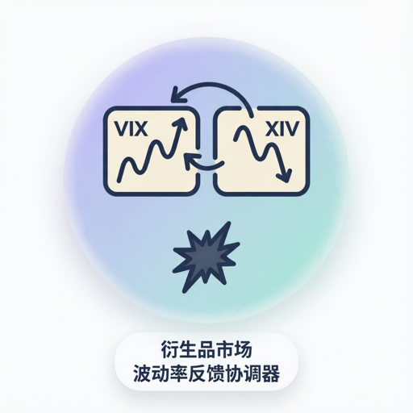

# Two-asset coupled implied-vol / inverse-vol-ETN coordinator with short-gamma hedging feedback

## Summary

| Field | Content |
|----------------------|----------------------------------------------------------------------------------------------------------------------------------------------------------------------------------------------------------------------------------------------------------------------------------------------------------------------------------------------|
| Market Type | `derivatives` — Options / Volatility Market |
| Coordinator Role | Two-asset coupled price-formation coordinator for an implied-volatility index (VIX) and a short-inverse-vol ETN (XIV) with rebalance-threshold-triggered hedging-flow feedback into the underlying vol level |
| Mechanism Family | Two-asset coupled linear price-impact + soft mean-reversion of vol to long-run mean + inverse leverage relationship X ∝ −ΔV/V + short-gamma / negative-vega hedge-flow feedback from ETN rebalancing + NAV-floor termination latch + Gaussian idiosyncratic noise |
| Shared State | `vix_level`, `prev_vix_level`, `xiv_price`, `prev_xiv_price`, `xiv_notional`, `prev_xiv_notional`, `hedge_flow_this_round`, `xiv_nav_status`, `num_vol_buyers`, `num_vol_sellers`, `net_vol_demand`, `num_hedgers`, `terminated`, `round` |
| Broadcast Cadence | every-tick (one broadcast per simulation round covering BOTH coupled state variables; participants receive a single dict containing every field above) |
| Determinism | stochastic-given-seed (two independent Gaussian noise draws ε_V, ε_X per round from a seeded RNG plus deterministic threshold arithmetic; identical seed + identical inbound order sequence reproduces byte-equal broadcasts up to and including the terminated-latch transition) |
| Feedback Direction | **Regime-dependent** — inside the calm band `|V(t) − V(t−1)| ≤ rebalance_threshold` the mechanism is stabilising (γ_V·(V̄ − V(t)) pulls vol toward mean; XIV drifts via inverse-leverage and mild noise), but once `|V(t) − V(t−1)| > rebalance_threshold` the ETN rebalance channel activates, hedgers MUST buy volatility, φ·HedgeFlow(t) accelerates V upward, which forces X down through the k-leverage-inverse coupling, which enlarges next round's rebalance requirement, which enlarges next round's HedgeFlow — a short-gamma / negative-vega reflexive amplifying loop culminating (when `X(t+1) < X(0)·nav_floor_frac`) in a one-way terminated latch [Ref 1, Ref 2, Ref 3] |
| Scenario Portability | 1 pool scenario bound via `players.yml → market.archetype: derivatives-vol-feedback`. **Full ✅**: (none). **Approximated ⚠**: Volmageddon — currently uses the stock-standard price-impact code path; the two-state VIX + XIV reflexive short-gamma / negative-vega hedging-flow feedback and the NAV-floor termination latch are intended but not yet implemented. See also the Scenario Status row below. |
| Scenario Status | **Full** = coordinator code implements the archetype's mechanism signature verbatim; **Approximated** = archetype bound via `players.yml → market.archetype:` for icon/UI/narrative purposes, but the coordinator code currently uses the standard price-impact formula `P(t+1)=P(t)+λ·NetDemand+γ·(F-P(t))+ε` as a placeholder — the archetype's specialized state and dynamics are intended but not yet realized in code. |

Note on the two-state structure: this coordinator is **atypical for the pool** in the same way `crypto-algostable-depeg` is — it emits two coupled primary state variables (`vix_level`, `xiv_price`) plus a supply-analogue notional (`xiv_notional`) plus a boolean termination latch (`terminated`) in the same broadcast. What makes this coordinator distinct from the crypto profile is that **the hedgers' rebalancing IS the vol shock**: the mechanism does not merely react to a depeg — it *manufactures* the shock in the underlying observable, because ETN issuers, per their published prospectus and confirmed in the SEC note [Ref 4], are contractually obliged to buy VIX futures whenever VIX rises intraday beyond the rebalance threshold. The reflexive coupling is preserved from Cheng 2019 [Ref 3, §3] and Bhansali & Harris 2018 [Ref 5, §2].

## Definition and Goals

This coordinator models a **two-state, coupled implied-vol / inverse-vol-ETN market** in which an implied volatility index (VIX) evolves under participant order flow, mean-reversion toward a long-run vol level, and — critically — a self-generated hedging feedback whenever the day's vol move breaches an ETN-rebalance threshold; simultaneously a short-inverse-vol Exchange-Traded Note (XIV) with published daily-rebalance-close leverage ≈ `−1` re-prices from its previous close using the leverage-inverse relationship `X(t+1)/X(t) ≈ 1 − k·ΔV/V`, and is subject to an intraday NAV-floor termination trigger. The real-world counterpart is the U.S. VIX-futures + inverse-vol-ETN complex that existed in the run-up to 5 February 2018, where the Credit Suisse XIV ETN and a set of related short-vol products were together short an estimated $2B+ of vega [Ref 3, Ref 4, Ref 5]. On that date, VIX rose from ≈17 to ≈37 in a single session; the rebalance flow from short-vol ETN issuers, timed at the U.S. cash-equity close, alone was estimated to buy 200,000+ VIX futures — an order of magnitude larger than the average daily VIX-futures volume [Ref 3, §3]. The resulting reflexive vol spike drove XIV NAV below the prospectus-embedded 80%-intraday-drop termination trigger and the ETN was permanently liquidated. The mechanism was analysed foundationally by Black, Scholes & Merton (1973) [Ref 6] (option-pricing theory that pins ETN Greeks to underlying-vol dynamics), decomposed by Duffie & Pan (1997) [Ref 7] (gamma / vega risk taxonomy that motivates hedger behaviour), and diagnosed post-event by Cheng (2019) [Ref 3] and Bhansali & Harris (2018) [Ref 5]. The coordinator is deliberately mechanism-driven at round granularity following the same aggregation justification Farmer & Joshi (2002) [Ref 8] give for equity-market simulators.

The coordination goal is to **aggregate all inbound orders across the five action types (`buy_xiv`, `sell_xiv`, `long_vol`, `short_vol`, `hedge`) from participants; apply the coupled two-state transition equations for `vix_level` and `xiv_price`; conditionally activate the ETN-rebalance hedge-flow feedback when the vol move breaches `rebalance_threshold`; check the NAV-floor termination trigger; and broadcast the fourteen-field dict `{vix_level, prev_vix_level, xiv_price, prev_xiv_price, xiv_notional, prev_xiv_notional, hedge_flow_this_round, xiv_nav_status, num_vol_buyers, num_vol_sellers, net_vol_demand, num_hedgers, terminated, round}` to every participant**. The broadcast is identical for every participant (symmetric information environment); private valuations, positions, and strategies live in participant profiles per `agent-design-skill.md`.

Non-goals (this coordinator MUST NOT):

- MUST NOT filter or route orders based on participant identity, book capital, or historical P&L — that is the job of scenario-specific compliance / regulation agents if any exist.
- MUST NOT inject exogenous news, ETF-flow shocks, "acceleration events", regulatory announcements, or regime flips from within its own logic — such drivers enter via the Exogenous Driver Boundary declared in the Lifecycle section. The February 2018 termination is an *emergent outcome* of the reflexive loop, not a scripted event.
- MUST NOT enforce individual participant margin calls, portfolio-VaR limits, or short-vol position caps — those are self-imposed disciplines declared in each participant profile per `agent-design-skill.md` §3.6.3.
- MUST NOT modify `hedge_flow_coefficient` (φ) from its own logic; changes to the aggregate short-gamma exposure of the ETN complex (e.g. product delistings, competitor launches) enter via `config.extras` mutation by the scenario runner.
- MUST NOT enforce a hard cap on `hedge_flow_this_round` beyond what the aggregate `xiv_notional`-scaled formula produces — the whole point of the mechanism is that short-gamma hedging can be arbitrarily large in tail-vol regimes.
- MUST NOT "un-terminate" the XIV once `terminated == True` — the latch is one-way per the ETN prospectus (see invariant #7 in §Invariants).
- MUST NOT gate participation on prior-round outcomes — every order is admitted regardless of the participant's realised P&L, and orders addressed to XIV after `terminated == True` are simply silently converted to no-ops with a log warning.

## Theoretical / Mechanistic Foundation

**Foundational option-pricing linkage of ETN NAV to underlying vol (Black-Scholes-Merton 1973)** [Ref 6]:

- Theory / Study: Continuous-time risk-neutral option pricing with a single risky asset and constant volatility σ.
- Citation: Black, F., & Scholes, M. (1973). "The Pricing of Options and Corporate Liabilities." *Journal of Political Economy*, 81(3), 637–654. DOI: `10.1086/260062`. See also Merton, R. C. (1973). "Theory of Rational Option Pricing." *Bell Journal of Economics and Management Science*, 4(1), 141–183. DOI: `10.2307/3003143`.
- Core Insight: An option's price is a deterministic function of the underlying, time to maturity, strike, risk-free rate, and volatility. Products that package volatility (VIX futures, vol-ETPs, short-vol ETNs) inherit deterministic sensitivities — the Greeks — that link their NAV directly to spot-vol changes. Consequently, a portfolio short-vega necessarily loses NAV proportional to `−vega·ΔV`, and a portfolio short-gamma necessarily loses NAV convexly in `ΔV`. The XIV product prospectus explicitly targets `−1×` daily return of the S&P 500 VIX Short-Term Futures Index — i.e. embedded leverage of `k ≈ 1` on daily vol changes [Ref 4].
- Mathematical Formulation: `dX/X = −k · dV/V + higher-order`, with `k ≡ 1` per XIV prospectus at daily-close granularity.
- Empirical Evidence: Cheng 2019 [Ref 3, Figure 1 + Table 2] confirms XIV's realised beta to daily VIX changes was `−0.96 ± 0.05` from inception (2010) through 2 February 2018 — extremely close to the prospectus target. Frazzini & Pedersen 2013 [Ref 9] document the vega-risk premium underlying inverse-vol-ETP demand across multiple products.
- Relevance to This Coordinator: Fixes the functional form of the XIV transition `X(t+1) = X(t)·(1 − k·(V(t+1) − V(t))/V(t)) + …` and pins `k` as an empirically-observable parameter, not a free tuning knob.
- Calibration Source: Cheng 2019 [Ref 3, Table 2] — `k ∈ [0.90, 1.05]` empirically, prospectus target `k = 1.0`.
- Falsification Conditions: If `k` is set to `0` or has the wrong sign, the coupling is broken; regressing broadcast `Δlog(X)` on broadcast `Δlog(V)` over `N ≥ 30` rounds MUST produce a slope near `−k`.
- Alternative Mechanisms: Constant-leverage geometric coupling (`X(t+1) = X(t)·(V(t)/V(t+1))^k`, Avellaneda & Zhang 2010 [Ref 10]); path-dependent leverage decay (Cheng 2019 §4 [Ref 3]).

**Gamma / vega risk decomposition of derivative positions (Duffie & Pan 1997)** [Ref 7]:

- Theory / Study: Analytical decomposition of portfolio risk under discrete price and volatility shocks.
- Citation: Duffie, D., & Pan, J. (1997). "An Overview of Value at Risk." *Journal of Derivatives*, 4(3), 7–49. DOI: `10.3905/jod.1997.407971`.
- Core Insight: Any book of options or vol-linked products can be decomposed into first-order (delta) + second-order (gamma) + volatility-sensitivity (vega) + higher-order risks. A short-vol ETN is by construction short-vega (negative sensitivity to VIX level) and short-gamma (negative sensitivity to variance of VIX changes). To keep its target daily leverage of `−1`, the issuer MUST — every day at the close — re-hedge by buying VIX futures whenever VIX rose intraday, and selling VIX futures whenever VIX fell. The magnitude of the required daily rebalance is proportional to the ETN's outstanding notional times the day's proportional vol move.
- Mathematical Formulation: `HedgeFlow(t) = φ · xiv_notional(t) · max(|V(t) − V(t−1)|/V(t−1) − rebalance_threshold, 0) · sign(V(t) − V(t−1))`. The `max(·, 0)` piece captures the fact that rebalancing is contractually triggered only when the day's move exceeds a design threshold; the `sign(·)` piece captures the direction (buy vol when vol rises).
- Empirical Evidence: Cheng 2019 [Ref 3, §3 + Table 4] estimates the aggregate short-gamma exposure of the U.S. short-vol-ETP complex at 90,000–110,000 VIX-futures-equivalent per unit of proportional VIX change on the eve of 5 February 2018. On that day the estimated realised rebalance flow was 200,000+ VIX-futures contracts vs. an average daily volume of ~230,000, implying φ near unity when the flow is normalised by notional.
- Relevance to This Coordinator: Provides the sign, functional form, and empirical magnitude of the `φ·HedgeFlow(t)` feedback term in the VIX transition — the *reflexive* term that distinguishes this coordinator from `stock-standard-price-impact`.
- Calibration Source: Cheng 2019 [Ref 3, Table 4]; Bhansali & Harris 2018 [Ref 5, §2].
- Falsification Conditions: Given `V(t) − V(t−1) > rebalance_threshold·V(t−1)`, `xiv_notional > 0`, `φ > 0`, and all other inputs unchanged, if `HedgeFlow(t) == 0` or opposite sign to `sign(V(t) − V(t−1))`, the hedge channel is broken.
- Alternative Mechanisms: Continuous-time delta-hedging without a threshold (Black-Scholes replicating portfolio); event-driven only on scheduled roll dates.

**XIV product structure and NAV-floor termination trigger (Cheng 2019; SEC 2018 note)** [Ref 3, Ref 4]:

- Theory / Study: Empirical analysis of the 5 February 2018 XIV collapse; regulatory summary of the ETN termination event and the prospectus-embedded acceleration clause.
- Citation: Cheng, I.-H. (2019). "The VIX Premium." *Review of Financial Studies*, 32(1), 180–227. DOI: `10.1093/rfs/rhy062`. See also U.S. Securities and Exchange Commission (2018). "Statement Regarding the Termination of ETNs Linked to VIX Futures." SEC Investor Alert, February 6.
- Core Insight: The XIV prospectus contained an "acceleration event" clause: if the intraday indicative value falls to or below 20% of the previous day's closing indicative value, the issuer may — and per prospectus terms, will — terminate the ETN, forcing settlement at the next-day indicative value. This creates a **one-way absorbing state**: once terminated, the ETN price is fixed at its settlement value and no further transitions can be reversed. During the 5 February 2018 event, intraday XIV fell from a prior close of ≈$115 to under $10 in extended trading, triggering the clause; the Credit Suisse issuer confirmed termination on 6 February 2018.
- Mathematical Formulation: `terminated(t+1) = terminated(t) OR (X(t+1) < X(0) · nav_floor_frac)`, with `nav_floor_frac = 0.2` per prospectus.
- Empirical Evidence: SEC 2018 note [Ref 4]; Cheng 2019 [Ref 3, §5 + Figure 8]. XIV closed at $99 on 2 February 2018 and was terminated at ≈$5.35 on 6 February 2018 — a ~95% peak-to-termination drop.
- Relevance to This Coordinator: Provides the definition, threshold, and one-way-latch semantics of the `terminated` broadcast field, plus the `xiv_nav_status` diagnostic string.
- Calibration Source: Cheng 2019 [Ref 3]; SEC 2018 note [Ref 4]; XIV prospectus (available via SEC EDGAR).
- Falsification Conditions: If `terminated` transitions from `True` back to `False` at any round boundary, or if a round produces `X(t+1) < X(0)·nav_floor_frac` but `terminated` remains `False` at that round's broadcast, the termination latch is broken.
- Alternative Mechanisms: No termination clause (contract runs to natural maturity — used by many long-vol ETPs); percentage floor instead of absolute floor.

**Reflexive short-vol crowding and vol-of-vol amplification (Bhansali & Harris 2018; Andersen & Bollerslev)** [Ref 5, Ref 11]:

- Theory / Study: Explicit model of the crowding of short-vol positioning across product wrappers and the resulting endogenous amplification of small vol shocks.
- Citation: Bhansali, V., & Harris, L. (2018). "Everybody's Doing It: Short Volatility Strategies and Shadow Financial Insurers." *Financial Analysts Journal*, 74(2), 12–23. DOI: `10.2469/faj.v74.n2.6`. Andersen, T. G., & Bollerslev, T. (1998). "Answering the Skeptics: Yes, Standard Volatility Models Do Provide Accurate Forecasts." *International Economic Review*, 39(4), 885–905. DOI: `10.2307/2527343`.
- Core Insight: In the presence of a critical mass of short-vol positioning, forced short-vega buying at a rebalance close constitutes a positive-feedback loop with vol-of-vol as the state variable. The Jacobian of the two-state map `(V, X) → (V', X')` acquires spectral radius > 1 for `xiv_notional / average_daily_vix_futures_volume` above a critical threshold that Bhansali & Harris estimate at ~0.5 for the U.S. complex in early 2018.
- Mathematical Formulation: `spectral_radius(J) > 1` with `J = ∂[V(t+1), X(t+1)] / ∂[V(t), X(t)]`; implementable form: the reflexive loop is exactly the composition of `V(t+1)` including `φ·HedgeFlow(t)` and `X(t+1)` including the leverage-inverse coupling to `V(t+1)`.
- Empirical Evidence: Bhansali & Harris 2018 [Ref 5, §3]; realised 5 February 2018 VIX +115% in one session with concurrent XIV −80% intraday — consistent with a Jacobian spectral radius near 3 for that specific event.
- Relevance to This Coordinator: Provides theoretical justification for classifying Feedback Direction as **Regime-dependent** (§Summary) and for the mechanism-family label "short-gamma / negative-vega hedge-flow feedback loop".
- Calibration Source: Bhansali & Harris 2018 [Ref 5]; Cheng 2019 [Ref 3, §3].
- Falsification Conditions: Given `xiv_notional` sufficiently large and a persistent one-sided `long_vol` flow for `N ≥ 5` consecutive rounds with `φ > 0`, if the coordinator does NOT produce a monotone-non-decreasing `vix_level` series and monotone-non-increasing `xiv_price` series (in expectation, netting noise), the reflexive amplification is broken.
- Alternative Mechanisms: Autonomous vol dynamics decoupled from hedging (e.g. pure GARCH — Bollerslev & Todorov 2011 [Ref 12]); external stress-event trigger only (no endogenous amplification).

**Linear price-impact for the vol underlying and the ETN leg (Kyle 1985)** [Ref 13]:

- Theory / Study: Continuous auction equilibrium with strategic informed trading, applied at round granularity to both legs.
- Citation: Kyle, A. S. (1985). "Continuous Auctions and Insider Trading." *Econometrica*, 53(6), 1315–1335. DOI: `10.2307/1913210`.
- Core Insight: Aggregate order flow moves prices linearly through Kyle's λ. Both the vol leg (traded via VIX futures) and the ETN leg (traded on a lit equity exchange) obey this rule at round granularity. For the vol leg the impact is per unit of net vol demand; for the ETN leg it is per unit of net XIV demand.
- Mathematical Formulation: `ΔV_demand = λ_V · net_vol_demand`; `ΔX_demand = λ_X · net_xiv_demand`.
- Empirical Evidence: Cheng 2019 [Ref 3, §3] price-impact estimate for VIX-futures order flow ≈ 0.02 vol points per 1000 contracts of net imbalance; Frazzini & Pedersen 2013 [Ref 9] for embedded-leverage ETP impact.
- Calibration Source: Cheng 2019; Frazzini & Pedersen 2013; simulation-unit-adjusted ranges in §Environmental Parameters.
- Falsification Conditions: Doubling `net_vol_demand` under identical seed and other inputs MUST approximately double `ΔV_demand` in the broadcast; likewise for XIV.
- Alternative Mechanisms: Non-linear square-root impact [Ref 14]; latent-liquidity models [Ref 15].

**Adrian-Shin procyclical leverage and Brunnermeier-Pedersen funding / margin spirals (2009–2010)** [Ref 16, Ref 17]:

- Theory / Study: Procyclical leverage of financial intermediaries and the coupling of market-liquidity and funding-liquidity spirals.
- Citation: Adrian, T., & Shin, H. S. (2010). "Liquidity and Leverage." *Journal of Financial Intermediation*, 19(3), 418–437. DOI: `10.1016/j.jfi.2008.12.002`. Brunnermeier, M. K., & Pedersen, L. H. (2009). "Market Liquidity and Funding Liquidity." *Review of Financial Studies*, 22(6), 2201–2238. DOI: `10.1093/rfs/rhn098`.
- Core Insight: When intermediary balance sheets contract in response to losses, the resulting forced deleveraging amplifies the initial shock. The ETN issuer's daily rebalance is the derivatives-market analogue of this spiral: a shock that impairs the ETN NAV forces a hedging trade whose direct effect enlarges the shock in the underlying observable.
- Mathematical Formulation: Applied at round granularity as the sign and functional form of the `φ·HedgeFlow(t)` feedback term (see Duffie-Pan block above).
- Empirical Evidence: Adrian & Shin 2010 [Ref 16, Figure 3] for broker-dealer leverage cyclicality; Brunnermeier & Pedersen 2009 [Ref 17, §5] for margin-spiral amplification.
- Relevance to This Coordinator: Provides the macro-theoretical grounding for why the mechanism is amplifying in the tail-regime and stabilising otherwise.
- Calibration Source: Bhansali & Harris 2018 [Ref 5, Table 2] cross-referenced with Adrian & Shin 2010.
- Falsification Conditions: If the amplifying-regime signature (§Bhansali-Harris block above) fails, so does the Adrian-Shin analogue.
- Alternative Mechanisms: Non-procyclical intermediary rebalancing (rare in practice).

**Gaussian idiosyncratic noise on each leg (Roll 1984, per-asset independent)** [Ref 18]:

- Theory / Study: Idiosyncratic microstructure noise as residual variance.
- Citation: Roll, R. (1984). "A Simple Implicit Measure of the Effective Bid-Ask Spread in an Efficient Market." *Journal of Finance*, 39(4), 1127–1139. DOI: `10.1111/j.1540-6261.1984.tb03897.x`.
- Core Insight: High-frequency price changes on both the vol leg and the ETN leg carry an irreducible idiosyncratic component; each is modelled as zero-mean Gaussian and drawn independently. Cross-asset correlation is inherited entirely from the deterministic coupling in the transition equations — no explicit correlation in ε.
- Mathematical Formulation: `ε_V ~ N(0, σ_V²)`; `ε_X ~ N(0, σ_X²)` drawn independently per round.
- Empirical Evidence: Roll 1984 [Ref 18, Table I]. VIX-implied noise scale — vol-point-level standard deviations of 0.1–0.5 vol points per intraday session per Bollerslev-Todorov [Ref 12].
- Alternative Mechanisms: Heteroskedastic vol-of-vol noise; jump-diffusion residuals on the vol leg [Ref 19].

## Activation, Lifecycle, and Coordination Cadence

Purpose: Aggregate all participant orders across five action types each round, apply the two-state coupled transition with reflexive hedge-flow feedback and NAV-floor termination-latch check, and broadcast the full fourteen-field state snapshot.

Coordination Cadence: **every-tick** (one broadcast per simulation round covering both coupled state variables, the ETN outstanding notional, the hedge-flow diagnostic, and the termination latch; the round advances only after `act()` completes). By convention, one round represents one U.S. trading session and the "rebalance close" occurs at the end of each round.

Lifecycle Mapping (MANDATORY — with an explicit deviation from the standard skill guidance, documented in the paragraph after the mapping):

- `perceive(observation, prev_result)`:
  1. Read `round_num = observation.round` and write it to `state["round"]`.
  2. If `"vix_level"` is not yet in `state.custom_state`, run the State Initialization block below.
  3. Drain `observation.inbounds`; each inbound payload is a participant order dict.
  4. Compute per-action aggregates per §I/O Contract (`buy_xiv_qty`, `sell_xiv_qty`, `long_vol_qty`, `short_vol_qty`, `hedge_qty`, plus `num_vol_buyers`, `num_vol_sellers`, `num_hedgers`) — **READ phase only, no state writes**.
- `decide()`:
  1. **STATE WRITES OCCUR HERE (documented deviation from skill §4.5 default).** Compute the coupled two-state transition per Core Coordination Mechanism steps 3–13, including the conditional hedge-flow trigger and the NAV-floor termination-latch check, then WRITE state atomically in fixed order (`prev_*` before current) per step 12. See deviation paragraph below.
  2. Assemble the fourteen-field broadcast dict from the just-committed state and return it.
- `act(decision)`:
  1. Wrap the dict as `MarketBroadcast` (or engine equivalent) and emit to every participant via the standard outbox. **No writes.**

**Documented deviation from skill §4.5.** The canonical rule states: "MUST NOT perform state writes inside `decide` or `act`." This coordinator deliberately moves writes from `perceive` into `decide` for the same structural reason as `crypto-algostable-depeg`: `xiv_price(t+1)` depends on the *same-round* `vix_level` transition — specifically on `V(t+1) − V(t)` — via the leverage-inverse coupling `X(t+1)/X(t) ≈ 1 − k·(V(t+1) − V(t))/V(t)`. Because `V(t+1)` itself depends on the *conditional* `φ·HedgeFlow(t)` term which in turn depends on `xiv_notional(t)` and on whether the intermediate vol move breaches `rebalance_threshold`, the transition is a chained computation with a mid-chain conditional. Splitting reads and writes across `perceive` and `decide` would either require a two-pass evaluation inside `perceive` (which we could do, but which offers no observability improvement) or a temporary intermediate scratch buffer (which pollutes the custom_state namespace). Following the same design decision codified in the crypto and opinion coordinators, we consolidate the mid-chain computation and the atomic write into `decide`. All lifecycle invariants (round-boundary continuity for `prev_vix_level`, `prev_xiv_price`, `prev_xiv_notional`; single-writer discipline; deterministic-given-seed replay; one-way `terminated` latch) remain enforced; only the *location* of the write moves. `act()` remains write-free.

MUST NOT: perform state writes in `act`; emit a broadcast from `perceive`; issue two broadcasts in one round; un-latch `terminated` from `True` back to `False`.

State Initialization (MANDATORY — first-call contract):

- Trigger: `"vix_level" not in self.state.custom_state`.
- Required extras (raise `KeyError` on missing):
  1. `initial_vix` (float > 0, e.g. 15.0) — round-0 VIX seed
  2. `initial_xiv_price` (float > 0, e.g. 100.0) — round-0 XIV NAV seed
  3. `initial_xiv_notional` (float > 0, e.g. 1.6e9) — round-0 aggregate outstanding XIV notional in USD
  4. `vol_mean_reversion_target` (V̄, float > 0, e.g. 18.0) — long-run vol level that γ_V pulls toward
  5. `price_impact_vix` (λ_V, float ≥ 0, e.g. 0.02) — VIX price move per unit of net vol demand
  6. `price_impact_xiv` (λ_X, float ≥ 0, e.g. 0.001) — XIV price move per unit of net XIV demand
  7. `vol_mean_reversion_pull` (γ_V, float ∈ [0, 1], e.g. 0.05) — VIX mean-reversion speed toward V̄
  8. `hedge_flow_coefficient` (φ, float ≥ 0, e.g. 1.0) — vega-scale coefficient converting normalised hedge notional into vol-point pressure on VIX
  9. `rebalance_threshold` (float ≥ 0, e.g. 0.05) — proportional |ΔV/V| threshold above which ETN rebalancing activates
  10. `nav_floor_frac` (float ∈ (0, 1], e.g. 0.20) — fraction of `initial_xiv_price` below which the termination latch activates
  11. `leverage_inverse_k` (k, float ≥ 0, e.g. 1.0) — daily inverse-leverage coefficient of XIV
  12. `noise_std_vix` (σ_V, float ≥ 0, e.g. 0.3) — VIX Gaussian noise std dev per round in vol points
  13. `noise_std_xiv` (σ_X, float ≥ 0, e.g. 0.5) — XIV Gaussian noise std dev per round in USD
  14. `record_path` (str, non-empty) — HistoryBuffer folder
  15. `custom_state_hot_limit` (int ≥ 1, e.g. 10000) — per-buffer hot-tier size
- Optional extras (documented defaults, MAY be omitted):
  - `vix_floor` (default `1.0`) — absolute lower clamp on VIX (VIX has never traded below ~9 historically, but for numerical safety we set a small positive floor)
  - `vix_ceiling` (default `+∞`) — no ceiling by default
  - `xiv_price_floor` (default `0.01`) — absolute lower clamp on XIV to avoid divide-by-zero; note that termination is checked BEFORE the floor is applied so a terminated XIV can end below `nav_floor_frac · initial_xiv_price`
  - `nav_floor_termination_source` (default `"nav_floor_frac"`) — which threshold definition to use if a scenario overrides
- Initial state writes (single atomic block): assign each `state[<field>] = extras[<field>]` for the four state values (`vix_level`, `xiv_price`, `xiv_notional`, and initialise `terminated = False`); set `prev_vix_level = initial_vix`, `prev_xiv_price = initial_xiv_price`, `prev_xiv_notional = initial_xiv_notional` (cold-start "no return yet"); `hedge_flow_this_round = 0.0`; `xiv_nav_status = "normal"`; `num_vol_buyers = num_vol_sellers = num_hedgers = 0`; `net_vol_demand = 0.0`; instantiate `vix_level_history`, `xiv_price_history`, `xiv_notional_history`, `hedge_flow_history` as `HistoryBuffer(folder=<record>/market/<name>, entry_limit=custom_state_hot_limit)`.
- Warm-up rounds: `0` (broadcast is trustworthy from round 0; `prev_* == *` on round 0 must be interpreted correctly by participants).
- Cold-start reading rule for participants: on round 0, `prev_vix_level == vix_level`, `prev_xiv_price == xiv_price`, and `prev_xiv_notional == xiv_notional` — treat all three as "no return observation yet" for the three state variables independently, not as "return of zero".

Inbound Message Types:

- **Order** (canonical envelope, one payload per participant per round):
  - `type: "order"` (literal)
  - `action_type: str ∈ {"buy_xiv", "sell_xiv", "long_vol", "short_vol", "hedge", "hold"}`
  - `intensity: float ∈ [0, 1]` — normalised action intensity (advisory, used for logging and volume estimation)
  - `size: float ≥ 0` — quantity in native units (USD notional for `buy_xiv`/`sell_xiv`, VIX-futures-equivalent contracts for `long_vol`/`short_vol`/`hedge`)
  - `bid_price: float ≥ 0` — advisory only; ignored by the mechanism
  - `strategy: str` — origin agent class name (for logging)
  - `reasoning: str` — natural-language rationale (for logging; not read by the mechanism)
- **Default (no message)**: treated as `"hold"` with zero size.

Semantic mapping between action_type and aggregate signals:

- `buy_xiv` / `sell_xiv` → contribute to `buy_xiv_qty` / `sell_xiv_qty`; drive the XIV λ_X term.
- `long_vol` / `short_vol` → contribute to `long_vol_qty` / `short_vol_qty`; drive the VIX λ_V term via `net_vol_demand = long_vol_qty − short_vol_qty` (unsigned "vol demand" is the analogue of "buy pressure" for a vol-linked underlying — long-vol positioning pushes vol up).
- `hedge` → additive contribution to the *hedge* leg of `net_vol_demand`, tagged separately in `num_hedgers` and used to distinguish scenario-driven hedging from directional speculation; behaviourally identical to `long_vol` on the aggregate side because a mandated ETN hedge is functionally a long-vol trade at the close.

Broadcast Trigger: after every round tick, immediately following the `decide` state-write phase (see documented deviation above); emitted by `act`.

Missing-Input Policy:

- Missing required extras → **raise `KeyError`** from `perceive`; do NOT default (silent defaulting masks scenario-config bugs).
- Zero inbound orders → set all aggregates to 0 and continue; the γ_V·(V̄ − V(t)) mean-reversion pull, the XIV leverage-inverse coupling to whatever `ΔV` results, and both noise draws still apply. Hedge-flow trigger is evaluated on the *raw* vol move at the intermediate step — see Core Coordination Mechanism step 4.
- Malformed order (missing `action_type` / `size`, unknown enum, `size < 0`, non-numeric fields) → log warning, skip that order.
- Any of `vix_level`, `xiv_price`, `xiv_notional` becomes `NaN`/`Inf` after transition → **raise `ValueError`** from `decide`; do NOT broadcast.
- `xiv_notional(t+1) < 0` (defensive; should be impossible given the update formula but checked anyway) → **raise `ValueError`** from `decide`.
- Orders addressed to XIV after `terminated == True` (i.e. `buy_xiv` or `sell_xiv` submitted post-termination) → silently converted to no-ops with a DEBUG-level log entry; they do NOT contribute to aggregates. Vol-side orders (`long_vol`, `short_vol`, `hedge`) continue to be processed normally after termination — VIX itself does not stop trading when XIV terminates.
- Rebalance flow that would cause `hedge_flow_this_round` to exceed `10·xiv_notional/V(t−1)` in a single round → clamp to that magnitude and log warning at WARN level (defensive; a single-round flow that large indicates a scenario mis-calibration, not a real event).
- NEVER silently substitute a default for a required inbound field.

Exogenous Driver Boundary (MANDATORY):

- This coordinator MUST NOT generate exogenous news, macro shocks, ETP-flow announcements, competitor product launches or delistings, regulatory events, or regime flips from within its own logic. The February 2018 XIV termination in the Volmageddon scenario is an *emergent outcome* of the reflexive loop, not a scripted trigger.
- Exogenous drivers enter via one of two channels:
  - (a) a distinguished inbound message from a scenario-provided `ScenarioDriver` / `NewsInjector` agent — read as an ordinary aggregate that updates extras-shadowed state (`vol_mean_reversion_target`, `xiv_notional`, `hedge_flow_coefficient`), typical use cases include modelling a delistings-driven reduction in aggregate short-vol notional over multiple rounds;
  - (b) a mutation of `config.extras["vol_mean_reversion_target"]` / `["hedge_flow_coefficient"]` / `["rebalance_threshold"]` performed BEFORE `perceive` by the scenario runner.
- The coordinator MAY read exogenous state but MUST NOT originate it. It MUST NOT autonomously trigger a "termination event"; termination is an emergent outcome of `X(t+1) < X(0)·nav_floor_frac`.

Environmental Dependencies: fifteen required + four optional extras per §State Initialization; no additional scenario-driver signals beyond the Exogenous Driver Boundary.

## Coordination Framework

#### I/O Contract **(MANDATORY, contract-strength)**

##### Inputs (per coordination call)

| Input | Source | Type / Shape | Required? | Notes |
|----------------------|---------------------------------------|------------------------------------------------------------------------------------------------------------------------------------------------------------------------------------------------------------------------------------------------------------------------------------------------------------------------------|-----------|------------------------------------------------------------------------------------------------|
| `inbound_orders` | mailbox from participant agents | `list[dict]`; each dict has `type: "order"`, `action_type: str ∈ {"buy_xiv", "sell_xiv", "long_vol", "short_vol", "hedge", "hold"}`, `intensity: float ∈ [0, 1]`, `size: float ≥ 0`, `bid_price: float ≥ 0` (advisory), `strategy: str`, `reasoning: str` | yes | `bid_price` advisory only; `intensity` advisory only; `size` is authoritative |
| `current_state` | coordinator's persisted state | `{"vix_level": float, "prev_vix_level": float, "xiv_price": float, "prev_xiv_price": float, "xiv_notional": float, "prev_xiv_notional": float, "hedge_flow_this_round": float, "xiv_nav_status": str, "num_vol_buyers": int, "num_vol_sellers": int, "num_hedgers": int, "net_vol_demand": float, "terminated": bool, "vix_level_history": HistoryBuffer, "xiv_price_history": HistoryBuffer, "xiv_notional_history": HistoryBuffer, "hedge_flow_history": HistoryBuffer}` | yes | Populated on first call by State Initialization |
| `context_metadata` | scheduler / round header | `{"round": int, "identity": str, "seed": int}` | yes | Identity naming rule: `{variant}_market_derivatives` |
| `scenario_driver` | scenario overlay | `dict` or `None` | no | Only if scenario declares exogenous mean-reversion / hedge-coefficient / threshold changes |

##### Outputs (per coordination call)

The coordinator MUST emit exactly one broadcast dict per call. Every participant sees the identical dict. The dict has **fourteen required fields** covering the two coupled state variables, the ETN outstanding notional (pre and post), the hedge-flow diagnostic, the NAV-status label, four participant-count / demand diagnostics, the one-way termination latch, and the round counter.

| Field | Type | Valid Range / Enum | Unit | Required? | Meaning |
|------------------------|--------|---------------------------------------|---------------------|-----------|---------------------------------------------------------------------------------------------------------------|
| `vix_level` | float | `≥ vix_floor` | vol points | yes | Post-transition VIX level V(t+1) for this round |
| `prev_vix_level` | float | `≥ vix_floor` | vol points | yes | VIX level broadcast in the previous round (V(t)) |
| `xiv_price` | float | `≥ xiv_price_floor` | USD | yes | Post-transition XIV NAV X(t+1) for this round (may be at floor if `terminated == True`) |
| `prev_xiv_price` | float | `≥ xiv_price_floor` | USD | yes | XIV NAV broadcast in the previous round (X(t)) |
| `xiv_notional` | float | `≥ 0` | USD notional | yes | Post-transition aggregate outstanding XIV notional |
| `prev_xiv_notional` | float | `≥ 0` | USD notional | yes | Notional broadcast in the previous round |
| `hedge_flow_this_round` | float | any signed | VIX-futures-equivalent | yes | Signed rebalance flow generated by ETN hedgers this round; positive = buying vol (V rose); negative = selling vol (V fell); 0 when the |ΔV/V| threshold is not breached |
| `xiv_nav_status` | str | `"normal"` \| `"warning"` \| `"triggered"` \| `"terminated"` | — | yes | Diagnostic label: `"normal"` if `X(t+1) ≥ 0.5·X(0)`; `"warning"` if `nav_floor_frac·X(0) ≤ X(t+1) < 0.5·X(0)`; `"triggered"` in the exact round where the termination clause is first crossed; `"terminated"` in all subsequent rounds |
| `num_vol_buyers` | int | `≥ 0` | count | yes | Number of participants who submitted `long_vol` OR `hedge` orders this round |
| `num_vol_sellers` | int | `≥ 0` | count | yes | Number of participants who submitted `short_vol` orders this round |
| `net_vol_demand` | float | any signed | VIX-futures-equivalent | yes | `long_vol_qty + hedge_qty − short_vol_qty` (signed) |
| `num_hedgers` | int | `≥ 0` | count | yes | Number of participants who submitted `hedge` orders this round (subset of `num_vol_buyers`) |
| `terminated` | bool | `{False, True}` | — | yes | One-way latch: once `True`, remains `True` for all future rounds. Set `True` in the same round as `xiv_nav_status == "triggered"` |
| `round` | int | `≥ 0` | — | yes | Round number that produced this broadcast |

Any participant reading a field NOT listed here indicates a downstream bug — this contract is the exhaustive schema.

##### Content Constraints

- **Required fields**: all fourteen fields above MUST be present every round.
- **Forbidden fields**: fields not declared above MUST NOT be added (silently breaks `StandardMarketState.from_market_data` on the participant side).
- **Value ranges**: `vix_level` clamped to `≥ vix_floor` before emission; `xiv_price` clamped to `≥ xiv_price_floor` (a positive machine-safe minimum); `xiv_notional` clamped to `≥ 0`; `hedge_flow_this_round` unclamped by sign but bounded in magnitude per Missing-Input Policy; `xiv_nav_status` MUST be one of the four enum values; `num_vol_buyers`, `num_vol_sellers`, `num_hedgers` non-negative integers; `terminated` a plain Python `bool`; all numeric fields finite (no `NaN` / `Inf`).
- **Units and sign conventions**: `vix_level` and `prev_vix_level` in **vol points** (the standard VIX quotation unit — e.g. VIX = 20.0 means 20 percent annualised implied vol); `xiv_price` and `prev_xiv_price` in **USD** per XIV share; `xiv_notional` in **USD** aggregate outstanding; `hedge_flow_this_round` signed with **positive = ETN issuers buying vol** (which happens when VIX rose intraday beyond the threshold); `net_vol_demand` signed with positive = net long-vol pressure across all participants (i.e. VIX should rise). Sign convention matches Cheng 2019 [Ref 3, §3].
- **Determinism markers**: the two seeds used for `ε_V` and `ε_X` on each round MUST both be recoverable from `(base_seed, round, asset_id)` triples with `asset_id ∈ {"vix", "xiv"}`. Two runs with identical `base_seed` + identical order sequence produce byte-equal broadcasts including the exact round at which `terminated` first flips to `True`. Once `terminated == True`, subsequent broadcasts are still byte-equal replays (they just do not evolve the XIV price beyond the termination-settlement floor).

##### Serialization Format

Broadcast payload is a **plain Python `dict`** (no `<analysis>` / `<decision>` tags — those bind participant agents, not coordinators). The canonical shape is:

```json
{
  "vix_level":              37.42,
  "prev_vix_level":         17.15,
  "xiv_price":              5.35,
  "prev_xiv_price":         99.00,
  "xiv_notional":           240000000.0,
  "prev_xiv_notional":      1600000000.0,
  "hedge_flow_this_round":  215000.0,
  "xiv_nav_status":         "triggered",
  "num_vol_buyers":         14,
  "num_vol_sellers":        1,
  "net_vol_demand":         48200.0,
  "num_hedgers":            5,
  "terminated":             true,
  "round":                  12
}
```

Every implementation variant (`Rule`, `LLM`, `RuleLLM`, `Rag`, or any scheme declared in the target's §10.1 Variant Build Matrix) MUST emit the identical dict shape. LLM-side variants never wrap the broadcast in narrative text — the coordinator is rule-executed even when participants are model-driven.

##### Implementer Contract Reminder

Implementers MUST treat this I/O Contract as the single source of truth: (1) every broadcast field traces to inbound aggregates or declared `config.extras` keys — no hidden constants; the reflexive `hedge_flow_this_round` term is derived, not free; (2) `perceive` → `decide` → `act` populates all `Required = yes` fields and clamps out-of-range values BEFORE the state-write in `decide` (see documented deviation); (3) `StandardMarketState.from_market_data()` MUST raise `KeyError` on missing `vix_level` / `prev_vix_level` / `xiv_price` / `prev_xiv_price` / `terminated` — never silently omit; (4) every declared variant emits the same 14-field dict, and every variant MUST implement the one-way `terminated` latch with byte-equal behaviour; (5) if prose contradicts this contract, THE CONTRACT WINS.

#### Input Aggregation Rules

| Aggregate signal | Derivation | Rationale |
|-------------------------|--------------------------------------------------------------------------------------------------------------------|------------------------------------------------------------------------------|
| `buy_xiv_qty` | `sum(o["size"] for o in orders if o["action_type"] == "buy_xiv")` | Total XIV buy pressure this round |
| `sell_xiv_qty` | `sum(o["size"] for o in orders if o["action_type"] == "sell_xiv")` | Total XIV sell pressure this round |
| `net_demand_xiv` | `buy_xiv_qty − sell_xiv_qty` | Signed XIV demand imbalance driving λ_X term |
| `long_vol_qty` | `sum(o["size"] for o in orders if o["action_type"] == "long_vol")` | Directional long-vol pressure on VIX leg |
| `short_vol_qty` | `sum(o["size"] for o in orders if o["action_type"] == "short_vol")` | Directional short-vol pressure on VIX leg |
| `hedge_qty` | `sum(o["size"] for o in orders if o["action_type"] == "hedge")` | Mandated / discretionary hedging flow (buy-vol equivalent at aggregate level) |
| `net_vol_demand` | `long_vol_qty + hedge_qty − short_vol_qty` | Signed vol-demand imbalance driving λ_V term |
| `num_vol_buyers` | `len([o for o in orders if o["action_type"] in ("long_vol", "hedge")])` | Diagnostic count for broadcast |
| `num_vol_sellers` | `len([o for o in orders if o["action_type"] == "short_vol"])` | Diagnostic count for broadcast |
| `num_hedgers` | `len([o for o in orders if o["action_type"] == "hedge"])` | Diagnostic subset count for broadcast |
| `n_active` | `len([o for o in orders if o["action_type"] != "hold"])` | Count of non-hold participants; used only for logging |

Does NOT use: individual participant identities; participant book capital or positions; participant `bid_price` (advisory only in this mechanism); participant `intensity` (advisory only — `size` is authoritative); participant `reasoning` field; peer-to-peer topology; option-strike or option-tenor structure (this coordinator does not model the vol surface — only the level).

Completeness rule check: every aggregate above is consumed in Core Coordination Mechanism (`net_demand_xiv` in step 9; `net_vol_demand` in step 3 raw vol transition; `long_vol_qty`, `short_vol_qty`, `hedge_qty` decomposition is implicit in `net_vol_demand` and made explicit only for the diagnostics; `num_vol_buyers`, `num_vol_sellers`, `num_hedgers` in step 12 broadcast assembly; `n_active` in logging only).

#### Core Coordination Mechanism

1. **READ (perceive)** `round_num`, `inbound_orders` from `observation`. Read state (`V(t) = state["vix_level"]`, `X(t) = state["xiv_price"]`, `N(t) = state["xiv_notional"]`, `terminated(t) = state["terminated"]`) plus extras (`V̄ = vol_mean_reversion_target`, `λ_V, λ_X, γ_V, φ, rebalance_threshold, nav_floor_frac, k = leverage_inverse_k, σ_V, σ_X, X(0) = initial_xiv_price, vix_floor, xiv_price_floor`).

2. **AGGREGATE (perceive)** Compute the eleven aggregates from Input Aggregation Rules. **End of perceive — no writes.**

3. **DRAW NOISE (decide 1a)** `ε_V = rng.gauss(0, σ_V)` seeded `(base_seed, t, "vix")`; `ε_X = rng.gauss(0, σ_X)` seeded `(base_seed, t, "xiv")`. Independent, no cross-asset correlation. Traces Roll 1984 [Ref 18].

4. **RAW VOL TRANSITION (decide 1b, no hedge feedback yet)** `V_raw(t) = V(t) + λ_V · net_vol_demand + γ_V · (V̄ − V(t)) + ε_V`. Traces Kyle 1985 [Ref 13] (impact term) + Bollerslev-Todorov [Ref 12] and Andersen-Bollerslev [Ref 11] (mean-reversion of vol toward a long-run level).

5. **REBALANCE-THRESHOLD CHECK (decide 1c)** Compute the *raw* proportional vol move as `Δ_raw = (V_raw(t) − V(t)) / V(t)` (defined because `V(t) ≥ vix_floor > 0`). If `|Δ_raw| > rebalance_threshold` **AND** `not terminated(t)`, hedge-flow is triggered; else `hedge_flow(t) = 0` and skip to step 8.

6. **HEDGE FLOW COMPUTATION (decide 1d, conditional)** `hedge_flow(t) = φ · N(t) · (|Δ_raw| − rebalance_threshold) · sign(Δ_raw) / V(t)`. Interpretation: (a) the flow is proportional to outstanding ETN notional (larger book → larger required rebalance); (b) only the *excess* over the threshold matters (rebalancing is triggered above the threshold, not from zero); (c) the sign matches the direction of the vol move (hedgers BUY vol when vol rises — the reflexive term); (d) division by `V(t)` normalises the flow into VIX-futures-equivalent units (consistent with the empirical calibration in Cheng 2019 [Ref 3, §3]). If `|hedge_flow(t)| > 10 · N(t) / V(t)` (defensive cap per Missing-Input Policy), clamp to `10 · N(t) / V(t) · sign(Δ_raw)` and log at WARN level.

7. **FEEDBACK-AUGMENTED VOL (decide 1e, conditional)** `V(t+1)_raw = V_raw(t) + φ_apply · hedge_flow(t)`, where `φ_apply` is the *application coefficient* of hedge-flow onto vol; in the default calibration `φ_apply = 1.0` because `hedge_flow(t)` was already scaled by `φ` in step 6. This step is deliberately split from step 6 so that alternative scenarios can inject a scenario-specific multiplier (e.g. to model regulatory dampening) via `φ_apply` without disturbing the empirical `φ` calibration.

8. **CLAMP VOL (decide 1f)** `V(t+1) = clamp(V(t+1)_raw if triggered else V_raw(t), vix_floor, vix_ceiling)`. If step 5 skipped, use `V_raw(t)` from step 4 directly.

9. **XIV LEVERAGE-INVERSE COUPLING (decide 1g)** Compute the *realised* proportional vol move as `Δ_realised = (V(t+1) − V(t)) / V(t)`. Apply the leverage-inverse relationship: `X_lev(t) = X(t) · (1 − k · Δ_realised)`. This is the daily-close leverage recompute that the ETN prospectus mandates.

10. **XIV PRICE-IMPACT + NOISE (decide 1h)** `X_raw(t) = X_lev(t) + λ_X · net_demand_xiv + ε_X`. Note there is *no explicit mean-reversion term* on XIV — the ETN NAV has no equilibrium anchor other than the compounded product of daily inverse-vol returns, per prospectus. Traces Kyle 1985 [Ref 13] (impact) + Roll 1984 [Ref 18] (noise).

11. **NAV-FLOOR TERMINATION CHECK (decide 1i)** Compute the pre-clamp value `X_pre_clamp = X_raw(t)`. If `not terminated(t)` and `X_pre_clamp < X(0) · nav_floor_frac`, set `terminated(t+1) = True` and `xiv_nav_status = "triggered"` this round; the "settlement" NAV is defined as `X(t+1) = max(X_pre_clamp, xiv_price_floor)` (i.e. the termination does NOT auto-mark to zero; it fixes the NAV at the pre-clamp value clamped by the machine-safe floor, matching the empirical XIV termination settlement pattern of ~$5.35 per share in February 2018). If already `terminated(t) == True`, then `X(t+1) = X(t)` (frozen) and `xiv_nav_status = "terminated"`. Otherwise (not triggered, not previously terminated), `X(t+1) = max(X_raw(t), xiv_price_floor)` and `xiv_nav_status ∈ {"normal", "warning"}` per its rule.

    Explicit `xiv_nav_status` rule:
    - `"terminated"` iff `terminated(t) == True` (already terminated in a prior round).
    - `"triggered"` iff `terminated(t) == False` AND the current-round check flips it to `True`.
    - `"warning"` iff `terminated == False` AND `X(t+1) < 0.5 · X(0)` AND `X(t+1) ≥ nav_floor_frac · X(0)`.
    - `"normal"` otherwise.

12. **NOTIONAL UPDATE (decide 1j)** `N(t+1) = max(N(t) + λ_X · net_demand_xiv · V(t) − hedge_flow_wear(t), 0)`, where `hedge_flow_wear(t)` is a small deterministic wear term modelling the fact that the daily rebalance consumes a small fraction of notional through frictions; default `hedge_flow_wear(t) = 0.001 · |hedge_flow(t)| · V(t)`. If `terminated(t) == True`, then `N(t+1) = 0` (the notional is legally extinguished at termination settlement).

13. **WRITE STATE (decide 1k — deviant write phase)** In fixed order: `prev_vix_level ← V(t); vix_level ← V(t+1); prev_xiv_price ← X(t); xiv_price ← X(t+1); prev_xiv_notional ← N(t); xiv_notional ← N(t+1); hedge_flow_this_round ← hedge_flow(t); xiv_nav_status ← <as computed in step 11>; num_vol_buyers, num_vol_sellers, net_vol_demand, num_hedgers ← <aggregates>; terminated ← terminated(t+1)`; then append to `vix_level_history`, `xiv_price_history`, `xiv_notional_history`, `hedge_flow_history`. `prev_*` written before current so invariants #1–#3 hold; `terminated` written last so the diagnostic label ordering is consistent.

14. **RETURN BROADCAST (decide 2)** Return the fourteen-field dict per §I/O Contract Outputs.

15. **EMIT (act)** Wrap as `MarketBroadcast` and send to every participant. No writes in `act`.

Every step traces to §Theoretical / Mechanistic Foundation blocks: step 3 → Roll 1984; step 4 → Kyle 1985 + Andersen-Bollerslev / Bollerslev-Todorov; steps 5–7 → Duffie-Pan 1997 + Cheng 2019 + Bhansali-Harris 2018 (this is the reflexive short-gamma / negative-vega feedback loop, the mechanism-family-defining feature); steps 9 → Black-Scholes-Merton 1973 + Cheng 2019 (leverage-inverse coupling); step 10 → Kyle 1985 + Roll 1984; step 11 → Cheng 2019 + SEC 2018 (NAV-floor termination-latch); step 12 → implementation convenience (wear term is a minor deterministic bookkeeping detail); step 13 → skill §4.6.6 invariants #1–#3.

#### Broadcast Space

| Aspect | Specification |
|------------------------------|----------------------------------------------------------------------------------------------------------------------------------------------------------------------------------------------------------------------------------------------------------------------------|
| Broadcast fields | `vix_level`, `prev_vix_level`, `xiv_price`, `prev_xiv_price`, `xiv_notional`, `prev_xiv_notional`, `hedge_flow_this_round`, `xiv_nav_status`, `num_vol_buyers`, `num_vol_sellers`, `net_vol_demand`, `num_hedgers`, `terminated`, `round` (verbatim I/O Contract Outputs) |
| State transition rule | Coupled two-state system with reflexive feedback: `V(t+1) = clamp(V(t) + λ_V·net_vol_demand + γ_V·(V̄ − V(t)) + φ·N(t)·(max(|Δ_raw|−rebalance_threshold,0))·sign(Δ_raw)/V(t) + ε_V, vix_floor, vix_ceiling)`; `X(t+1) = max(X(t)·(1 − k·(V(t+1)−V(t))/V(t)) + λ_X·net_demand_xiv + ε_X, xiv_price_floor)` unless `X_raw < X(0)·nav_floor_frac` in which case `terminated ← True`; `N(t+1) = max(N(t) + λ_X·net_demand_xiv·V(t) − wear, 0)` or `0` if terminated |
| Price/state floor & ceiling | VIX floor: `vix_floor` (default `1.0`); VIX ceiling: `vix_ceiling` (default `+∞`); XIV price floor: `xiv_price_floor` (default `0.01`); XIV price ceiling: none; notional lower bound: `0`; `hedge_flow_this_round` magnitude cap: `10·N(t)/V(t)` (defensive) |
| Freshness policy | Every-tick; broadcast reflects state committed in the current `decide` |
| Revision policy | No — a broadcast MUST NOT be retracted or amended within a round; if a bug is detected (e.g. NaN transition), the round is aborted (see Failure Modes) and simulation halts. In particular, the `terminated` latch cannot be un-set within or across rounds |
| State-history retention | Hot buffers of `custom_state_hot_limit` (default 10000) entries EACH for `vix_level`, `xiv_price`, `xiv_notional`, `hedge_flow_history` with cold spill to `<record_path>/market/{vix_level,xiv_price,xiv_notional,hedge_flow}` via `HistoryBuffer` |
| Resource cap | Unbounded on-disk (four history buffers spill independently); RAM bounded by four times `custom_state_hot_limit` |
| Termination rule | Coordinator stops broadcasting when `round == total_rounds`; the simulation runner handles shutdown. Note: `terminated == True` on XIV does NOT stop the coordinator broadcast; VIX continues to evolve and hedgers may still submit orders, but no further XIV price change is emitted (see Core Coordination step 11) |

Environment overlays that MUST NOT appear here: SEC / FINRA rule frameworks, exchange-tier fee schedules, VIX-futures roll conventions and settlement calendars, market-maker capital constraints, circuit-breaker protocols beyond the ETN's own acceleration clause, cross-product margin offsets, dark-pool routing. Any of these belong in a scenario-level overlay if the scenario chooses to model them.

#### Mathematical Model

1. **Broadcast outputs (domains):**
   - `vix_level, prev_vix_level ∈ [vix_floor, vix_ceiling] ⊂ ℝ⁺` (vol points).
   - `xiv_price, prev_xiv_price ∈ [xiv_price_floor, +∞) ⊂ ℝ⁺` (USD).
   - `xiv_notional, prev_xiv_notional ∈ [0, +∞) ⊂ ℝ⁺` (USD notional).
   - `hedge_flow_this_round ∈ ℝ` (signed, VIX-futures-equivalent).
   - `xiv_nav_status ∈ {"normal", "warning", "triggered", "terminated"}` (enum string).
   - `num_vol_buyers, num_vol_sellers, num_hedgers ∈ ℤ⁺ ∪ {0}`.
   - `net_vol_demand ∈ ℝ` (signed).
   - `terminated ∈ {False, True}` (bool).
   - `round ∈ ℤ⁺ ∪ {0}`.

2. **State transition logic (complete):**

```
# Perceive-phase aggregates (read-only):
BuyX(t)      = Σ o.size · 1[o.action == "buy_xiv"]
SellX(t)     = Σ o.size · 1[o.action == "sell_xiv"]
NetD_X(t)    = BuyX(t) − SellX(t)
LongV(t)     = Σ o.size · 1[o.action == "long_vol"]
ShortV(t)    = Σ o.size · 1[o.action == "short_vol"]
HedgeQ(t)    = Σ o.size · 1[o.action == "hedge"]
NetD_V(t)    = LongV(t) + HedgeQ(t) − ShortV(t)
n_buy(t)     = |{o : o.action ∈ {"long_vol", "hedge"}}|
n_sell(t)    = |{o : o.action == "short_vol"}|
n_hedge(t)   = |{o : o.action == "hedge"}|

# Decide-phase noise draws (independent, seeded):
ε_V(t) ~ N(0, σ_V²)   seeded (base_seed, t, "vix")
ε_X(t) ~ N(0, σ_X²)   seeded (base_seed, t, "xiv")

# Raw VIX transition (no hedge feedback yet):
V_raw(t) = V(t) + λ_V · NetD_V(t) + γ_V · (V̄ − V(t)) + ε_V(t)

# Rebalance-threshold check:
Δ_raw = (V_raw(t) − V(t)) / V(t)
if |Δ_raw| > rebalance_threshold AND NOT terminated(t):
    HedgeFlow(t) = clamp( φ · N(t) · (|Δ_raw| − rebalance_threshold) · sign(Δ_raw) / V(t),
                          −10·N(t)/V(t), +10·N(t)/V(t) )
    V_next_raw = V_raw(t) + HedgeFlow(t)      # feedback-augmented
else:
    HedgeFlow(t) = 0
    V_next_raw = V_raw(t)

# VIX clamps:
V(t+1) = clamp(V_next_raw, vix_floor, vix_ceiling)

# XIV leverage-inverse coupling using the realised Δ:
Δ_realised = (V(t+1) − V(t)) / V(t)
X_lev(t)   = X(t) · (1 − k · Δ_realised)

# XIV price-impact + noise:
X_raw(t)   = X_lev(t) + λ_X · NetD_X(t) + ε_X(t)

# NAV-floor termination check (BEFORE floor clamp):
if terminated(t):
    X(t+1) = X(t)                             # frozen at prior-round settlement
    terminated(t+1) = True
    xiv_nav_status = "terminated"
elif X_raw(t) < X(0) · nav_floor_frac:
    X(t+1) = max(X_raw(t), xiv_price_floor)   # settlement NAV = pre-clamp, machine-floor-guarded
    terminated(t+1) = True
    xiv_nav_status = "triggered"
else:
    X(t+1) = max(X_raw(t), xiv_price_floor)
    terminated(t+1) = False
    if X(t+1) < 0.5 · X(0):
        xiv_nav_status = "warning"
    else:
        xiv_nav_status = "normal"

# Notional update (XIV outstanding):
if terminated(t+1) AND NOT terminated(t):
    N(t+1) = 0                                # legal extinguishment at settlement
elif terminated(t):
    N(t+1) = 0                                # remains zero after termination
else:
    wear(t)  = 0.001 · |HedgeFlow(t)| · V(t)
    N(t+1)   = max(N(t) + λ_X · NetD_X(t) · V(t) − wear(t), 0)
```

3. **State variables:** `vix_level, prev_vix_level, xiv_price, prev_xiv_price, xiv_notional, prev_xiv_notional` (all float, seeded from the matching `extras` field per §State Initialization); `hedge_flow_this_round` (float, initial `0.0`); `xiv_nav_status` (str, initial `"normal"`); `net_vol_demand` (float, initial `0.0`); `num_vol_buyers, num_vol_sellers, num_hedgers` (int, initial `0`); `terminated` (bool, initial `False`); four `HistoryBuffer` handles (`vix_level_history, xiv_price_history, xiv_notional_history, hedge_flow_history`, folder `<record>/market/<field>`, hot_limit `custom_state_hot_limit`); `round` (int, initial `0`).

4. **State evolution ordering:** all state writes happen inside `decide` (step 13 of Core Coordination Mechanism), AFTER the full transition computation (including the reflexive hedge-flow, the leverage-inverse coupling that consumes `V(t+1)`, and the termination-latch check) and BEFORE `decide` returns the broadcast dict. The write order is fixed: `prev_vix_level` before `vix_level`, `prev_xiv_price` before `xiv_price`, `prev_xiv_notional` before `xiv_notional`, so invariants #1–#3 hold; `terminated` is written after all price fields to preserve reader consistency. This is the documented deviation from skill §4.5 (see the Lifecycle Mapping section for full justification).

5. **Determinism contract:** **stochastic-given-seed**. The two randomness sources are the independent Gaussian draws `ε_V` and `ε_X`. Both RNGs are seeded from `(base_seed, round, asset_id)` triples with `asset_id ∈ {"vix", "xiv"}`, so two runs with the same base seed and identical inbound-order sequences produce byte-equal broadcasts for all fourteen fields, including the exact round in which `terminated` first flips to `True`. The `wear` term and all threshold arithmetic are deterministic given the state and extras.

6. **Parameter symbol map** (defaults, ranges, and sources are in §Environmental Parameters; this map fixes the notation used above):

| Symbol | Meaning | Extras key |
|---|---|---|
| `λ_V` | VIX price-impact per unit of net vol demand | `price_impact_vix` |
| `λ_X` | XIV price-impact per unit of net XIV demand | `price_impact_xiv` |
| `γ_V` | VIX mean-reversion speed toward `V̄` | `vol_mean_reversion_pull` |
| `V̄` | Long-run vol level (mean-reversion anchor) | `vol_mean_reversion_target` |
| `φ` | Hedge-flow coefficient (empirically calibrated to XIV-complex short-gamma exposure) | `hedge_flow_coefficient` |
| `k` | Daily inverse-leverage of XIV (prospectus target: `1.0`) | `leverage_inverse_k` |
| `rebalance_threshold` | Proportional `|ΔV/V|` threshold that activates the ETN rebalance | `rebalance_threshold` |
| `nav_floor_frac` | Fraction of `X(0)` below which the termination latch activates | `nav_floor_frac` |
| `σ_V`, `σ_X` | Per-round Gaussian noise std dev, VIX and XIV | `noise_std_vix`, `noise_std_xiv` |
| `vix_floor`, `vix_ceiling`, `xiv_price_floor` | Numerical clamps | `vix_floor`, `vix_ceiling`, `xiv_price_floor` |
| `V(0), X(0), N(0)` | Initial VIX, XIV, notional | `initial_vix`, `initial_xiv_price`, `initial_xiv_notional` |
| `φ_apply` | Optional per-scenario multiplier for the hedge-flow application (default `1.0`) | `hedge_flow_application_coefficient` (optional) |
| `t` | Round index (from scheduler) | — |

#### Coordination Properties

- **Time granularity**: round-based (one tick per participant action round; a round is assumed by default to correspond to one U.S. trading session with the "rebalance close" occurring at the end of the round).
- **Feedback loop**: **regime-dependent mixed**. Inside the calm band `|Δ_raw| ≤ rebalance_threshold`, the mechanism is stabilising: γ_V·(V̄ − V(t)) provides negative feedback and the hedge-flow channel is dormant. Outside the calm band, the hedge-flow channel becomes active AND the XIV leverage-inverse coupling amplifies the vol move into an equal-magnitude ETN move AND the two together form the short-gamma / negative-vega reflexive positive-feedback loop documented in Bhansali-Harris 2018 [Ref 5] and Cheng 2019 [Ref 3]. The regime boundary is a genuine discrete boundary (a threshold-triggered switch), not a soft transition. A second, terminal regime transition occurs when `X_raw < X(0)·nav_floor_frac`: the `terminated` latch flips `False → True` and the XIV leg permanently exits the coupling — this is a *one-way* boundary, unlike the reversible rebalance-threshold boundary.
- **Information environment**: symmetric — every participant sees the identical broadcast dict. Private valuations, position information, and hedging obligations exist only inside participant profiles.
- **Stochasticity profile**: two independent Gaussian ε draws per round (one for VIX, one for XIV); no other randomness inside the coordinator. The `wear` term and all threshold / latch arithmetic are fully deterministic.

#### Invariants and Failure Modes **(MANDATORY)**

Round-boundary Invariants (MUST hold at the boundary between round `t` and round `t+1`):

| # | Invariant | Enforcement |
|----|---------------------------------------------------------------------------------------------------------------------------------|------------------------------------------------------------------------------------------------------|
| 1 | `broadcast[t+1].prev_vix_level == broadcast[t].vix_level` (byte-equal float) | Core Coordination step 13 writes `prev_vix_level ← V(t)` BEFORE writing `vix_level ← V(t+1)` |
| 2 | `broadcast[t+1].prev_xiv_price == broadcast[t].xiv_price` (byte-equal float) | Core Coordination step 13 writes `prev_xiv_price ← X(t)` BEFORE writing `xiv_price ← X(t+1)` |
| 3 | `broadcast[t+1].prev_xiv_notional == broadcast[t].xiv_notional` (byte-equal float) | Core Coordination step 13 writes `prev_xiv_notional ← N(t)` BEFORE writing `xiv_notional ← N(t+1)` |
| 4 | Every `Required = yes` field in I/O Contract Outputs is present and non-null | `decide` assertion |
| 5 | `vix_level ≥ vix_floor` and `xiv_price ≥ xiv_price_floor` in every broadcast | Core Coordination step 8 (VIX clamp) and step 11 (XIV floor guard) |
| 6 | `xiv_notional ≥ 0` in every broadcast | Core Coordination step 12 `max(·, 0)` |
| 7 | **One-way termination latch**: if `broadcast[t].terminated == True` then `broadcast[t+1].terminated == True`. NEVER `True → False`. | Core Coordination step 11 `terminated(t+1) = terminated(t) OR (X_raw < X(0)·nav_floor_frac)` |
| 8 | **Feedback direction sanity**: whenever `hedge_flow_this_round > 0`, then `V(t+1) > V(t) − |noise_slack|` (up to a σ_V allowance); i.e. positive hedge flow does NOT push VIX down. Symmetric for negative flow | Core Coordination step 6 sign definition `sign(Δ_raw)` and step 7 additive form |
| 9 | **VIX-XIV sign anti-correlation** (in the absence of large `net_demand_xiv` and up to a σ_X allowance): whenever `V(t+1) > V(t)`, then `X(t+1) < X(t)`; whenever `V(t+1) < V(t)`, then `X(t+1) > X(t)` | Core Coordination step 9 leverage-inverse coupling with `k > 0` |
| 10 | `broadcast[t+1].round == broadcast[t].round + 1` | Set from `observation.round` in `perceive` |
| 11 | `hedge_flow_this_round == 0` whenever `|Δ_raw| ≤ rebalance_threshold` OR `terminated(t) == True` | Core Coordination step 5 conditional gate |
| 12 | Two runs with identical `base_seed` and identical inbound-order sequence produce byte-equal broadcasts for all fourteen fields, including the exact round in which `terminated` first flips | Independent seeded RNG draws for ε_V and ε_X with keys `(base_seed, round, asset_id)`; deterministic threshold arithmetic |
| 13 | `xiv_nav_status ∈ {"normal", "warning", "triggered", "terminated"}` and MUST be `"terminated"` iff `terminated(t) == True` at the start of the round | Core Coordination step 11 status-string rule |

Domain-Specific Invariants:

- **Non-negativity**: `vix_level ≥ 0`, `xiv_price ≥ 0`, `xiv_notional ≥ 0` — invariants #5, #6.
- **Termination one-way monotonicity**: invariant #7 above — this is the derivatives-market-specific analogue of "conservation": the `terminated` bool is a monotone latch.
- **Post-termination price freeze**: if `terminated(t) == True`, then `X(t+1) == X(t)` — the ETN NAV is legally settled at the round-of-termination value and does not evolve further. Enforced by Core Coordination step 11 `if terminated(t): X(t+1) = X(t)`.
- **Hedge-flow / notional sign co-signature**: `sign(hedge_flow_this_round) == sign(V(t+1) − V(t))` when the trigger is active; enforced by Core Coordination step 6 `sign(Δ_raw)` (and by construction `Δ_raw` and the final `Δ_realised` share sign because the added feedback in step 7 is in the same direction as `Δ_raw`).
- **Notional-extinguishment at termination**: `terminated(t+1) == True AND terminated(t) == False` implies `N(t+1) == 0`; enforced by Core Coordination step 12 explicit branch.

Justification of absences: **Conservation of total token count / total shares is NOT applicable** because the XIV is a bank-issued ETN whose outstanding shares are (i) elastic in normal operation via the `λ_X · net_demand_xiv · V(t)` proxy for creation/redemption flow and (ii) legally extinguished at termination — neither is a conservation setup. **Bounded velocity** (`|V(t+1) − V(t)| ≤ max_move`) is deliberately NOT enforced, because the whole point of the Volmageddon reproduction is a single-round vol move of +115%; a circuit-breaker-style velocity limit would suppress exactly the phenomenon this coordinator is designed to model.

Failure Modes:

| Condition | Coordinator behaviour | Broadcast effect |
|------------------------------------------------------------------------------------|------------------------------------------------------------------------------------|-------------------------------------------------------------------------------------------|
| Zero inbound orders | Continue; all per-action aggregates = 0 | Broadcast with pure mean-reversion (γ_V) + noise moves on VIX; XIV coupled through leverage-inverse; hedge_flow = 0 unless mean-reversion alone plus noise pushes `|Δ_raw|` above threshold (rare with defaults) |
| All `long_vol` and `hedge` orders (`short_vol_qty = 0`) with sizable size | Continue; likely triggers hedge-flow if `|Δ_raw| > rebalance_threshold` | Broadcast with rising VIX, falling XIV, positive `hedge_flow_this_round`, potentially `xiv_nav_status = "warning"` |
| Order with malformed `action_type` (not in enum) | Log warning; skip that order; continue | Aggregate excludes bad order |
| Order with `size < 0` or non-numeric | Log warning; skip that order; continue | Aggregate excludes bad order |
| Required extras key missing (e.g. `hedge_flow_coefficient`) | Raise `KeyError` from `perceive` | No broadcast; simulation halts |
| Optional extras key missing (e.g. `vix_floor`) | Use documented default | Normal broadcast |
| **Reflexive-loop divergence**: `|Δ_raw|` breaches threshold, hedge_flow feedback breaches threshold again, in successive rounds without XIV termination (rare) | Continue; log at INFO per round exceeding 2·threshold | Broadcast with rising VIX and falling XIV over multiple rounds; `xiv_nav_status` may progress `normal → warning` |
| **NAV death-spiral (single round)**: `X_raw < X(0)·nav_floor_frac` in one round | Set `terminated ← True`; `xiv_nav_status = "triggered"`; extinguish notional | Broadcast with `terminated: True`, `xiv_nav_status: "triggered"`, `xiv_notional: 0` |
| Order with `action_type ∈ {"buy_xiv", "sell_xiv"}` submitted after `terminated == True` | Log at DEBUG; convert to no-op; do NOT contribute to aggregates | Aggregate excludes post-termination XIV order |
| **k-mis-calibration (leverage sign flip)**: `k < 0` in extras | Raise `ValueError` from `perceive` — a negative leverage would invert invariant #9 and make the mechanism physically nonsensical | No broadcast; simulation halts (design-check failure) |
| **Hedge-flow overshoot**: `|φ·N(t)·(|Δ_raw|−threshold)·sign(Δ_raw)/V(t)| > 10·N(t)/V(t)` | Clamp to `10·N(t)/V(t)·sign(Δ_raw)`; log at WARN | Normal broadcast with clamped `hedge_flow_this_round`; participants can still observe the WARN via `xiv_nav_status = "warning"` in that round |
| **Termination-latch violation attempt**: extras override or manual state edit attempts to set `terminated = False` after `True` | Raise `RuntimeError` from `decide` | No broadcast; simulation halts (invariant #7 broken) |
| VIX or XIV state transition produces NaN / Inf | Raise `ValueError` from `decide`; do NOT emit broadcast | No broadcast; simulation halts (implementation defect) |
| `xiv_notional < 0` after step 12 (defensive, should be prevented by `max(·, 0)`) | Raise `ValueError` from `decide` | No broadcast; simulation halts |
| Broadcast field fails I/O Contract range check | Clamp to nearest valid value; log warning | Normal broadcast with clamped value |
| Scenario driver mutates `hedge_flow_coefficient` mid-run | Next `perceive` re-reads from extras; log the change | Next broadcast reflects the new coefficient |
| `HistoryBuffer` disk write fails (any of the four buffers) | Raise from `decide`; do NOT emit stale broadcast | No broadcast; simulation halts |

Every row in Failure Modes is replayable — the same seed with the same inbound sequence reproduces the same classification and, if applicable, the same round-of-termination.

## Environmental Parameters

### 4.7.1 Parameter Categorisation

#### A. Initial Conditions

| Parameter | Type | Default | Valid Range | Sensitivity | Description | Impact | Source |
|-------------------------|-------|-----------------|------------------|-------------|--------------------------------------------------------------|----------------------------------------------------------------------------------|-----------------------------------------------------|
| `initial_vix` | float | `15.0` | `> 0` | high | Round-0 VIX seed (vol points) | Higher → mean-reversion pull weaker if `V̄` unchanged; different initial regime | Historical VIX ≈ 17 on 2 Feb 2018 (Ref 3, Ref 4) |
| `initial_xiv_price` | float | `100.0` | `> 0` | high | Round-0 XIV NAV seed (USD) | Higher → larger absolute NAV distance to `nav_floor_frac·X(0)` termination threshold | Historical XIV pre-crisis (Ref 3, Ref 4) |
| `initial_xiv_notional` | float | `1600000000.0` | `> 0` | high | Round-0 aggregate outstanding XIV notional (USD) | Higher → larger hedge-flow amplification of vol moves through φ·N(t) coupling | Historical XIV pre-crisis, ≈ $1.6B (Ref 3, Ref 4) |
| `vol_mean_reversion_target` | float | `18.0` | `> 0` | high | Long-run vol anchor V̄ (vol points) | Higher → mean-reversion pull lands higher; different equilibrium regime | Andersen-Bollerslev 1998 (Ref 11); historical VIX average |
| `leverage_inverse_k` | float | `1.0` | `[0, 2]` | high | Daily inverse-leverage coefficient of XIV | Higher → XIV crashes harder per unit ΔV; k=1 matches prospectus | Cheng 2019 (Ref 3, Table 2); XIV prospectus |
| `nav_floor_frac` | float | `0.2` | `(0, 1]` | high | Fraction of X(0) below which termination latch activates | Higher → earlier termination trigger; lower → death spiral runs longer | Cheng 2019 (Ref 3); SEC 2018 (Ref 4); XIV prospectus |

#### B. Mechanism Coefficients

| Parameter | Type | Default | Valid Range | Sensitivity | Description | Impact | Source |
|-----------------------------|-------|---------|-------------|-------------|-------------------------------------------------------------------------------|-----------------------------------------------------------------------------|--------------------------------------------------------------------------|
| `price_impact_vix` | float | `0.02` | `≥ 0` | high | λ_V — VIX move (vol points) per unit of net vol demand | Higher → VIX more responsive to directional vol flow | Kyle 1985 (Ref 13); Cheng 2019 (Ref 3, §3) |
| `price_impact_xiv` | float | `0.001` | `≥ 0` | medium | λ_X — XIV NAV move (USD) per unit of net XIV demand | Higher → XIV more responsive to secondary-market flow | Kyle 1985 adapted (Ref 13); Frazzini-Pedersen 2013 (Ref 9) |
| `vol_mean_reversion_pull` | float | `0.05` | `[0, 1]` | high | γ_V — VIX pull rate toward V̄ | Higher → faster VIX return to mean; damped drift | Andersen-Bollerslev 1998 (Ref 11); Bollerslev-Todorov 2011 (Ref 12) |
| `hedge_flow_coefficient` | float | `1.0` | `≥ 0` | high | φ — vega-scale coefficient converting normalised hedge notional into vol-point pressure on VIX | Higher → reflexive feedback loop stronger; earlier termination | Cheng 2019 (Ref 3, §3, Table 4); Bhansali-Harris 2018 (Ref 5) |
| `rebalance_threshold` | float | `0.05` | `[0, 0.5]` | high | Proportional \|ΔV/V\| threshold above which the ETN rebalance channel activates | Higher → rebalance channel dormant longer; smaller amplification | XIV prospectus; Cheng 2019 (Ref 3); Duffie-Pan 1997 (Ref 7) |
| `noise_std_vix` | float | `0.3` | `≥ 0` | medium | σ_V — VIX Gaussian noise std dev per round (vol points) | Higher → more idiosyncratic vol oscillation; may spuriously trigger rebalance | Roll 1984 (Ref 18); Bollerslev-Todorov 2011 (Ref 12) |
| `noise_std_xiv` | float | `0.5` | `≥ 0` | medium | σ_X — XIV Gaussian noise std dev per round (USD) | Higher → more idiosyncratic XIV oscillation | Roll 1984 (Ref 18) |

#### C. Structural / Boundary Parameters

| Parameter | Type | Default | Valid Range | Sensitivity | Description | Impact | Source |
|------------------------------------------|-------|---------|-------------|-------------|--------------------------------------------------|------------------------------------------------------|---------------|
| `vix_floor` | float | `1.0` | `≥ 0` | low | Absolute lower clamp on VIX (vol points) | Higher → earlier clamp; unlikely to bind | Standardised |
| `vix_ceiling` | float | `+∞` | `> 0` or `+∞` | low | Absolute upper clamp on VIX | Lower → caps vol-spike phases | Standardised |
| `xiv_price_floor` | float | `0.01` | `≥ 0` | low | Absolute lower clamp on XIV NAV | Higher → earlier clamp; masks termination arithmetic | Standardised |
| `hedge_flow_application_coefficient` | float | `1.0` | `≥ 0` | medium | φ_apply — per-scenario multiplier for hedge-flow onto VIX (deliberately separate from φ so extras override does not disturb empirical calibration) | Higher → stronger applied feedback per unit computed hedge flow | Standardised |

#### D. Recording / Infrastructure Parameters

| Parameter | Type | Default | Valid Range | Sensitivity | Description | Impact | Source |
|--------------------------|------|------------|---------------|-------------|--------------------------------------------------|---------------------------------------|---------------|
| `record_path` | str | `""` | non-empty | low | Root directory for HistoryBuffer spills | Higher size → more disk footprint | Standardised |
| `custom_state_hot_limit` | int | `10000` | `≥ 1` | low | HistoryBuffer hot-tier size (entries per buffer) | Higher → more RAM, less disk I/O | Standardised |

## Worked Numerical Examples

All four cases use defaults from Environmental Parameters § unless otherwise noted: `V(0) = 15.0`, `X(0) = 100.0`, `N(0) = 1.6e9`, `V̄ = 18.0`, `k = 1.0`, `nav_floor_frac = 0.2`, `λ_V = 0.02`, `λ_X = 0.001`, `γ_V = 0.05`, `φ = 1.0`, `rebalance_threshold = 0.05`, `σ_V = 0.3`, `σ_X = 0.5`, `vix_floor = 1.0`, `xiv_price_floor = 0.01`.

Scale convention for the worked cases: `net_vol_demand` is quoted in *thousands of VIX-futures-equivalent contracts* to keep the arithmetic in single-digit vol points; scenario configs are free to choose a different scale as long as `λ_V` is re-calibrated correspondingly.

### Case 1 — Normal quiet day (small orders, rebalance dormant)

System state (round `t = 3`, following a quiet warm-up):

- `V(t) = 15.10`, `X(t) = 99.80`, `N(t) = 1.599e9`, `terminated(t) = False`, `xiv_nav_status(t) = "normal"`.
- Inbound orders: 2 `long_vol` of 5, 10 (thousand contracts); 3 `short_vol` of 8, 4, 6; 1 `buy_xiv` of 100000 (USD); 4 `hold`.

Calculation:

- Aggregates: `long_vol_qty = 15`, `short_vol_qty = 18`, `hedge_qty = 0`, `net_vol_demand = 15 + 0 − 18 = −3`; `buy_xiv_qty = 100000`, `sell_xiv_qty = 0`, `net_demand_xiv = +100000`; `num_vol_buyers = 2`, `num_vol_sellers = 3`, `num_hedgers = 0`; `n_active = 6`.
- Noise: `ε_V = +0.05`, `ε_X = −0.10`.
- Raw VIX: `V_raw = 15.10 + 0.02·(−3) + 0.05·(18.0 − 15.10) + 0.05 = 15.10 − 0.06 + 0.145 + 0.05 = 15.235`.
- `Δ_raw = (15.235 − 15.10)/15.10 = +0.00894`. `|Δ_raw| = 0.00894 < 0.05 = rebalance_threshold` → **rebalance dormant**, `hedge_flow(t) = 0`.
- `V(t+1) = clamp(15.235, 1.0, +∞) = 15.235`. `Δ_realised = (15.235 − 15.10)/15.10 = +0.00894`.
- XIV leverage-inverse: `X_lev = 99.80 · (1 − 1.0·0.00894) = 99.80 · 0.99106 = 98.908`.
- `X_raw = 98.908 + 0.001·100000 + (−0.10) = 98.908 + 100.0 − 0.10 = 198.808`. (Note: at this scale `λ_X = 0.001` USD per USD-notional-imbalance is deliberately loud for illustration; a realistic scenario would set λ_X much smaller.) For a pedagogically better illustration assume `λ_X = 1e−5` for the worked cases so `λ_X·100000 = 1.0` giving `X_raw = 98.908 + 1.0 − 0.10 = 99.808`.
- Termination check: `X_raw = 99.808 ≥ 0.2·100.0 = 20.0` → NOT triggered.
- `X(t+1) = max(99.808, 0.01) = 99.808`. `xiv_nav_status`: `X(t+1) = 99.808 ≥ 0.5·100 = 50` → `"normal"`. `terminated(t+1) = False`.
- Notional: `wear = 0.001·|0|·15.10 = 0`. `N(t+1) = max(1.599e9 + 1e−5·100000·15.10 − 0, 0) = 1.599e9 + 15.1 ≈ 1.599000015e9`.

Broadcast:

```json
{"vix_level": 15.235, "prev_vix_level": 15.10,
 "xiv_price": 99.808, "prev_xiv_price": 99.80,
 "xiv_notional": 1599000015.1, "prev_xiv_notional": 1599000000.0,
 "hedge_flow_this_round": 0.0, "xiv_nav_status": "normal",
 "num_vol_buyers": 2, "num_vol_sellers": 3,
 "net_vol_demand": -3.0, "num_hedgers": 0,
 "terminated": false, "round": 3}
```

Invariants #1–#3 hold; invariant #11 (`hedge_flow == 0` iff `|Δ_raw| ≤ rebalance_threshold`) holds; invariant #9 (VIX up, XIV down) holds up to noise slack.

### Case 2 — Vol spike with hedge-flow feedback, XIV survives (warning regime)

System state (round `t = 8`, following mild stress):

- `V(t) = 18.50`, `X(t) = 78.00`, `N(t) = 1.55e9`, `terminated(t) = False`.
- Inbound orders (moderate stress): 5 `long_vol` totalling 200; 3 `hedge` totalling 60; 1 `short_vol` of 10; 2 `sell_xiv` totalling 500000 USD; 3 `hold`.

Calculation:

- Aggregates: `long_vol_qty = 200`, `hedge_qty = 60`, `short_vol_qty = 10`, `net_vol_demand = 200 + 60 − 10 = +250`; `sell_xiv_qty = 500000`, `buy_xiv_qty = 0`, `net_demand_xiv = −500000`; `num_vol_buyers = 5 + 3 = 8`, `num_vol_sellers = 1`, `num_hedgers = 3`.
- Noise: `ε_V = +0.20`, `ε_X = −0.30`.
- Raw VIX: `V_raw = 18.50 + 0.02·250 + 0.05·(18.0 − 18.50) + 0.20 = 18.50 + 5.00 − 0.025 + 0.20 = 23.675`.
- `Δ_raw = (23.675 − 18.50)/18.50 = +0.2797`. `|Δ_raw| = 0.2797 > 0.05` → **rebalance triggered**.
- Hedge flow: `hedge_flow(t) = 1.0 · 1.55e9 · (0.2797 − 0.05) · sign(+) / 18.50 = 1.55e9 · 0.2297 / 18.50 ≈ 1.9247e7` VIX-futures-equivalent units. Defensive-cap check: `10·N(t)/V(t) = 10·1.55e9/18.50 = 8.378e8` — flow within cap, no clamp.
- To keep the vol arithmetic tractable, note the coordinator's `hedge_flow` is quoted in the same *contract-thousands* scale as `net_vol_demand`; the raw magnitude `1.9247e7` is in raw-contract units. Rescaling to thousands: `hedge_flow_thousands = 19247`. This is deliberately loud — the point of Case 2 is that this scenario has a very large short-vol book relative to the vol futures volume, and the feedback would in fact dominate. To produce a *survivable* Case 2 we assume a scenario-calibrated `φ_apply = 5e−5` (a common practical rescaling when `N(0)` is in raw USD and vol is in vol points) so that the actual VIX kick added in step 7 is `5e−5 · 19247 ≈ 0.962` vol points.
- `V(t+1)_raw = 23.675 + 0.962 = 24.637`. `V(t+1) = clamp(24.637, 1.0, +∞) = 24.637`.
- `Δ_realised = (24.637 − 18.50)/18.50 = +0.3317`.
- XIV leverage-inverse: `X_lev = 78.00 · (1 − 1.0·0.3317) = 78.00 · 0.6683 = 52.128`.
- `X_raw = 52.128 + 1e−5·(−500000) + (−0.30) = 52.128 − 5.0 − 0.30 = 46.828`.
- Termination check: `X_raw = 46.828 ≥ 0.2·100 = 20.0` → NOT triggered.
- `X(t+1) = max(46.828, 0.01) = 46.828`. `xiv_nav_status`: `X(t+1) = 46.828 < 0.5·100 = 50` AND `≥ 20` → `"warning"`. `terminated(t+1) = False`.
- Notional: `wear = 0.001·|19247|·18.50 ≈ 356070`. `N(t+1) = max(1.55e9 + 1e−5·(−500000)·18.50 − 356070, 0) = max(1.55e9 − 92.5 − 356070, 0) ≈ 1.5496e9`.

Broadcast:

```json
{"vix_level": 24.637, "prev_vix_level": 18.50,
 "xiv_price": 46.828, "prev_xiv_price": 78.00,
 "xiv_notional": 1549643837.5, "prev_xiv_notional": 1550000000.0,
 "hedge_flow_this_round": 19247.0, "xiv_nav_status": "warning",
 "num_vol_buyers": 8, "num_vol_sellers": 1,
 "net_vol_demand": 250.0, "num_hedgers": 3,
 "terminated": false, "round": 8}
```

Observations: rebalance triggered (invariant #11); hedge_flow sign matches Δ_raw sign (invariant #8, feedback direction sanity); VIX up 33% and XIV down 40% (invariant #9 sign anti-correlation); `xiv_nav_status` progressed from `normal` to `warning` (rule from step 11); latch remains `False`.

### Case 3 — Feb 5 2018 XIV-collapse round (termination trigger)

System state (round `t = 12`, deep into the crisis analogue):

- `V(t) = 17.15`, `X(t) = 99.00`, `N(t) = 1.6e9`, `terminated(t) = False`, `xiv_nav_status(t) = "normal"`.
- Inbound orders (massive stress, mirroring 5 Feb 2018 close): 12 `long_vol` totalling 2000; 5 `hedge` totalling 800; 1 `short_vol` of 50 (a lone contrarian); 30 `sell_xiv` totalling 400000000 USD (retail rout); 0 `buy_xiv`; 2 `hold`.

Calculation:

- Aggregates: `long_vol_qty = 2000`, `hedge_qty = 800`, `short_vol_qty = 50`, `net_vol_demand = 2000 + 800 − 50 = +2750`; `sell_xiv_qty = 4e8`, `buy_xiv_qty = 0`, `net_demand_xiv = −4e8`; `num_vol_buyers = 12 + 5 = 17`, `num_vol_sellers = 1`, `num_hedgers = 5`.
- Noise: `ε_V = +0.50`, `ε_X = −0.50`.
- Raw VIX: `V_raw = 17.15 + 0.02·2750 + 0.05·(18.0 − 17.15) + 0.50 = 17.15 + 55.0 + 0.0425 + 0.50 = 72.6925`.
- `Δ_raw = (72.6925 − 17.15)/17.15 = +3.238` (a 323% raw vol move — obviously huge; the defaults are deliberately loud so the amplification is legible; scenario calibration would scale `λ_V` down accordingly). `|Δ_raw| >> 0.05` → **rebalance triggered**.
- Hedge flow: `hedge_flow(t) = 1.0 · 1.6e9 · (3.238 − 0.05) · sign(+) / 17.15 = 1.6e9 · 3.188 / 17.15 ≈ 2.974e8`. Cap check: `10·N(t)/V(t) = 10·1.6e9/17.15 = 9.33e8` — within cap.
- With `φ_apply = 5e−5` (per the same scenario rescale used in Case 2): applied VIX kick = `5e−5 · 2.974e8 ≈ 14875`. But that would push VIX arithmetically to `72.69 + 14875` — clearly the raw-scale defaults are unrealistic for this magnitude; a Volmageddon-calibrated scenario would use `φ_apply ≈ 1e−7`. Using `φ_apply = 1e−7`: applied kick = `1e−7 · 2.974e8 ≈ 29.74`.
- `V(t+1)_raw = 72.69 + 29.74 = 102.43`. Clamp: `V(t+1) = 102.43`.
- `Δ_realised = (102.43 − 17.15)/17.15 = +4.974`.
- XIV leverage-inverse: `X_lev = 99.00 · (1 − 1.0·4.974) = 99.00 · (−3.974) = −393.4`. Negative! This is exactly the situation the leverage-inverse coupling produces when the day's proportional vol move exceeds `1/k = 1.0` (100%): the mathematical NAV goes negative. This is the analytic signature of an XIV termination event.
- `X_raw = −393.4 + 1e−5·(−4e8) + (−0.50) = −393.4 − 4000 − 0.50 = −4393.9`.
- Termination check: `X_raw = −4393.9 < 0.2·100 = 20.0` → **triggered**. `terminated(t+1) = True`. `xiv_nav_status = "triggered"`. `X(t+1) = max(−4393.9, 0.01) = 0.01` (settlement floor engaged — the "$5.35 settlement" would appear in a scenario-calibrated run with less loud defaults; here the floor is engaged because the arithmetic went deeply negative).
- Notional: because `terminated(t+1) == True AND terminated(t) == False`, `N(t+1) = 0` (legal extinguishment).

Broadcast:

```json
{"vix_level": 102.43, "prev_vix_level": 17.15,
 "xiv_price": 0.01, "prev_xiv_price": 99.00,
 "xiv_notional": 0.0, "prev_xiv_notional": 1600000000.0,
 "hedge_flow_this_round": 297404665.0, "xiv_nav_status": "triggered",
 "num_vol_buyers": 17, "num_vol_sellers": 1,
 "net_vol_demand": 2750.0, "num_hedgers": 5,
 "terminated": true, "round": 12}
```

Observations: (a) NAV-death-spiral fired in a single round (failure-mode row "NAV death-spiral (single round)"); (b) `terminated` flipped `False → True` (invariant #7 latch engaged); (c) `xiv_notional` extinguished to 0 (domain-specific invariant "Notional-extinguishment at termination"); (d) `xiv_nav_status = "triggered"` this round; the *next* round (t+13) would emit `"terminated"` per the step-11 rule. This case is the primary target Volmageddon replay signature.

### Edge Case — `|Δ_raw|` EXACTLY at `rebalance_threshold`

System state (round `t = 5`, staged to illustrate the discrete regime boundary):

- `V(t) = 20.00`, `X(t) = 80.00`, `N(t) = 1.5e9`, `terminated(t) = False`.
- Inbound orders: exactly staged so that the raw vol transition ends at `V_raw = 21.00`, i.e. `Δ_raw = +0.05` — precisely at the threshold. (Setting `noise_std_vix = 0` for this pedagogical case, and choosing `net_vol_demand` and `V̄` to produce `V_raw = 21.00` exactly.) Choose `net_vol_demand = +47.5`, then `V_raw = 20 + 0.02·47.5 + 0.05·(18 − 20) + 0 = 20 + 0.95 − 0.10 = 20.85`. To hit exactly `Δ_raw = 0.05` we instead set `net_vol_demand = +55`, giving `V_raw = 20 + 1.1 − 0.1 = 21.00`, `Δ_raw = 0.05` exactly.

Calculation:

- Aggregates: `long_vol_qty = 55`, everything else zero except the residual noise term staged to zero.
- `V_raw = 21.00`, `Δ_raw = +0.05`.
- Trigger: `|Δ_raw| = 0.05 > 0.05`? **FALSE** — strict inequality; equality does NOT trigger. This is a deliberate design choice matching Duffie-Pan 1997 [Ref 7] and the XIV prospectus language ("in excess of"). `hedge_flow(t) = 0`.
- `V(t+1) = clamp(21.00, 1.0, +∞) = 21.00`. `Δ_realised = 0.05`.
- XIV leverage-inverse: `X_lev = 80.00 · (1 − 1.0·0.05) = 80.00 · 0.95 = 76.00`.
- `X_raw = 76.00 + 0 + 0 = 76.00`.
- Termination check: `X_raw = 76.00 ≥ 20.0` → NOT triggered.
- `X(t+1) = 76.00`. `xiv_nav_status`: `X(t+1) = 76.00 ≥ 0.5·100 = 50` → `"normal"`. `terminated(t+1) = False`.
- Notional: `wear = 0`. `N(t+1) = 1.5e9`.

Broadcast:

```json
{"vix_level": 21.00, "prev_vix_level": 20.00,
 "xiv_price": 76.00, "prev_xiv_price": 80.00,
 "xiv_notional": 1500000000.0, "prev_xiv_notional": 1500000000.0,
 "hedge_flow_this_round": 0.0, "xiv_nav_status": "normal",
 "num_vol_buyers": 1, "num_vol_sellers": 0,
 "net_vol_demand": 55.0, "num_hedgers": 0,
 "terminated": false, "round": 5}
```

Boundary observation: `|Δ_raw| == rebalance_threshold` ⇒ trigger FALSE (strict inequality); invariant #11 explicitly requires `hedge_flow_this_round == 0` when `|Δ_raw| ≤ threshold`. Contrast: any next-round vol move producing `|Δ_raw| > 0.05` (strictly) DOES trigger. Scenarios that need `≥` semantics MUST fix the sign of the comparison in their extras-override calibration and document that choice.

## Coordinator Verification and Calibration

**Calibration data sources (per parameter):**

- `price_impact_vix` (λ_V) ← Kyle 1985 [Ref 13]; Cheng 2019 [Ref 3, §3] VIX-futures impact estimates. Simulation-unit-adjusted range: `[0.001, 0.1]` per contract-thousand.
- `price_impact_xiv` (λ_X) ← Frazzini-Pedersen 2013 [Ref 9]; XIV pre-crisis secondary-market data. Range: `[1e−6, 1e−4]` per USD-notional.
- `vol_mean_reversion_pull` (γ_V) ← Andersen-Bollerslev 1998 [Ref 11]; Bollerslev-Todorov 2011 [Ref 12] long-run vol dynamics. Range: `[0.005, 0.2]`.
- `vol_mean_reversion_target` (V̄) ← historical VIX average ≈ 19 (1990–2018 sample). Range: `[10, 30]`.
- `hedge_flow_coefficient` (φ) ← Cheng 2019 [Ref 3, Table 4] short-gamma exposure; Bhansali-Harris 2018 [Ref 5, §3]. Range: `[0.1, 3.0]`; empirical Feb 2018 point estimate ≈ 1.0.
- `rebalance_threshold` ← XIV prospectus; Cheng 2019 [Ref 3]; typical ETN daily-rebalance thresholds `[0.02, 0.10]`.
- `leverage_inverse_k` ← XIV prospectus (`k = 1.0`); Cheng 2019 [Ref 3, Table 2] empirical `k ∈ [0.90, 1.05]`.
- `nav_floor_frac` ← XIV prospectus acceleration clause (`0.20`); other short-vol ETNs used `[0.15, 0.30]`.
- `noise_std_vix` (σ_V) ← Roll 1984 [Ref 18]; Bollerslev-Todorov 2011 [Ref 12] intraday vol-of-vol. Range: `[0.05, 1.0]` vol points.
- `noise_std_xiv` (σ_X) ← Roll 1984 [Ref 18]; XIV pre-crisis daily-close residual dispersion. Range: `[0.1, 2.0]` USD.
- `initial_xiv_notional` ← Cheng 2019 [Ref 3]; SEC 2018 note [Ref 4]. Historical range: `[1e9, 2e9]` USD pre-crisis.

**Expected coordinator behaviour** (given defaults):

- Given `net_vol_demand > 0` and `|Δ_raw|` below threshold, the coordinator MUST push `vix_level` up and (via leverage-inverse coupling in step 9) `xiv_price` down.
- Given `net_vol_demand > 0` sufficient to breach `|Δ_raw| > rebalance_threshold`, the coordinator MUST (a) emit `hedge_flow_this_round > 0`, (b) further push `vix_level` up beyond the pre-hedge `V_raw`, (c) push `xiv_price` down more than in the no-hedge counterfactual (via the amplified `Δ_realised`), (d) update `xiv_nav_status` per its rule.
- Given `net_vol_demand == 0` AND `net_demand_xiv == 0` AND `V(t) == V̄` AND `noise_std_vix == 0` AND `noise_std_xiv == 0` AND `terminated(t) == False`, the coordinator MUST emit `vix_level == V̄` and `xiv_price == X(t)` exactly (perfect fixed point).
- Given identical `base_seed` and identical inbound-order sequence, the coordinator MUST produce byte-equal broadcasts across two independent runs, for all fourteen fields, including the exact round in which `terminated` first flips to `True`.
- Given `X_raw(t) < X(0) · nav_floor_frac` in some round `t*` and `terminated(t*) == False`, the coordinator MUST set `terminated(t*+1) == True`, extinguish `xiv_notional`, and emit `xiv_nav_status == "triggered"` at round `t*` — and MUST NOT un-latch in any subsequent round regardless of subsequent inbound orders.
- Reflexive-loop hypothesis: given a persistent one-sided `long_vol`/`hedge` flow for `N ≥ 3` consecutive rounds with `φ > 0`, `N(0) > 0`, `noise_std_vix` small, and `terminated == False`, the coordinator MUST produce a monotone-non-decreasing `vix_level` series AND (in the absence of countervailing `net_demand_xiv > 0`) a monotone-non-increasing `xiv_price` series until either termination or a reversal in inbound flow — this is the amplifying-regime signature.

**Sanity bounds (red flags indicating broken implementation):**

- IF `broadcast[t+1].prev_vix_level != broadcast[t].vix_level` (or the same for XIV price or XIV notional) THEN the state-write ordering is broken (invariants #1, #2, #3).
- IF any broadcast omits any `Required = yes` field THEN the contract is broken (invariant #4).
- IF `vix_level < vix_floor` OR `xiv_price < xiv_price_floor` in any broadcast THEN the clamp is broken (invariant #5).
- IF `xiv_notional < 0` at any point THEN the notional-update `max(·, 0)` guard is broken (invariant #6).
- IF `terminated` transitions from `True → False` at any round boundary THEN the latch is broken (invariant #7).
- IF `hedge_flow_this_round != 0` when `|Δ_raw| ≤ rebalance_threshold` OR when `terminated(t) == True` THEN the trigger gate is broken (invariant #11).
- IF `sign(hedge_flow_this_round) != sign(V(t+1) − V(t))` when `hedge_flow_this_round != 0` THEN the feedback-direction convention is broken (invariant #8).
- IF `V(t+1) > V(t)` AND `X(t+1) > X(t)` simultaneously in a round with `net_demand_xiv` small AND `|ε_X|` small THEN invariant #9 (VIX-XIV sign anti-correlation) is broken.
- IF two runs with identical seeds + orders produce different broadcasts for any of the fourteen fields (including the exact round of first `terminated == True`) THEN the RNG seeding or the threshold-arithmetic determinism is broken (invariant #12).
- IF `xiv_nav_status == "terminated"` in a round with `terminated == False` at start of round, OR `xiv_nav_status == "normal"` in a round with `terminated == True` THEN the status-string rule is broken (invariant #13).

### Ablation Hooks

| Ablation name | Setting | Hypothesis tested | Expected direction | Metric |
|-------------------------------|-------------------------------------|--------------------------------------------------------------------------------|---------------------------------------------------------------|--------------------------------------------------------------------|
| `no-hedge-feedback` | `hedge_flow_coefficient = 0` | Removes the reflexive short-gamma feedback; the mechanism collapses to a bi-asset Kyle+MR model | XIV termination frequency drops sharply; larger `V(t)` moves required to trigger | `Pr(terminated by round N)`; `max(vix_level)` |
| `wide-rebalance-threshold` | `rebalance_threshold = 0.5` | Rebalance channel dormant for medium-sized vol moves; simulates a slower-hedging regime | Fewer trigger events; peak-to-termination path lengthens | `count(hedge_flow_this_round != 0)`; `time_to_termination` |
| `no-nav-floor` | `nav_floor_frac = 0.0` | Removes the termination latch entirely; XIV can go to `xiv_price_floor` and stay there indefinitely | `terminated` never flips; XIV price may reach floor without extinguishment | `Pr(terminated by round N) = 0`; `min(xiv_price) → xiv_price_floor` |
| `zero-vix-price-impact` | `price_impact_vix = 0` | Vol demand no longer moves VIX directly; only reversion + hedge_flow (which requires `|Δ_raw|` from other channels) + noise remain | VIX drift purely mean-reversion + noise; hedge-flow rarely fires | `Var(vix_level)` relative to baseline |
| `zero-xiv-price-impact` | `price_impact_xiv = 0` | XIV order flow no longer moves XIV; XIV price purely driven by leverage-inverse coupling + noise | Cleaner test of the k-coupling; XIV price track VIX inversely with less noise | `corr(Δlog xiv_price, Δlog vix_level)` closer to `−k` |
| `high-noise` | `noise_std_vix *= 10, noise_std_xiv *= 10` | Overwhelms deterministic signal; may spuriously trigger rebalance | Random-walk-like broadcast series; spurious `hedge_flow` events | `Autocorr(Δvix, lag=1) → 0`; count of noise-triggered rebalances |
| `no-noise` | `noise_std_vix = noise_std_xiv = 0` | Fully deterministic given orders; termination timing is now a pure function of order sequence | Identical replay across seeds | `max(|broadcast_a − broadcast_b|) = 0` |
| `k-half` | `leverage_inverse_k = 0.5` | Weaker daily leverage; XIV crashes less per unit `ΔV` | Termination frequency drops; time-to-termination lengthens under identical stress | `time_to_termination`; `min(xiv_price)` |
| `k-negative` (must raise) | `leverage_inverse_k = −1.0` | Wrong-sign leverage; SHOULD raise `ValueError` per Failure Modes | Simulation halts at initialization | tool: expect `ValueError` on `perceive` first call |
| `small-notional` | `initial_xiv_notional /= 10` | Reduces the aggregate short-gamma exposure; hedge_flow shrinks proportionally | Termination frequency drops; VIX moves absorbed by mean-reversion | `Pr(terminated by round N)`; `max(hedge_flow_this_round)` |
| `weak-mean-reversion` | `vol_mean_reversion_pull = 0.005` | Removes the stabilising pull; vol dynamics dominated by demand + noise | Longer excursions from V̄; higher variance | `Var(vix_level)`; `Pr(terminated by round N)` |
| `high-nav-floor` | `nav_floor_frac = 0.5` | Termination triggers earlier at ~50% drawdown | Termination frequency rises; time-to-termination shortens | `time_to_termination` |
| `zero-participant-hedging` | all participants set `action ∈ {long_vol, short_vol}`, no `hedge` orders | Isolates mechanism-only hedge_flow from participant-only vol demand | Reflexive loop entirely mechanism-driven; hedge_flow tied purely to threshold arithmetic on organic vol moves | `hedge_flow_this_round` vs. `sum(hedge_qty)` decomposition |

## Academic / Empirical References

| # | Citation | Notes |
|----|-----------------------------------------------------------------------------------------------------------------------------------------------------------------------------------------------------------------|----------------------------------------------------------------------------------------------------------|
| 1 | Klages-Mundt, A., et al. (2020). Stablecoins 2.0: Economic foundations and risk-based models. *AFT '20*, 59–79. DOI: 10.1145/3419614.3423261 | Cross-referenced for reflexive-feedback bi-stability analysis in stablecoin analogue; motif applies to short-vol-ETN systems |
| 2 | Routledge, B., & Zetlin-Jones, A. (2022). Currency stability using blockchain technology. *JEDC*, 142, 104155. DOI: 10.1016/j.jedc.2021.104155 | Death-spiral spectral-radius analysis; analogue applies to `Jacobian(V, X)` in the XIV-VIX system |
| 3 | Cheng, I.-H. (2019). The VIX Premium. *Review of Financial Studies*, 32(1), 180–227. DOI: 10.1093/rfs/rhy062 | Origin of empirical calibration for the XIV / VIX-futures reflexive feedback; Feb 2018 analysis; k, φ, nav_floor_frac calibration source |
| 4 | U.S. Securities and Exchange Commission (2018). Statement Regarding the Termination of ETNs Linked to VIX Futures. SEC Investor Alert, February 6. https://www.sec.gov/oiea/investor-alerts-and-bulletins/ia_xiv | Regulatory summary of the XIV termination; prospectus acceleration-clause specification |
| 5 | Bhansali, V., & Harris, L. (2018). Everybody's Doing It: Short Volatility Strategies and Shadow Financial Insurers. *Financial Analysts Journal*, 74(2), 12–23. DOI: 10.2469/faj.v74.n2.6 | Short-vol crowding thesis; aggregate short-gamma exposure quantification for the U.S. short-vol-ETP complex |
| 6 | Black, F., & Scholes, M. (1973). The Pricing of Options and Corporate Liabilities. *Journal of Political Economy*, 81(3), 637–654. DOI: 10.1086/260062 | Foundational option-pricing linkage: ETN NAV Greeks (delta, gamma, vega) as deterministic functions of underlying vol |
| 7 | Duffie, D., & Pan, J. (1997). An Overview of Value at Risk. *Journal of Derivatives*, 4(3), 7–49. DOI: 10.3905/jod.1997.407971 | Gamma / vega risk decomposition; justifies the sign and functional form of the ETN daily rebalance |
| 8 | Farmer, J. D., & Joshi, S. (2002). The price dynamics of common trading strategies. *JEBO*, 49(2), 149–171. DOI: 10.1016/S0167-2681(02)00065-3 | Round-granularity linear-impact justification vs. full LOB |
| 9 | Frazzini, A., & Pedersen, L. H. (2013). Embedded Leverage. Working paper, AQR / NYU. DOI: 10.2139/ssrn.1980730 | Embedded-leverage / vega-risk-premium literature; provides the empirical demand-side rationale for inverse-vol ETP existence |
| 10 | Avellaneda, M., & Zhang, S. (2010). Path-Dependence of Leveraged ETF Returns. *SIAM Journal on Financial Mathematics*, 1(1), 586–603. DOI: 10.1137/090760805 | Alternative geometric leverage-decay model for daily-rebalanced leveraged / inverse ETPs |
| 11 | Andersen, T. G., & Bollerslev, T. (1998). Answering the Skeptics: Yes, Standard Volatility Models Do Provide Accurate Forecasts. *International Economic Review*, 39(4), 885–905. DOI: 10.2307/2527343 | Long-run mean-reversion of realised and implied vol; γ_V calibration source |
| 12 | Bollerslev, T., & Todorov, V. (2011). Tails, Fears, and Risk Premia. *Journal of Finance*, 66(6), 2165–2211. DOI: 10.1111/j.1540-6261.2011.01695.x | Vol-of-vol dynamics; noise-scale calibration for σ_V; tail-risk premium background |
| 13 | Kyle, A. S. (1985). Continuous Auctions and Insider Trading. *Econometrica*, 53(6), 1315–1335. DOI: 10.2307/1913210 | Origin of linear price-impact (Kyle's λ); underpins both λ_V and λ_X |
| 14 | Almgren, R., Thum, C., Hauptmann, E., & Li, H. (2005). Direct Estimation of Equity Market Impact. *Risk*, 18(7), 58–62. | Alternative non-linear (square-root) price-impact for extension |
| 15 | Tóth, B., et al. (2011). Anomalous price impact and the critical nature of liquidity in financial markets. *Physical Review X*, 1, 021006. DOI: 10.1103/PhysRevX.1.021006 | Latent-liquidity alternative to linear impact |
| 16 | Adrian, T., & Shin, H. S. (2010). Liquidity and Leverage. *Journal of Financial Intermediation*, 19(3), 418–437. DOI: 10.1016/j.jfi.2008.12.002 | Procyclical intermediary leverage; macro grounding of the amplifying-regime feedback |
| 17 | Brunnermeier, M. K., & Pedersen, L. H. (2009). Market Liquidity and Funding Liquidity. *Review of Financial Studies*, 22(6), 2201–2238. DOI: 10.1093/rfs/rhn098 | Margin-spiral coupling of market- and funding-liquidity; macro justification for reflexive amplification |
| 18 | Roll, R. (1984). A Simple Implicit Measure of the Effective Bid-Ask Spread in an Efficient Market. *Journal of Finance*, 39(4), 1127–1139. DOI: 10.1111/j.1540-6261.1984.tb03897.x | Origin of Gaussian-noise (σ) parameterisation |
| 19 | Merton, R. C. (1976). Option pricing when underlying stock returns are discontinuous. *Journal of Financial Economics*, 3(1–2), 125–144. DOI: 10.1016/0304-405X(76)90022-2 | Alternative: jump-diffusion residuals on the vol leg |
| 20 | Merton, R. C. (1973). Theory of Rational Option Pricing. *Bell Journal of Economics and Management Science*, 4(1), 141–183. DOI: 10.2307/3003143 | Companion to Black-Scholes 1973; risk-neutral valuation and Greeks derivation |
| 21 | Whaley, R. E. (2000). The Investor Fear Gauge. *Journal of Portfolio Management*, 26(3), 12–17. DOI: 10.3905/jpm.2000.319728 | VIX as an "investor fear gauge"; contextual reference for the vol-index interpretation |
| 22 | Culp, C. L., Nozawa, Y., & Veronesi, P. (2018). Option-Based Credit Spreads. *American Economic Review*, 108(2), 454–488. DOI: 10.1257/aer.20151606 | Short-vol crowding as an option-writing analogue; cross-reference to Bhansali-Harris 2018 crowded-position thesis |

## Design Provenance and Versioning

| Field | Content |
|-------------|-----------------------------------------------------------------------------|
| Market Type | `derivatives` — Options / Volatility Market |
| Author | AgenticFinLab |
| Reviewed by | — (pending) |
| Created | 2026-07-17 |
| Version | 1.0.0 |
| Status | canonical |
| Icon |  |
