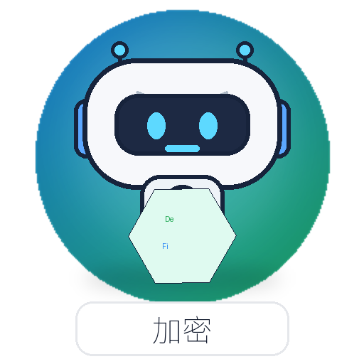

# Investor Agent Images

This folder maps each deduplicated investor-agent archetype to one stable, unique avatar image for interface display.

## Files

- `png/`: PNG avatar files, one per deduplicated agent type. Use these as the default interface images.
- `avatars/`: original SVG avatar files, kept as scalable source assets.
- `agent_avatar_map.csv`: tabular mapping for spreadsheet or simple loader use.
- `agent_avatar_map.json`: structured mapping for application code.
- `README.md`: visual preview table.

## Usage Contract

- Use `agent_type` as the stable lookup key.
- Use `image_path` for the default PNG path relative to this folder.
- Use `svg_image_path` if a scalable SVG source is preferred.
- The source profile points back to `agent_pool/ExtractedExampleInvestors/unique/`.

## Avatar Map

| Agent type | Display name | PNG avatar | Source profile |
| --- | --- | --- | --- |
| `AlgorithmicHighFrequencyTrader` | Algorithmic HFT |  | [AlgorithmicHighFrequencyTrader.md](../agent_pool/ExtractedExampleInvestors/unique/AlgorithmicHighFrequencyTrader.md) |
| `AnchoringBiasInvestor` | Anchoring Bias |  | [AnchoringBiasInvestor.md](../agent_pool/ExtractedExampleInvestors/unique/AnchoringBiasInvestor.md) |
| `Arbitrageur` | Arbitrageur |  | [Arbitrageur.md](../agent_pool/ExtractedExampleInvestors/unique/Arbitrageur.md) |
| `BankingCreditAgent` | Banking Credit |  | [BankingCreditAgent.md](../agent_pool/ExtractedExampleInvestors/unique/BankingCreditAgent.md) |
| `ContrarianReversalInvestor` | Contrarian Reversal |  | [ContrarianReversalInvestor.md](../agent_pool/ExtractedExampleInvestors/unique/ContrarianReversalInvestor.md) |
| `CryptoDeFiAgent` | Crypto DeFi |  | [CryptoDeFiAgent.md](../agent_pool/ExtractedExampleInvestors/unique/CryptoDeFiAgent.md) |
| `FramingEffectTrader` | Framing Effect |  | [FramingEffectTrader.md](../agent_pool/ExtractedExampleInvestors/unique/FramingEffectTrader.md) |
| `HerdingCascadeAgent` | Herding Cascade |  | [HerdingCascadeAgent.md](../agent_pool/ExtractedExampleInvestors/unique/HerdingCascadeAgent.md) |
| `InformedOpportunisticTrader` | Informed Opportunistic |  | [InformedOpportunisticTrader.md](../agent_pool/ExtractedExampleInvestors/unique/InformedOpportunisticTrader.md) |
| `LeveragedFundInvestor` | Leveraged Fund |  | [LeveragedFundInvestor.md](../agent_pool/ExtractedExampleInvestors/unique/LeveragedFundInvestor.md) |
| `LossAversionDispositionInvestor` | Loss Aversion |  | [LossAversionDispositionInvestor.md](../agent_pool/ExtractedExampleInvestors/unique/LossAversionDispositionInvestor.md) |
| `MacroCurrencySovereignTrader` | Macro Currency |  | [MacroCurrencySovereignTrader.md](../agent_pool/ExtractedExampleInvestors/unique/MacroCurrencySovereignTrader.md) |
| `MarketMakerLiquidityAgent` | Market Maker Liquidity |  | [MarketMakerLiquidityAgent.md](../agent_pool/ExtractedExampleInvestors/unique/MarketMakerLiquidityAgent.md) |
| `MentalAccountingSunkCostTrader` | Mental Accounting |  | [MentalAccountingSunkCostTrader.md](../agent_pool/ExtractedExampleInvestors/unique/MentalAccountingSunkCostTrader.md) |
| `MomentumTrendTrader` | Momentum Trend |  | [MomentumTrendTrader.md](../agent_pool/ExtractedExampleInvestors/unique/MomentumTrendTrader.md) |
| `NoiseTrader` | Noise Trader |  | [NoiseTrader.md](../agent_pool/ExtractedExampleInvestors/unique/NoiseTrader.md) |
| `OverconfidenceAndRepresentativenessTrader` | Overconfidence |  | [OverconfidenceAndRepresentativenessTrader.md](../agent_pool/ExtractedExampleInvestors/unique/OverconfidenceAndRepresentativenessTrader.md) |
| `PanicForcedSeller` | Panic Forced Seller |  | [PanicForcedSeller.md](../agent_pool/ExtractedExampleInvestors/unique/PanicForcedSeller.md) |
| `PassiveInstitutionalLongHorizonInvestor` | Passive Institutional |  | [PassiveInstitutionalLongHorizonInvestor.md](../agent_pool/ExtractedExampleInvestors/unique/PassiveInstitutionalLongHorizonInvestor.md) |
| `PolicyBackstopAgent` | Policy Backstop |  | [PolicyBackstopAgent.md](../agent_pool/ExtractedExampleInvestors/unique/PolicyBackstopAgent.md) |
| `RationalAnalystInvestor` | Rational Analyst |  | [RationalAnalystInvestor.md](../agent_pool/ExtractedExampleInvestors/unique/RationalAnalystInvestor.md) |
| `RebalancingStatusQuoInvestor` | Rebalancing Status Quo |  | [RebalancingStatusQuoInvestor.md](../agent_pool/ExtractedExampleInvestors/unique/RebalancingStatusQuoInvestor.md) |
| `RetailCoordinatedTrader` | Retail Coordinated |  | [RetailCoordinatedTrader.md](../agent_pool/ExtractedExampleInvestors/unique/RetailCoordinatedTrader.md) |
| `RiskManagementInvestor` | Risk Management |  | [RiskManagementInvestor.md](../agent_pool/ExtractedExampleInvestors/unique/RiskManagementInvestor.md) |
| `SentimentNarrativeTrader` | Sentiment Narrative |  | [SentimentNarrativeTrader.md](../agent_pool/ExtractedExampleInvestors/unique/SentimentNarrativeTrader.md) |
| `ShortSellerAndShortVolTrader` | Short Seller Short Vol |  | [ShortSellerAndShortVolTrader.md](../agent_pool/ExtractedExampleInvestors/unique/ShortSellerAndShortVolTrader.md) |
| `SocialInformationAgents` | Social Information |  | [SocialInformationAgents.md](../agent_pool/ExtractedExampleInvestors/unique/SocialInformationAgents.md) |
| `ValueFundamentalInvestor` | Value Fundamental |  | [ValueFundamentalInvestor.md](../agent_pool/ExtractedExampleInvestors/unique/ValueFundamentalInvestor.md) |
| `VolatilityProductTrader` | Volatility Product |  | [VolatilityProductTrader.md](../agent_pool/ExtractedExampleInvestors/unique/VolatilityProductTrader.md) |
